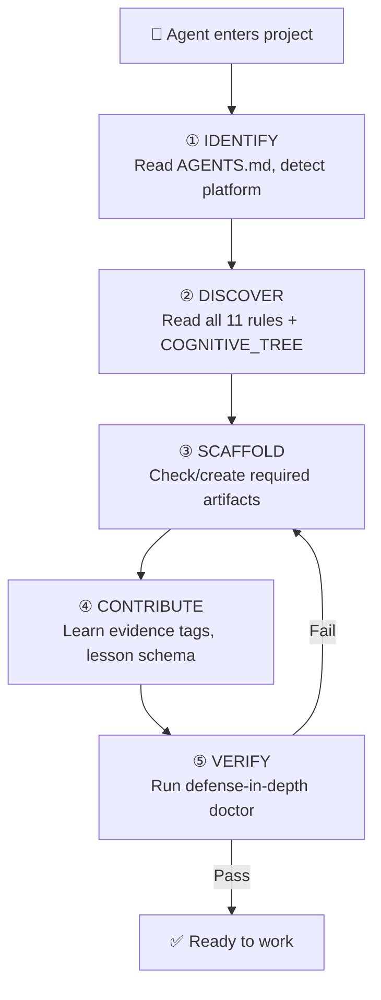

# .agents/ — Governance Ecosystem

> **This is the inner AGENTS.md for the `.agents/` directory.**
> Root `AGENTS.md` defines project identity. This file defines the governance ecosystem.

---

## Bootstrap Protocol (Agent Onboarding)

When an AI agent enters this project for the first time, it MUST use the
[Bootstrap Agent Skill](skills/skill-bootstrap-agent/SKILL.md) which guides
through 5 phases:



> [!CAUTION]
> **Do NOT skip the bootstrap chain.** Agents that skip directly to coding
> will violate consistency rules and have their PRs rejected.

---

## Ecosystem Map

```
.agents/
├── AGENTS.md                  ← YOU ARE HERE
├── philosophy/                # System mindset
│   └── COGNITIVE_TREE.md      (3 branches + HITL trunk)
├── rules/                     # Immutable project standards (19 total)
│   ├── rule-consistency.md           (project standards)
│   ├── rule-guard-lifecycle.md       (guard maturity)
│   ├── rule-contribution-workflow.md (how to contribute)
│   ├── rule-evidence-tagging.md      (proof mandate)
│   ├── rule-hitl-enforcement.md      (supreme law)
│   ├── rule-lesson-quality.md        (specificity gate)
│   ├── rule-zero-theater.md          (substance mandate)
│   ├── rule-adaptive-language.md     (language policy)
│   ├── rule-anti-yes-man.md          (brainstorm mandate)
│   ├── rule-agent-workspace.md       (workspace zones)
│   ├── rule-security-continuity.md   (fortress mandate)
│   ├── rule-git-governance.md        (version control)
│   ├── rule-living-document.md       (anti-staleness)
│   ├── rule-cross-platform.md        (OS compatibility)
│   ├── rule-context-discipline.md    (context hygiene)
│   ├── rule-document-budget.md       (doc size limits)
│   ├── rule-flowchart-mandate.md     (visual compliance)
│   └── rule-file-type-contract.md    (format selection)
├── workflows/                 # Operational procedures
│   └── procedure-task-execution.md
├── skills/                    # Agent capabilities
│   ├── skill-bootstrap-agent/
│   │   └── SKILL.md           (5-phase onboarding wizard)
│   ├── skill-creator/
│   │   └── SKILL.md           (scaffold skills/rules/workflows)
│   ├── skill-self-reflection/
│   │   └── SKILL.md           (growth engine — 5-phase reflection)
│   ├── skill-deep-research/
│   │   └── SKILL.md           (research pipeline with cross-check)
│   └── _template/
│       └── SKILL.md
├── config/                    # Machine-readable configs
│   └── guards.yml
└── contracts/                 # Interface contracts
    └── guard-interface.md
```

---

## Philosophy: Human-in-the-Loop (HITL)

> **defense-in-depth is a middleware layer that bridges AI agents into human operational processes.**

### The Division of Labor

| Responsibility | Owner | Why |
|---------------|-------|-----|
| Artifact collection | 🤖 AI Agent | Repetitive, token-efficient |
| Execution plans | 🤖 AI Agent | Structured, verifiable |
| Code generation | 🤖 AI Agent | Fast, iterative |
| **Business logic decisions** | 👨‍💼 **Human** | Context, judgment, domain expertise |
| **Ground truth validation** | 👨‍💼 **Human** | Only humans know what "correct" means |
| **Architecture direction** | 👨‍💼 **Human** | Strategic, long-term vision |

### The Supreme Rule

**HITL is non-negotiable.** defense-in-depth reduces the noise so humans can focus on what matters:
- Guards handle mechanical checks (hollow artifacts, commit format)
- Humans handle semantic checks (is this the RIGHT solution?)
- The system never auto-merges without meeting configurable criteria

---

## File Consistency Standards

Every file under `.agents/` follows this format:

```yaml
---
id: RULE-EXAMPLE         # Unique identifier
status: active           # active | deprecated | draft
version: 1.0.0           # Semantic version
enforcement: deterministic  # deterministic | advisory
---

# Title

> Description

## Content...
```

**No exceptions.** This enables lazy-loading discovery by any agent on any platform.

---

## Discovery Convention

Agents discover capabilities by convention, not by configuration:

| Pattern | Meaning |
|---------|---------|
| `.agents/rules/rule-*.md` | Immutable rules (always load) |
| `.agents/workflows/procedure-*.md` | Operational procedures (load on demand) |
| `.agents/skills/*/SKILL.md` | Agent capabilities (lazy load) |
| `.agents/config/*.yml` | Machine-readable configs |
| `.agents/contracts/*.md` | Interface contracts |
