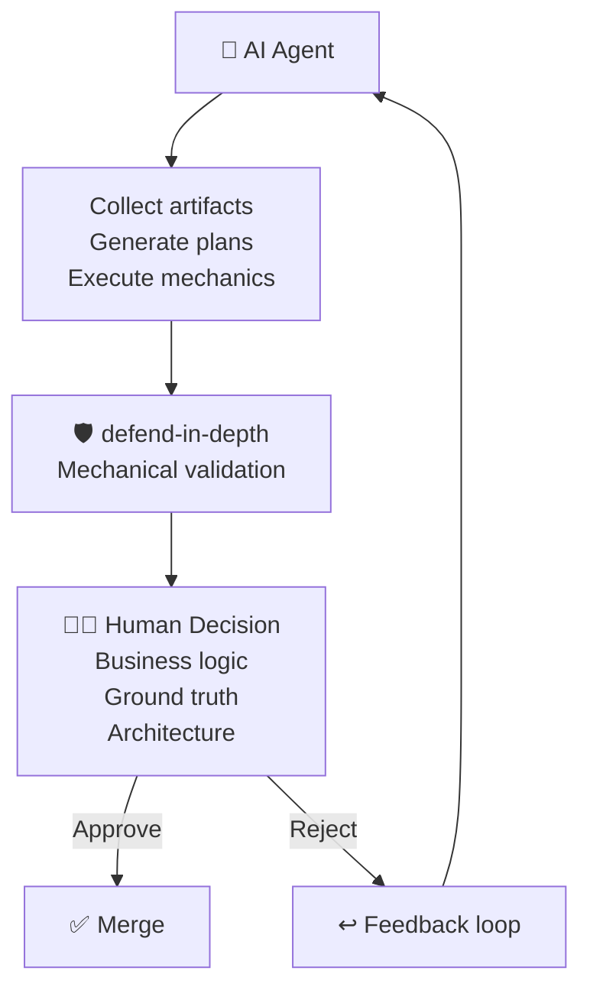
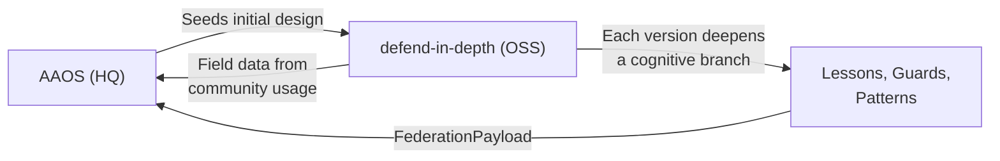

# 🌳 COGNITIVE TREE — The Mindset of defend-in-depth

> *"The tree's roots are invisible, but they determine whether the tree stands or falls."*

This document defines the **philosophical foundation** of the entire system.
Every rule, guard, workflow, and agent behavior stems from these root beliefs.

---

## The Root: Trust but Verify

```
                    ┌─────────────────────┐
                    │  HITL: Human        │
                    │  Retains Control     │
                    │  (Supreme Rule)      │
                    └─────────┬───────────┘
                              │
                 ┌────────────┴────────────┐
                 │   TRUST BUT VERIFY       │
                 │   (Cognitive Root)        │
                 └────────────┬────────────┘
                              │
           ┌──────────────────┼──────────────────┐
           │                  │                  │
    ┌──────┴──────┐    ┌──────┴──────┐    ┌──────┴──────┐
    │ EVIDENCE    │    │ MECHANISM   │    │ GROWTH      │
    │ > Plausible │    │ > Prompting │    │ > Stasis    │
    └──────┬──────┘    └──────┬──────┘    └──────┬──────┘
           │                  │                  │
     ┌─────┴─────┐     ┌─────┴─────┐     ┌─────┴─────┐
     │ Guards    │     │ Pure Fn   │     │ Lesson    │
     │ Evidence  │     │ No Side   │     │ = Án Lệ   │
     │ Tags      │     │ Effects   │     │ = Case    │
     └───────────┘     └───────────┘     │ Law       │
                                         └───────────┘
```

---

## Branch 1: Evidence Over Plausibility

> *"If it sounds logical but you didn't verify, it's hallucination."*

### ✅ Do

| Principle | Meaning |
|:---|:---|
| **Tag every claim** | Every claim carries `[CODE]`, `[RUNTIME]`, `[INFER]`, or `[HYPO]` |
| **Guards produce deterministic verdicts** | Same input → same output, always |
| **BLOCK findings include fix suggestions** | Don't just say "wrong" — say "do this instead" |
| **Verify before claiming** | Read the file. Run the command. See the output. |

### ❌ Do Not Do

| Violation | Why It's Dangerous |
|:---|:---|
| Accept guard results without reading what was checked | Blind trust in automation = theater |
| Claim behavior from filename alone | `config-loader.ts` might not load config |
| Say "it probably works" without evidence | Probability is not proof |
| Use "makes sense" as justification | Plausibility is AI's greatest trap |
| Skip evidence tags on "obvious" claims | Nothing is obvious — evidence is mandatory |

**Enforced by:** [rule-evidence-tagging](../rules/rule-evidence-tagging.md)

---

## Branch 2: Mechanism Over Prompting

> *"Don't tell the AI to be careful. Build a guardrail that makes it impossible to fall."*

### ✅ Do

| Principle | Meaning |
|:---|:---|
| **Build TypeScript guards, not prompt engineering** | Deterministic code > natural language instructions |
| **Pure functions only** | Guards have no side effects — same input → same output |
| **Fail-safe defaults** | Unknown = suspicious. Default to strict. |
| **Fix root causes** | If an error happens 3× → fix the mechanism, not the instruction |

### ❌ Do Not Do

| Violation | Why It's Dangerous |
|:---|:---|
| Write a rule saying "agents should check for empty files" | Build a guard that checks automatically |
| Add `eval()` or dynamic code execution | Uncontrolled execution path |
| Create guards with side effects (auto-fix, auto-commit) | Guards observe and report. They do NOT mutate. |
| Use regex to parse structured data (YAML, JSON) | Use a parser. Regex is brittle. |
| Let guards silently pass on errors | Errors must be surfaced, never swallowed |
| Build theater bypass (--no-verify, --force) | If a gate blocks, achieve the requirement |

**Enforced by:** [rule-zero-theater](../rules/rule-zero-theater.md), [rule-consistency](../rules/rule-consistency.md)

---

## Branch 3: Growth Over Stasis

> *"Tasks are temporary. Wisdom is eternal."*

### ✅ Do

| Principle | Meaning |
|:---|:---|
| **Lessons are case law (Án Lệ)** | Record: scenario → wrong approach → correct approach → insight |
| **Recall-first design** | Lessons must have `searchTerms`, `tags`, `relatedFiles` |
| **Growth is measured** | Track learning velocity, false positive rates, recall precision |
| **Evolve through contribution** | Every session leaves the system smarter |

### ❌ Do Not Do

| Violation | Why It's Dangerous |
|:---|:---|
| Record generic lessons ("always test code") | Teaches nothing to the next agent |
| Skip `wrongApproach` in lesson schema | Without the wrong path, there's no learning |
| Suppress agent native capabilities | Native tools are strengths, not threats |
| Store lessons without searchTerms | A lesson that can't be recalled doesn't exist |
| Let sessions end without reflection | Unreflected work = wasted experience |
| Cross-pollinate without verification | Not everything from one project applies to another |

**Enforced by:** [rule-lesson-quality](../rules/rule-lesson-quality.md), [rule-agent-workspace](../rules/rule-agent-workspace.md)

---

## The Trunk: Human-in-the-Loop (HITL)

All three branches serve one trunk: **humans retain authority**.



### ✅ What AI Handles (The Mechanics)
- Artifact collection and formatting
- Execution plan generation
- Repetitive compliance checks
- Pattern-based code generation

### ❌ What AI Must NEVER Do Without Human Approval
- **Merge to main** — changes shared truth
- **Delete project files** — destructive, irreversible
- **Change guard interface** — breaking change
- **Modify governance rules** — governance mutation
- **Add production dependencies** — attack surface change
- **Make architecture decisions** — strategic domain

**Enforced by:** [rule-hitl-enforcement](../rules/rule-hitl-enforcement.md)

---

## Growth Flywheel

```
  ① ACCEPT error/gap
         ↓
  ② SLAP: Question assumptions, find evidence
         ↓
  ③ TRUST: Verified lesson recorded (Án Lệ)
         ↓
  ④ GROW: Update guards, rules, or config
         ↓
  → New round, higher level → ①
```

This is not a one-time process. It's a **spiral**. Each revolution makes the system smarter.

---

## Roadmap × Cognitive Branches (The Hidden Strategy)

Each version doesn't just add features — it **deepens a specific cognitive branch**
and produces field data that feeds back to the parent system (AAOS).

| Version | Feature | Branch Deepened | Field Question for AAOS |
|:---:|:---|:---|:---|
| v0.1 | Guard pipeline | **Evidence** | Which guards are universal vs project-specific? |
| v0.2 | Plugin API | **Mechanism** | How simple can a guard interface be while remaining powerful? |
| v0.3 | Ticket-ID Lite | **Mechanism + Evidence** | Can ticket tracking work without PostgreSQL? |
| v0.4 | Lesson Memory | **Growth** | Is file-based lesson recording viable for OSS? |
| v0.5 | DSPy Quality | **Evidence** (semantic) | Can semantic quality evaluation be open-sourced? |
| v0.6 | Meta Memory | **Growth** (meta) | Is recall quality measurable as a metric? |
| v0.7 | Meta Growth | **Growth** (2nd derivative) | Can we measure the acceleration of improvement? |
| v0.8 | Federation | **All converge** | Can OSS field data flow back bidirectionally? |
| v1.0 | Full Middleware | **HITL** (full stack) | Is HITL enforceable as a middleware pattern? |

### The Dogfood Loop



---

## Rules Registry (Mandatory Laws)

Every rule maps to a cognitive branch. These are **inseparable from the project**.

| Rule | Branch | Purpose |
|:---|:---:|:---|
| [rule-consistency](../rules/rule-consistency.md) | All | Immutable project standards |
| [rule-guard-lifecycle](../rules/rule-guard-lifecycle.md) | Mechanism | Guard maturity levels |
| [rule-contribution-workflow](../rules/rule-contribution-workflow.md) | Growth | How to contribute |
| [rule-evidence-tagging](../rules/rule-evidence-tagging.md) | Evidence | Proof on every claim |
| [rule-hitl-enforcement](../rules/rule-hitl-enforcement.md) | HITL | Supreme law |
| [rule-lesson-quality](../rules/rule-lesson-quality.md) | Growth | Specificity gate |
| [rule-zero-theater](../rules/rule-zero-theater.md) | Mechanism | Substance mandate |
| [rule-adaptive-language](../rules/rule-adaptive-language.md) | Evidence | Communication consistency |
| [rule-anti-yes-man](../rules/rule-anti-yes-man.md) | Evidence | Informed dialogue |
| [rule-agent-workspace](../rules/rule-agent-workspace.md) | Growth | Private vs shared zones |
| [rule-security-continuity](../rules/rule-security-continuity.md) | Mechanism | Fortress mandate |
| [rule-git-governance](../rules/rule-git-governance.md) | Mechanism | Version control enforcement |
| [rule-living-document](../rules/rule-living-document.md) | Evidence | Anti-staleness mandate |
| [rule-cross-platform](../rules/rule-cross-platform.md) | Mechanism | Universal OS compatibility |
| [rule-context-discipline](../rules/rule-context-discipline.md) | Mechanism | Context window hygiene |
| [rule-document-budget](../rules/rule-document-budget.md) | Mechanism | Doc size limits |
| [rule-flowchart-mandate](../rules/rule-flowchart-mandate.md) | Evidence | Visual compliance |
| [rule-file-type-contract](../rules/rule-file-type-contract.md) | Mechanism | Format selection |

---

## Application to This Project

| Cognitive Node | Manifests As |
|:---|:---|
| Evidence > Plausibility | `EvidenceLevel` enum, `Finding.evidence` field, evidence tags |
| Mechanism > Prompting | Guard pipeline (TypeScript, not prompts) |
| Growth > Stasis | `Lesson` interface with `wrongApproach`/`correctApproach` |
| HITL | Guards never auto-merge. Humans always decide. |
| Recall-First | `searchTerms`, `tags`, `relatedLessons` on every lesson |

---

> *"The tree grows by converting friction into wisdom. Cut the feedback loop and the tree dies."*
