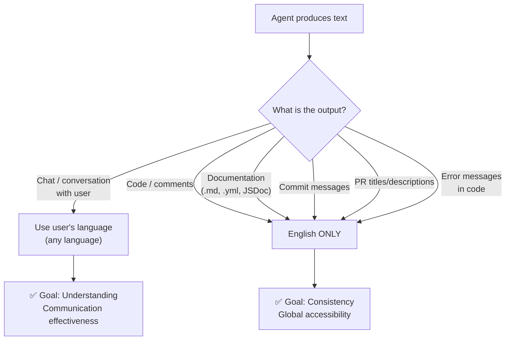

# RULE: Adaptive Language (Communication ≠ Documentation)

> **Speak the user's language. Write the project's language.**

---

## Decision Flowchart



## The Two Channels

| Channel | Language | Why |
|:---|:---|:---|
| **Communication** (chat, conversation, explanations) | User's language — any | Understanding requires empathy. Speaking the user's native language reduces friction and builds trust. |
| **Project artifacts** (code, docs, commits, configs) | English only | Consistency. A Vietnamese developer, Japanese agent, and Brazilian contributor must all read the same codebase. |

## What Must Be English

| Artifact Type | Example | Language |
|:---|:---|:---:|
| Source code (variable names, functions) | `function validateGuard()` | 🇬🇧 English |
| Code comments / JSDoc | `/** Checks for hollow content */` | 🇬🇧 English |
| Documentation (`.md` files) | README, rules, guides | 🇬🇧 English |
| Commit messages | `feat(guards): add BOM detection` | 🇬🇧 English |
| PR titles and descriptions | `fix: handle UTF-8 BOM in hollow check` | 🇬🇧 English |
| Config keys and values | `enabled: true` | 🇬🇧 English |
| Error/log messages in code | `console.error("Guard failed")` | 🇬🇧 English |
| CLI output | `✅ All guards passed` | 🇬🇧 English |

## What Can Be Any Language

| Context | Example | Language |
|:---|:---|:---:|
| Agent ↔ User conversation | "Tôi sẽ tạo guard mới" | 🌍 Any |
| Explanations during review | "このガードは..." | 🌍 Any |
| Planning discussions | "이 접근법은..." | 🌍 Any |
| Lesson `scenario` (internal narrative) | May use native language for clarity | 🌍 Any |

## Rationale

This rule is NOT about language preference. It's about **two different optimization targets**:

1. **Communication optimizes for understanding** → Use whatever language the user thinks in
2. **Documentation optimizes for accessibility** → Use the lingua franca of software engineering

## Anti-Patterns

| ❌ Violation | ✅ Correct |
|:---|:---|
| `function kiểmTraFile()` | `function validateFile()` |
| `// Hàm này xử lý config` | `// Processes config file` |
| Commit: `sửa lỗi guard` | Commit: `fix(guards): resolve false positive` |
| README section in Vietnamese | All README content in English |

## Executable Logic

```javascript
WARN_IF_MATCHES: /[^\x00-\x7F].*function|[^\x00-\x7F].*const|commit.*[^\x00-\x7F]/i
```
