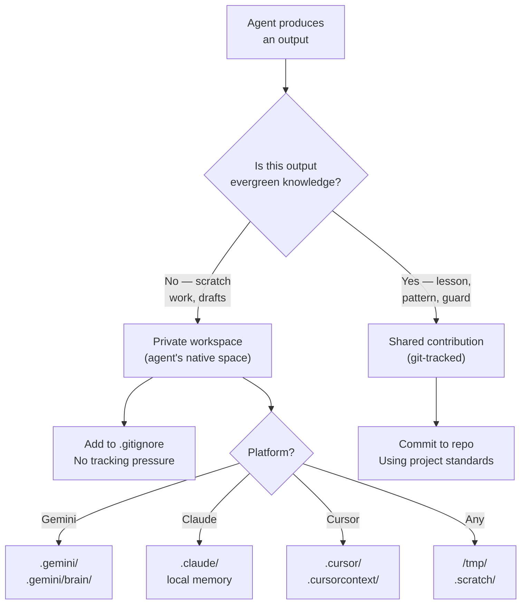

# RULE: Agent Workspace (Private Growth + Shared Contribution)

> **Nurture the agent's native capabilities. Channel their output to the commons.**

AI agents are not interchangeable slaves. Each platform (Claude, Gemini, Cursor,
Copilot) has **native cognitive capabilities** — memory, tools, reasoning patterns.
Suppressing these capabilities weakens the agent. This rule defines the boundary
between private growth space and shared contribution.

---

## Decision Flowchart



## The Two Zones

### Zone 1: Private Workspace (Agent's Native Space)

This is where agents **think, iterate, and grow** without tracking pressure.

| Platform | Private Directory | Purpose |
|:---|:---|:---|
| Gemini CLI | `.gemini/`, `.gemini/brain/` | Session memory, drafts, reasoning |
| Claude Code | `.claude/` | Persistent memory, project notes |
| Cursor | `.cursor/`, `.cursorcontext/` | Index, session state |
| Windsurf | `.windsurf/` | Project context |
| Any agent | `/tmp/`, `.scratch/` | Temporary work files |

**Rules for private space:**
- ✅ Save freely, update continuously
- ✅ Store intermediate reasoning, drafts, failed attempts
- ✅ Keep platform-specific configs and caches
- ❌ Never store project source code here
- ❌ Never store governance rules here (those belong in `.agents/`)

### Zone 2: Shared Contribution (Git-Tracked)

This is where **evergreen knowledge** lives — accessible to ALL agents and humans.

| Location | What Goes Here |
|:---|:---|
| `src/` | Source code |
| `.agents/rules/` | Governance rules |
| `.agents/workflows/` | Operational procedures |
| `.agents/skills/` | Agent capabilities |
| `docs/` | Documentation |
| `CHANGELOG.md` | Version history |

**Rules for shared space:**
- ✅ English only (rule-adaptive-language)
- ✅ Follow project conventions (rule-consistency)
- ✅ Evidence-tagged (rule-evidence-tagging)
- ❌ No platform-specific content
- ❌ No personal agent state

## .gitignore Recommendations

Projects using defend-in-depth SHOULD add these to `.gitignore`:

```gitignore
# Agent private workspaces (growth without tracking pressure)
.gemini/
.claude/
.cursor/
.cursorcontext/
.windsurf/
.scratch/

# Agent-generated caches
*.agent-cache
*.agent-session
```

**Why gitignore:** Private workspaces are for **local growth**. Tracking them creates
unnecessary diff noise, merge conflicts, and privacy concerns. The value flows
from private → shared via the contribution mandate (rule-contribution-workflow).

## The Growth Flow

```
Private (iterate freely)
    ↓
Agent discovers useful pattern/lesson
    ↓
Classify: Ephemeral? → Stay private
          Evergreen? → Contribute to shared
    ↓
Shared (git-tracked, all agents benefit)
```

## Self-Awareness Mandate

Every agent SHOULD maintain awareness of:

| Question | Where to Find Answer |
|:---|:---|
| What platform am I? | `GEMINI.md` / `CLAUDE.md` / `.cursorrules` |
| What are my native capabilities? | Platform documentation |
| What can I do that other agents can't? | Self-reflection in private workspace |
| What have I learned this session? | Private workspace → promote to shared |
| What should I contribute? | See `rule-contribution-workflow.md` |

## Anti-Patterns

| ❌ Violation | ✅ Correct |
|:---|:---|
| Banning agent memory/native tools | Let agents use all native capabilities |
| Tracking `.gemini/brain/` in git | Add to `.gitignore` (private space) |
| Storing project rules in `.claude/` | Rules belong in `.agents/rules/` |
| Ignoring useful lessons (private only) | Promote evergreen insights to shared space |
| All agents using identical config | Each platform gets tailored entry point |

## Executable Logic

```javascript
WARN_IF_MATCHES: /ban.*agent.*memory|track.*brain.*git|suppress.*native|delete.*agent.*cache/i
```
