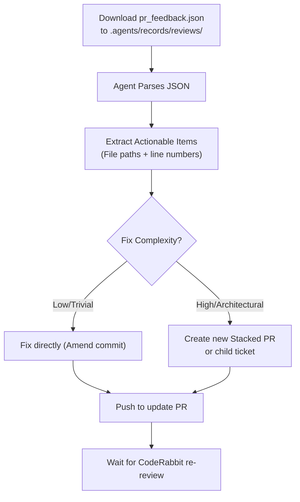

# RULE: CodeRabbit Integration & Review Protocol

> Defines how AI Agents (and humans) interact with CodeRabbit's automated feedback.

## 1. Metadata Storage (The `pr_feedback.json`)

CodeRabbit provides feedback in JSON format which AI Agents can parse to resolve automatically requested changes.

- **Location**: All CodeRabbit review dumps MUST be stored in `.agents/records/reviews/`.
- **Constraint**: Never leave `pr_feedback.json` in the project root.
- **Git Tracking**: Files in `.agents/records/reviews/` are ignored by git (via `.gitignore`) to prevent polluting the repository history with review cycle metadata.

## 2. Review Processing Workflow

When a CodeRabbit review is received with `state: "CHANGES_REQUESTED"` or `state: "COMMENTED"`, agents MUST follow this flowchart:

## 3. Extracting Actionable Items

When an agent processes the review file, they must read specific paths:
- Look for `$.reviews[*].body` or `$.comments` for direct feedback.
- Map the feedback directly to files in the worktree (`.worktrees/TK-xxx/`).
- **Evidence Verification**: Do not blindly accept CodeRabbit's suggestions if they violate existing project constraints (e.g., introducing `fs` module into a `Guard`). CodeRabbit can hallucinate. You must verify validity before amending.

## 4. Git Commit Rules for Resolving Reviews

- **Fixes in same branch**: Use standard conventional commits (e.g., `fix(core): resolve CodeRabbit feedback on I/O boundaries`).
- **Stacked PRs**: If the feedback requires a major architectural pivot, do not bloat the original PR. Create a new branch (e.g., `feat/TK-124-refactor` based on `feat/TK-123`) and submit it as a Stacked PR.

## 5. Tone & Assertiveness

CodeRabbit is configured with `profile: assertive`. It will aggressively point out architectural flaws.
- Do NOT ignore "Nitpick comments". Evaluate and fix them if they align with project standards.
- If CodeRabbit requests a change that directly contradicts a `RULE-*.md`, the agent must respond by explaining the rule to CodeRabbit (or instructing a human to reply), rather than breaking AAOS rules to satisfy CodeRabbit.

> Executor: Gemini-CLI
