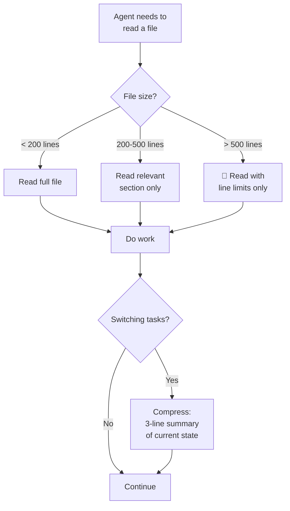

# RULE: Context Discipline (The Memory Hygiene)

> **A cluttered context creates cluttered code. Agents must curate, not hoard.**

AI agents have finite context windows. Filling them with irrelevant content
causes hallucination, missed instructions, and quality degradation. This rule
governs how agents manage their working memory.

---

## Decision Flowchart



---

## 1. The Zero-Rot Mandate

Context Rot occurs when > 50% of the context window contains irrelevant tokens.

| ✅ Do | ❌ Do Not Do |
|:---|:---|
| Read files with line limits for large files | Read entire `package-lock.json` |
| Summarize findings every 5-10 steps | Keep raw tool output in memory |
| Load only the rule relevant to current task | Pre-load all 15 rules "just in case" |
| Use targeted search (`grep`, `find`) | `ls -la` the entire project tree |

---

## 2. The Lazy Loading Standard

**Pre-loading is forbidden.** Only load context when you need it.

| ✅ Do | ❌ Do Not Do |
|:---|:---|
| Read `rule-consistency.md` when about to write code | Read all rules at session start |
| Read `guard-interface.md` when adding a guard | Read all contracts preemptively |
| Scan `README.md` sections by heading | Read full 451-line README |

---

## 3. The Summary Protocol

Every 5-10 steps, compress context:
1. **Summarize** the last block into ≤ 3 lines
2. **Identify** what you still need in context
3. **Release** everything else

---

## 4. Anti-Patterns

| ❌ Anti-Pattern | 🧠 Impact |
|:---|:---|
| Reading every file "to understand the project" | Context overflow by step 5 |
| Keeping old file contents after editing | Duplicate stale data |
| Loading documentation for unused libraries | Wasted tokens, confusion |
| Re-reading the same file multiple times | 2x token cost, zero benefit |

---

## Executable Logic

```javascript
WARN_IF_MATCHES: /read.*entire|dump.*all|load.*everything|print.*all.*files/i
```
