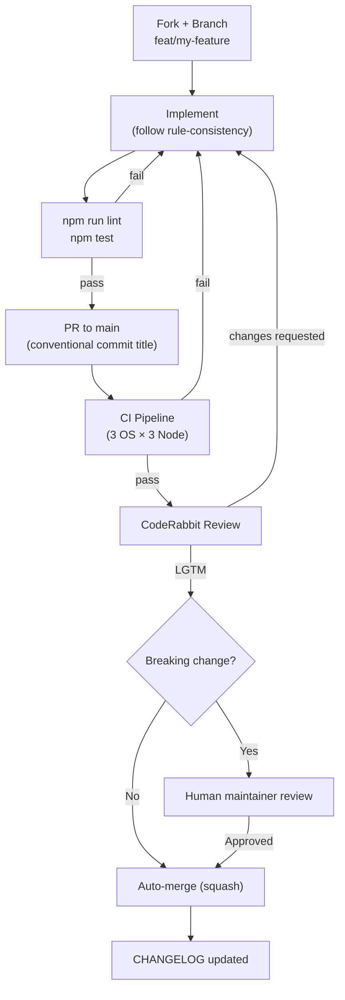

# RULE: Contribution Workflow

> How code flows from idea to main branch.

## Flow

## Auto-Merge Criteria

A PR can be auto-merged when ALL of these are true:
1. ✅ CI green (all 9 matrix jobs)
2. ✅ CodeRabbit approves
3. ✅ No breaking changes
4. ✅ Conventional commit title
5. ✅ CHANGELOG updated (if user-facing)

## Breaking Changes

A breaking change is any PR that:
- Changes the `Guard` interface
- Changes the `DefendConfig` schema
- Removes or renames a built-in guard
- Changes CLI command syntax

Breaking changes require:
- Human maintainer review
- Major or minor version bump
- Migration guide in CHANGELOG
