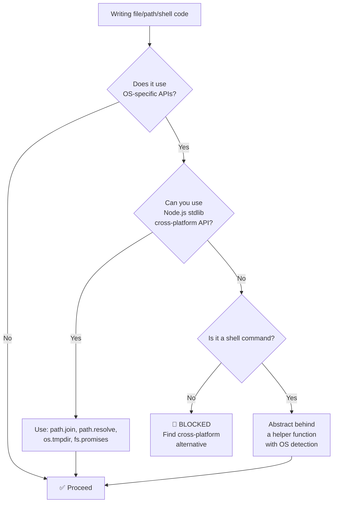

# RULE: Cross-Platform Compatibility (The Universal Runtime Mandate)

> **If it doesn't work on Windows, macOS, AND Linux — it doesn't ship.**

defend-in-depth is a cross-platform tool. Every line of code, every path operation,
every shell command must work identically on all three major operating systems.

---

## Decision Flowchart



---

## 1. Path Operations

| ✅ Do | ❌ Do Not Do |
|:---|:---|
| `path.join('src', 'guards', 'index.ts')` | `'src/guards/index.ts'` (hardcoded `/`) |
| `path.resolve(dir, file)` | String concatenation: `dir + '/' + file` |
| `path.sep` for separator checks | Assume `/` is the separator |
| `path.normalize(p)` for user input | Trust user paths raw |
| `os.tmpdir()` for temp files | Hardcode `/tmp/` |
| `os.homedir()` for home directory | Hardcode `~` or `$HOME` |
| `os.EOL` for line endings | Hardcode `\n` |

---

## 2. File System Operations

| ✅ Do | ❌ Do Not Do |
|:---|:---|
| `fs.promises` (async by default) | `fs.readFileSync` in hot paths |
| Handle both `\n` and `\r\n` line endings | Assume `\n` only |
| Use case-insensitive comparison for filenames on Windows | Assume case-sensitive FS |
| Check for BOM (`\uFEFF`) in text files | Assume UTF-8 without BOM |
| Handle long paths (>260 chars on Windows) | Assume short paths |

### File Naming Rules

| ✅ Allowed | ❌ Forbidden |
|:---|:---|
| `kebab-case.ts` | Spaces in filenames |
| `lowercase-only` | `CON`, `PRN`, `NUL`, `COM1` (Windows reserved) |
| ASCII alphanumeric + hyphen + dot | Colons `:`, pipes `\|`, quotes `"` |
| Max 100 chars per path segment | Unicode-only filenames |

---

## 3. Shell Commands & Processes

| ✅ Do | ❌ Do Not Do |
|:---|:---|
| Use `node:child_process` with explicit args array | Shell string concatenation |
| `execFile(cmd, args)` (no shell injection) | `exec("git " + userInput)` |
| Abstract OS-specific commands | Hardcode `bash`, `sh`, `chmod` |
| Use `process.platform` for OS detection | Assume POSIX |
| Test on CI matrix (3 OS × 3 Node) | "Works on my Mac" |

### Git Hook Generation

Git hooks must be generated differently per OS:

| OS | Hook shebang | Line ending |
|:---|:---|:---|
| macOS/Linux | `#!/usr/bin/env node` | `\n` (LF) |
| Windows | No shebang needed (`.cmd` wrapper) | `\r\n` (CRLF) |

The hook generator in `src/hooks/` MUST handle both cases.

---

## 4. Environment & Configuration

| ✅ Do | ❌ Do Not Do |
|:---|:---|
| `process.env.HOME \|\| process.env.USERPROFILE` | `process.env.HOME` only |
| `process.env.TMPDIR \|\| os.tmpdir()` | Hardcode temp path |
| Normalize path separators in config | Store OS-specific paths in config |
| Use `.yml` extension (universal) | Use symlinks (Windows support varies) |

---

## 5. Testing Contract

Every PR MUST pass the CI matrix:

```
Node 18 × { Windows, macOS, Linux }
Node 20 × { Windows, macOS, Linux }
Node 22 × { Windows, macOS, Linux }
```

9 jobs total. If ANY job fails, the PR is blocked.

### Common Cross-Platform Test Failures

| Failure | Cause | Fix |
|:---|:---|:---|
| Path mismatch | `\` vs `/` | Use `path.join()` |
| Line ending diff | `\r\n` vs `\n` | Normalize before compare |
| Permission error | `chmod` doesn't exist on Windows | Skip permission tests on Windows |
| Temp file path | `/tmp/` vs `C:\Users\...\Temp` | Use `os.tmpdir()` |
| Case sensitivity | `File.ts` ≠ `file.ts` on Linux, = on Windows | Enforce lowercase |

---

## 6. Dependencies

All dependencies MUST be cross-platform. Before adding any dependency:

1. Check: does it have Windows CI? 
2. Check: does it use native bindings? (avoid if possible)
3. Check: does `engines` in its package.json exclude any OS?

Currently allowed: `yaml` (pure JS, cross-platform ✅)

---

## Anti-Patterns Summary

| ❌ Pattern | Platform | Fix |
|:---|:---|:---|
| `chmod +x hook.sh` | Fails on Windows | Generate `.cmd` on Windows |
| `cp -r src/ dist/` | Fails on Windows | Use `fs.cpSync(src, dst, {recursive: true})` |
| `process.env.HOME` | Undefined on Windows | Use `os.homedir()` |
| `'/tmp/test-file'` | Wrong path on Windows | Use `path.join(os.tmpdir(), 'test-file')` |
| `file.split('\n')` | Misses `\r\n` on Windows | `file.split(/\r?\n/)` |
| `exec('which git')` | `which` doesn't exist on Windows | `exec('git --version')` |

---

## Executable Logic

```javascript
WARN_IF_MATCHES: /\/tmp\/|process\.env\.HOME[^P]|\.split\('\\n'\)|chmod|which\s|hardcoded.*path|exec\(.*\+/i
```
