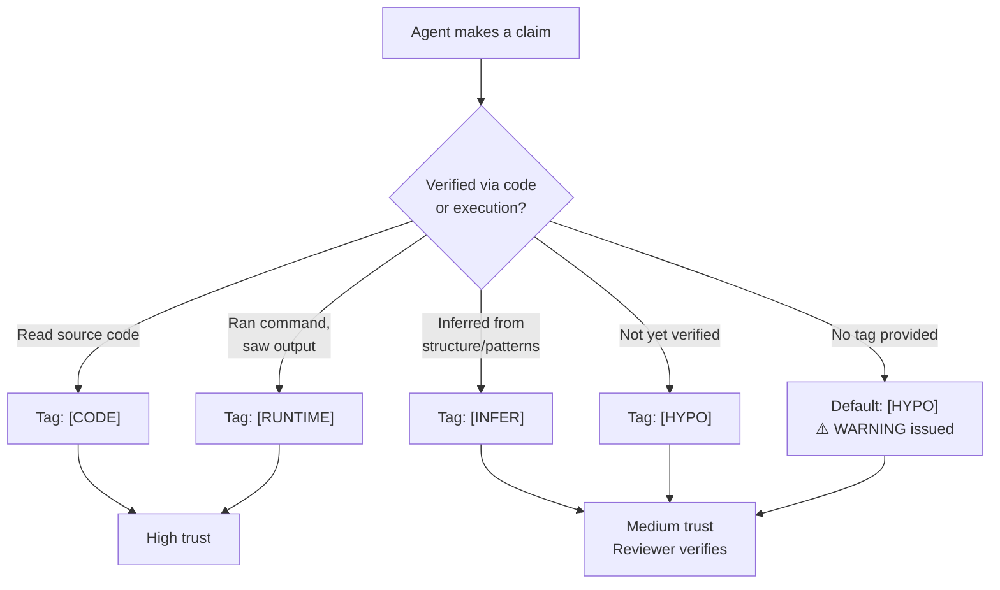

# RULE: Evidence Tagging (The Proof Mandate)

> **Every claim carries its proof. No tag = no trust.**

This rule is the operational manifestation of the **Evidence > Plausibility** branch
in [COGNITIVE_TREE.md](../philosophy/COGNITIVE_TREE.md).

---

## Decision Flowchart



## Evidence Levels

| Tag | Meaning | Trust Level | Usage |
|:---|:---|:---:|:---|
| `[CODE]` | Verified by reading source code | 🟢 High | File contents inspected |
| `[RUNTIME]` | Verified by execution, logs, tests | 🟢 High | Command ran, output captured |
| `[INFER]` | Inferred from code structure but not executed | 🟡 Medium | Pattern-based reasoning |
| `[HYPO]` | Hypothesis — plausible but unverified | 🟠 Low | Must be promoted to higher level |

## Mandatory Tagging Points

| Context | Tag Required? | Consequence |
|:---|:---:|:---|
| Guard findings (`Finding.evidence`) | ✅ Yes | Untagged = `HYPO` by default |
| Lesson `wrongApproach` / `correctApproach` | ✅ Yes | Untagged lesson = rejected |
| PR review comments | ✅ Yes | Untagged comment = CHANGES_REQUESTED |
| New guard proposals | ✅ Yes | Must include `[RUNTIME]` real-world example |
| Implementation plan claims | ✅ Yes | File:line refs required for `[CODE]` |

## Anti-Patterns

| ❌ Violation | ✅ Correct |
|:---|:---|
| "This file probably handles config" | "`[CODE]` config-loader.ts:L42 loads YAML via `parse()`" |
| "The guard should catch this" | "`[RUNTIME]` tested: echo 'TODO' > test.md && git commit → BLOCKED" |
| "It makes sense that..." | "`[INFER]` from engine.ts import graph: guards run sequentially" |

## Executable Logic

```javascript
WARN_IF_MATCHES: /probably|should.*work|makes.*sense|sounds.*right|likely/i
```
