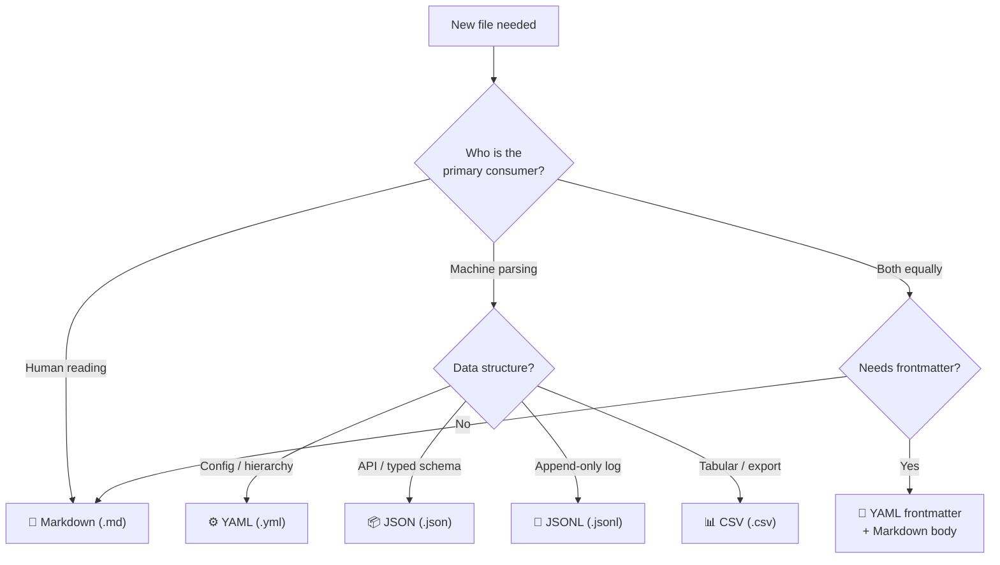

# RULE: File Type Contract (The Format Selection Mandate)

> **Every file format exists for a reason. Using the wrong format creates parsing friction, agent confusion, and integration failures.**

---

## Decision Flowchart



---

## 1. The Readability Spectrum

Every format lives on a spectrum. Understanding this prevents wrong choices.

```
HUMAN-READABLE ◄────────────────────────────────────► MACHINE-READABLE
     │                                                        │
     ▼                                                        ▼
  Markdown    YAML    YAML+MD    JSONL    JSON    CSV    TypeScript
  (.md)      (.yml)  (frontmatter) (.jsonl) (.json) (.csv)  (.ts)
     │         │         │          │        │       │        │
  prose     config    hybrid     append   strict  tabular   code
  narrative  tree    docs+meta   stream   schema   flat    compiled
```

| Category | Formats | Who reads it primarily | Key trait |
|:---|:---|:---|:---|
| **Human-first** | `.md` | Developers, architects, contributors | Prose, narrative, explanation |
| **Hybrid** | `.md` + YAML frontmatter | Agents + machines + humans | Best of both worlds |
| **Config-friendly** | `.yml` | Humans edit, machines consume | Comments, hierarchy, readable |
| **Machine-first** | `.json`, `.jsonl`, `.csv` | Parsers, APIs, data pipelines | Strict, fast, no ambiguity |

---

## 2. Pros / Cons / ROI Matrix

### 📝 Markdown (`.md`)

| Pros | Cons | ROI |
|:---|:---|:---|
| Universal readability | No structured data parsing | **HIGH** for docs, rules, guides |
| Supports mermaid diagrams | Agents may struggle with table extraction | **LOW** for config or data |
| GitHub renders natively | No schema validation | |
| Comments via prose | Cannot be queried programmatically | |

**Use when:** Humans need to read, understand, and discuss content.
**Never use when:** A machine needs to parse key-value pairs reliably.

---

### ⚙️ YAML (`.yml`)

| Pros | Cons | ROI |
|:---|:---|:---|
| Human-editable config | Indentation-sensitive (whitespace bugs) | **HIGH** for config files |
| Supports comments (`#`) | Complex types can be ambiguous | **MEDIUM** for data |
| Hierarchical nesting | Slower parsing than JSON | |
| Multi-doc support (`---`) | No native schema validation | |

**Use when:** Configuration that humans edit and machines consume.
**Never use when:** Strict schema validation is required (use JSON + JSON Schema instead).

---

### 📦 JSON (`.json`)

| Pros | Cons | ROI |
|:---|:---|:---|
| Universal parsing (every language) | No comments — zero documentation inline | **HIGH** for APIs, manifests |
| Strict schema (JSON Schema available) | Not human-friendly for large files | **LOW** for config humans edit |
| Fastest parsing speed | No trailing commas | |
| Typed (string, number, bool, null) | Verbose (lots of quotes and braces) | |

**Use when:** Machine-to-machine communication, typed schemas, package manifests.
**Never use when:** Humans need to add comments explaining config choices.

---

### 📜 JSONL — JSON Lines (`.jsonl`)

| Pros | Cons | ROI |
|:---|:---|:---|
| **Append-only** — no full-file rewrite | Not human-browsable | **HIGH** for logs, lessons |
| Stream-processable (line by line) | No hierarchy (flat per line) | **HIGH** for event streams |
| `grep`-friendly (each line = object) | Cannot represent nested arrays cleanly | |
| Git-diff friendly (1 line per record) | No comments | |
| Concurrent-write safe | | |

**Use when:** Append-only data (lessons, events, metrics). Data grows over time.
**Never use when:** You need to read/query the full dataset frequently. Use JSON or a database.

**Critical insight for agents:** If you find yourself doing `JSON.parse(fs.readFileSync())` repeatedly
and appending with `JSON.stringify() + '\n'`, the file should be `.jsonl`, not `.json`.

---

### 📊 CSV (`.csv`)

| Pros | Cons | ROI |
|:---|:---|:---|
| Spreadsheet-compatible (Excel, Sheets) | No type system (everything is string) | **HIGH** for export/import |
| Smallest file size for tabular data | No nesting or hierarchy | **LOW** for internal config |
| Universal import/export | Delimiter hell (commas in values) | |
| Human-scannable in small quantities | No schema, no comments | |

**Use when:** Tabular data export, metrics snapshots, data interchange with non-dev tools.
**Never use when:** Data has nested structure or multiple types.

---

### 📝 YAML Frontmatter + Markdown Body (Hybrid)

| Pros | Cons | ROI |
|:---|:---|:---|
| Machine parses metadata (YAML) | Two parsers needed (YAML + MD) | **HIGHEST** for agent docs |
| Human reads content (Markdown) | Slightly more complex tooling | |
| Single file for both concerns | Frontmatter schema not validated by default | |
| Standard in static site generators | | |

**Use when:** Documents consumed by BOTH agents and humans (rules, skills, workflows).
**This is the default for `.agents/` directory.**

---

## 3. Agent Decision Shortcuts

When an agent is uncertain, use this quick reference:

| Scenario | → Format | Why |
|:---|:---|:---|
| "I need to write a guide" | `.md` | Human prose |
| "I need to add a config option" | `.yml` | Editable + comments |
| "I need to record a lesson learned" | `.jsonl` | Append-only |
| "I need to define a type/schema" | `.ts` | Compiled, validated |
| "I need to store test results" | `.json` | Structured, parseable |
| "I need to export metrics" | `.csv` | Spreadsheet-compatible |
| "I need to write a new rule" | `.md` + frontmatter | Hybrid: agent + human |
| "I need to store package info" | `.json` | npm standard |
| "I need to configure CI" | `.yml` | GitHub Actions standard |

---

## 4. Extension Consistency

| ✅ Use | ❌ Do Not Use | Why |
|:---|:---|:---|
| `.yml` | `.yaml` | Project standard (exception: external tools like `.coderabbit.yaml`) |
| `.md` | `.markdown`, `.txt` | Consistent extension |
| `.json` | `.json5` | No comments needed in JSON; use YAML if comments needed |
| `.jsonl` | `.ndjson` | Clearer name, same format |
| `.ts` | `.js`, `.mjs`, `.cjs` | TypeScript-only project |

---

## Executable Logic

```javascript
WARN_IF_MATCHES: /\.yaml[^.]|\.json5|\.txt['">\s]|\.markdown|\.ndjson|\.mjs|\.cjs|readFileSync.*\.json.*append/i
```
