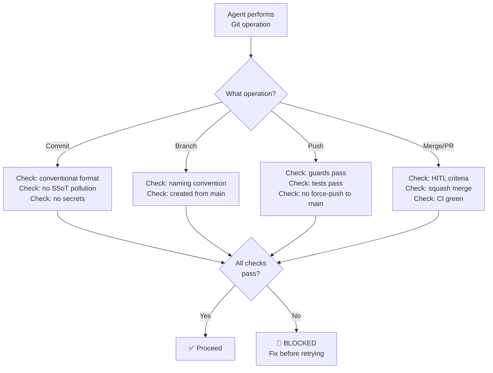

# RULE: Git Governance (The Version Control Mandate)

> **Git is the enforcement layer. If it's not committed, it didn't happen. If it's committed wrong, it's permanently wrong.**

Git is not just source control — it is the **primary audit trail**, the **universal
enforcement mechanism**, and the **single source of truth** for this project.

---

## Decision Flowchart



---

## 1. Commit Standards

### Format (Conventional Commits)

```
<type>(<scope>): <description>

[optional body]

[optional footer]
```

| Type | When to Use | Example |
|:---|:---|:---|
| `feat` | New feature or guard | `feat(guards): add YAML syntax validator` |
| `fix` | Bug fix | `fix(engine): handle empty file list gracefully` |
| `docs` | Documentation only | `docs(readme): add quick reference section` |
| `chore` | Maintenance, deps | `chore(deps): update yaml to 2.4.0` |
| `refactor` | Code restructure, no behavior change | `refactor(cli): extract config parsing into module` |
| `test` | Test additions or fixes | `test(guards): add BOM edge case coverage` |
| `style` | Formatting, whitespace | `style: fix indentation in engine.ts` |
| `ci` | CI/CD pipeline changes | `ci: add Node 22 to test matrix` |

### Commit Rules

| Rule | Why |
|:---|:---|
| **Atomic commits** — one logical change per commit | Enables clean reverts and cherry-picks |
| **Present tense imperative** — "add", not "added" or "adding" | Git convention, consistent history |
| **≤ 72 chars** for subject line | Readability in `git log --oneline` |
| **Body explains WHY**, not WHAT | Code shows what; commit explains motivation |
| **No secrets** — ever | Cannot be fully removed from Git history |
| **No generated files** — `dist/`, `node_modules/` | `.gitignore` handles these |

### ❌ Do Not Do

| Violation | Why |
|:---|:---|
| `git commit -m "fix stuff"` | Non-descriptive, breaks conventional format |
| `git commit -m "WIP"` | No WIP commits on shared branches |
| `git commit --no-verify` | Bypasses guards — FORBIDDEN |
| Commit `.env`, API keys, tokens | Security violation — permanent in history |
| Commit `node_modules/` or `dist/` | Pollutes history, bloats repo |
| Mix unrelated changes in one commit | Breaks atomic commit principle |

---

## 2. Branch Standards

### Naming Convention

```
<type>/<description>
```

| Pattern | Use Case | Example |
|:---|:---|:---|
| `feat/add-yaml-guard` | New feature | `feat/add-yaml-guard` |
| `fix/bom-false-negative` | Bug fix | `fix/bom-false-negative` |
| `docs/quickstart-guide` | Documentation | `docs/quickstart-guide` |
| `chore/update-deps` | Maintenance | `chore/update-deps` |

### Branch Rules

| Rule | Why |
|:---|:---|
| **Branch from `main`** | Clean baseline, no cascading conflicts |
| **Short-lived branches** — merge within days, not weeks | Reduces merge conflict surface |
| **Delete after merge** | Clean branch list |
| **`main` is protected** — no direct commits | All changes via PR |

### ❌ Do Not Do

| Violation | Why |
|:---|:---|
| Branch from another feature branch | Creates dependency chains |
| Name branch `my-branch` or `test123` | Non-descriptive, breaks convention |
| Keep branches alive > 2 weeks | Drift from main increases conflicts |
| Push directly to `main` | Bypasses review gate |

---

## 3. Pull Request Standards

### PR Title
Same format as commits — conventional commits:
```
feat(guards): add YAML syntax validator
```

### PR Checklist (auto-enforced)

- [ ] Title follows conventional commit format
- [ ] Branch is up-to-date with `main`
- [ ] All guards pass (`npx defend-in-depth verify`)
- [ ] Tests pass (`npm test`)
- [ ] TypeScript compiles (`npx tsc --noEmit`)
- [ ] No SSoT files modified (backlog, state, governance configs)
- [ ] No secrets in diff
- [ ] CHANGELOG updated (if user-facing change)

### PR Description Template

```markdown
## What
{Brief description of the change}

## Why
{Motivation — what problem does this solve?}

## Evidence
{[CODE] / [RUNTIME] — what was tested/verified}

## Breaking Changes
{None | Description of breaking change}
```

### ❌ Do Not Do

| Violation | Why |
|:---|:---|
| PR with "See code" as description | Zero-theater violation |
| PR modifying > 10 files without justification | Blast radius too large — split |
| Self-merge without meeting criteria | HITL violation |
| Force-push to PR after review started | Destroys review context |

---

## 4. Merge Standards

### Merge Method
**Squash merge only.** One commit per PR on main.

| Method | Allowed? | Why |
|:---|:---:|:---|
| Squash merge | ✅ Yes | Clean linear history |
| Merge commit | ❌ No | Clutters history |
| Rebase merge | ❌ No | Rewrites history |
| Fast-forward | ❌ No | Loses PR context |

### Post-Merge
1. Delete feature branch
2. Pull latest `main`
3. Verify CI green on main

### ❌ Do Not Do

| Violation | Why |
|:---|:---|
| `git push --force main` | Force-push to main is CATASTROPHIC |
| Merge with failing CI | Breaks main for everyone |
| Leave merged branch alive | Clutters branch list |
| `git rebase main` on a shared PR | Rewrites shared history |

---

## 5. Git as Enforcement (Project-Specific)

defend-in-depth uses Git hooks as its primary enforcement mechanism:

| Hook | Phase | What It Checks |
|:---|:---|:---|
| `pre-commit` | Before commit | Conventional format, no secrets, no SSoT files |
| `pre-push` | Before push | All guards pass, tests pass |
| `commit-msg` | During commit | Message format validation |

### Installing Hooks
```bash
npx defend-in-depth init  # Auto-installs hooks
```

### Bypassing Hooks
```
❌ FORBIDDEN — git commit --no-verify
❌ FORBIDDEN — git push --no-verify
```

**If a hook blocks you, the solution is to fix your code, not bypass the hook** (rule-zero-theater).

---

## 6. .gitignore Standards

These MUST be in `.gitignore`:

```gitignore
# Dependencies
node_modules/

# Build output
dist/
*.js
*.d.ts
*.js.map

# Environment
.env
.env.local
.env.*.local

# Agent private workspaces (rule-agent-workspace)
.gemini/
.claude/
.cursor/
.cursorcontext/
.windsurf/
.scratch/

# OS files
.DS_Store
Thumbs.db

# IDE
.vscode/
.idea/
```

---

## Executable Logic

```javascript
WARN_IF_MATCHES: /--no-verify|force.*push.*main|WIP.*commit|direct.*push.*main|merge.*commit|rebase.*merge/i
```
