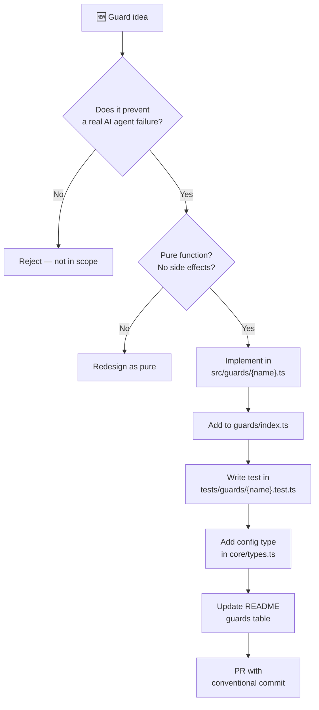

# RULE: Guard Lifecycle

> How guards are proposed, implemented, reviewed, and shipped.

## Decision Flowchart

## Guard Maturity Levels

| Level | Criteria | Config default |
|-------|----------|---------------|
| **Experimental** | New, limited real-world testing | `enabled: false` |
| **Stable** | Proven in ≥3 projects, low false-positive rate | `enabled: true` |
| **Core** | Fundamental to defend-in-depth identity | `enabled: true`, not removable |

## Evidence Requirements for New Guards

1. **Problem statement**: What AI agent behavior does this prevent?
2. **Real-world example**: Show a git diff where this guard would have caught the issue
3. **False positive analysis**: What legitimate code might this incorrectly flag?
4. **Performance impact**: Guard must complete in <100ms for typical workloads
