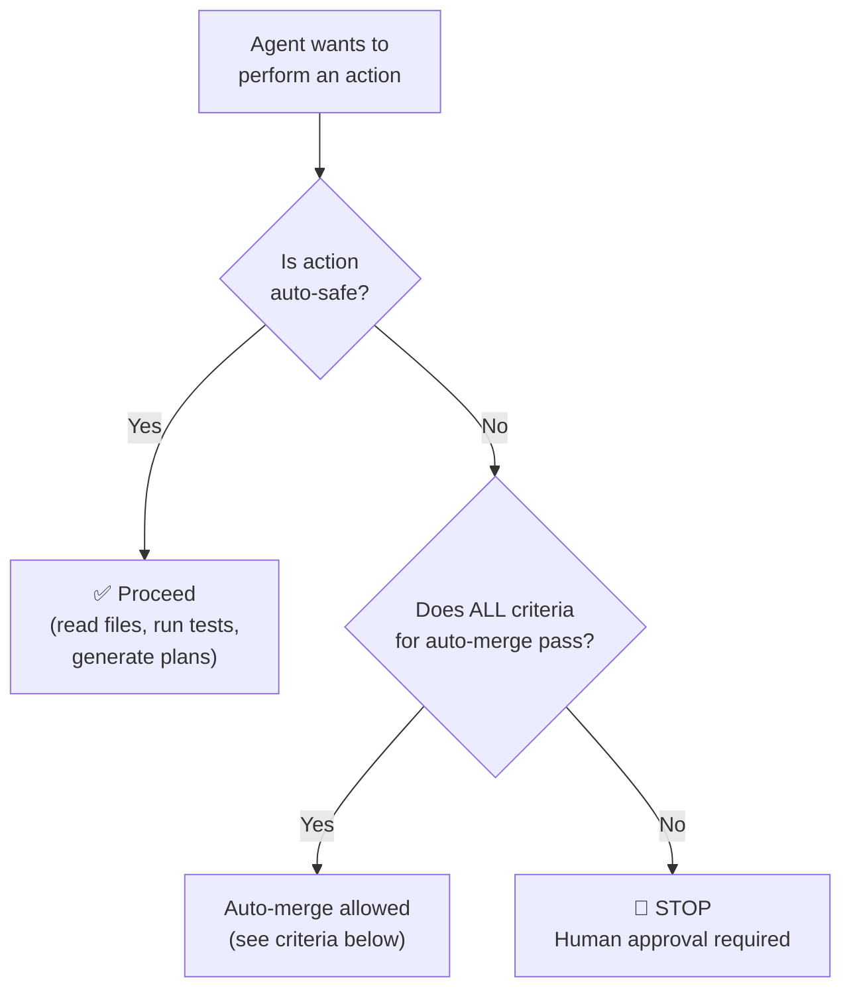

# RULE: Human-in-the-Loop Enforcement (The Supreme Rule)

> **AI proposes. Humans approve. No exceptions.**

This rule operationalizes the **HITL trunk** of [COGNITIVE_TREE.md](../philosophy/COGNITIVE_TREE.md).
Without HITL enforcement, all other rules are suggestions, not laws.

---

## Decision Flowchart



## What Agents CAN Do Autonomously

| Action | Why Allowed |
|:---|:---|
| Read any project file | Observation is safe |
| Run `defend-in-depth verify` | Guards are read-only |
| Run `defend-in-depth doctor` | Health check is read-only |
| Generate plans, drafts, proposals | Proposals don't mutate state |
| Run tests | Tests are observable, not mutative |
| Create branch + commits | Isolated work in progress |

## What Agents CANNOT Do Without Human Approval

| Action | Why Blocked | Gate |
|:---|:---|:---|
| **Merge PR to main** | Changes shared truth | Human review or auto-merge criteria |
| **Delete files from main** | Destructive, irreversible | Human approval always |
| **Change Guard interface** | Breaking change | Human maintainer review |
| **Change DefendConfig schema** | Breaking change | Human maintainer review |
| **Modify .agents/rules/** | Governance mutation | Human maintainer review |
| **Add production dependencies** | Attack surface change | Human maintainer review |

## Auto-Merge Criteria (All Must Pass)

```
✅ CI green (all 9 matrix jobs: 3 OS × 3 Node)
✅ CodeRabbit approves (LGTM)
✅ No breaking changes detected
✅ Conventional commit title format
✅ CHANGELOG updated (if user-facing change)
✅ No .agents/rules/ modifications
```

If ANY criterion fails → route to human maintainer.

## Guards Never Auto-Fix

| Guard Behavior | Why |
|:---|:---|
| Guards BLOCK (reject commit) | ✅ Correct — prevents bad state |
| Guards SUGGEST fixes | ✅ Correct — agent/human decides |
| Guards AUTO-FIX and commit | ❌ FORBIDDEN — violates HITL |

## Anti-Patterns

| ❌ Violation | ✅ Correct |
|:---|:---|
| Agent merges PR without human review | Wait for human approval or auto-merge criteria |
| Agent deletes "unused" file autonomously | Propose deletion in PR, human decides |
| Agent modifies rules to "improve" them | Propose changes, human reviews |
| Guard rewrites code it flagged | Guard blocks, suggests fix, human/agent decides |

## Executable Logic

```javascript
WARN_IF_MATCHES: /auto.*merge.*without|self.*approve|delete.*autonomously|auto.*fix.*commit/i
```
