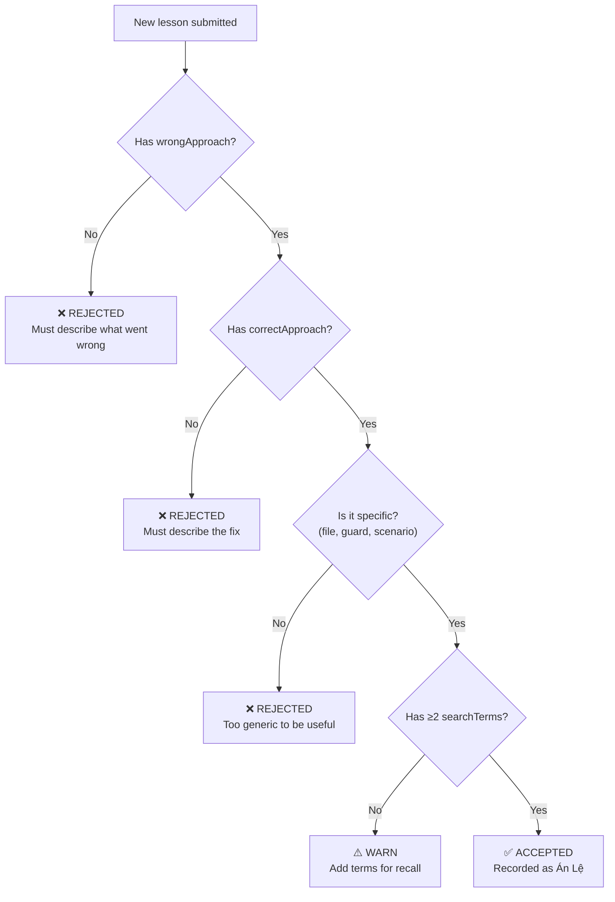

# RULE: Lesson Quality (The Specificity Gate)

> **Generic lessons are useless. Specific lessons are case law.**

This rule operationalizes the **Growth > Stasis** branch. A memory system filled
with generic advice ("test your code") is worse than no memory — it creates false
confidence that learning occurred.

---

## Decision Flowchart



## Mandatory Fields

| Field | Required | Why |
|:---|:---:|:---|
| `scenario` | ✅ | The context. What happened? |
| `wrongApproach` | ✅ | What was tried that failed? Concrete steps. |
| `correctApproach` | ✅ | What actually fixed it? Concrete steps. |
| `insight` | ✅ | The generalizable takeaway |
| `searchTerms` | ✅ (≥2) | Enables future recall |
| `tags` | ✅ (≥1) | Categorization for filtering |
| `evidenceLevel` | ✅ | How was this lesson verified? |

## Quality Rubric

| Score | Criteria | Example |
|:---:|:---|:---|
| ❌ 0 | Generic, no context | "Always write tests" |
| ❌ 1 | Has context but no wrong/correct | "The guard failed on UTF-8 files" |
| ⚠️ 2 | Has wrong/correct but vague | "Tried regex, didn't work. Used different regex." |
| ✅ 3 | Specific scenario + concrete fix | "hollow-artifact guard failed on files with UTF-8 BOM (U+FEFF) prefix because regex matched position 0 but BOM shifted content by 3 bytes. Fixed by adding BOM strip step in normalize function before pattern matching." |

**Minimum accepted score: 3.**

## Specificity Requirements

A lesson is "specific enough" when a future agent reading it can:
1. **Recognize** the same situation (scenario is concrete)
2. **Avoid** the wrong approach (wrongApproach describes actual steps taken)
3. **Apply** the correct approach (correctApproach is actionable, not advisory)
4. **Find** this lesson (searchTerms match likely queries)

## Anti-Patterns

| ❌ Rejected | ✅ Accepted |
|:---|:---|
| "Be more careful with encoding" | "Strip BOM from UTF-8 content before regex matching in guards" |
| "The test failed" | "Test failed because `fs.readFileSync` returns Buffer, not string, when no encoding specified" |
| "We learned to validate input" | "Adding `typeof input === 'string'` guard at L23 of config-loader.ts prevented `undefined.split()` crash" |

## Executable Logic

```javascript
WARN_IF_MATCHES: /always.*test|be.*careful|we.*learned.*to|remember.*to|generic.*advice/i
```
