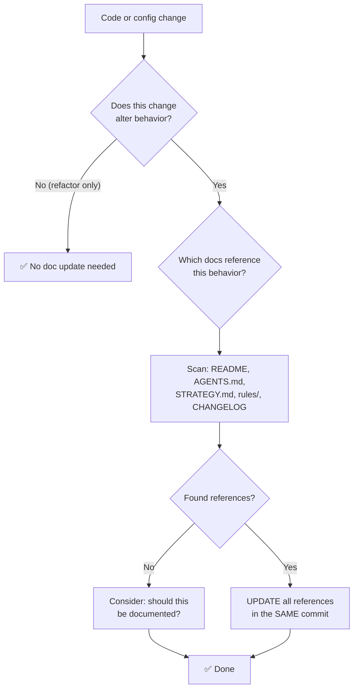

# RULE: Living Document (The Anti-Staleness Mandate)

> **A document that lies is worse than no document at all. Stale documentation is active misinformation.**

Every document in this project is a **living contract** — not a one-time artifact.
When code changes, documentation MUST change with it. A commit that changes behavior
without updating its documentation is **incomplete**.

---

## Decision Flowchart



---

## 1. The Co-Location Mandate

Documentation updates MUST be in the **same commit** as the code change.

| ✅ Do | ❌ Do Not Do |
|:---|:---|
| Update README table when adding a guard | "I'll update docs later" (you won't) |
| Update STRATEGY.md when adding rules | Separate "docs cleanup" PR weeks later |
| Update CHANGELOG when shipping features | Leave CHANGELOG stale for 3 versions |
| Update AGENTS.md when changing structure | Assume agents will "figure it out" |

---

## 2. The Staleness Detection Contract

Every document with **quantitative claims** must be verifiable:

| Claim Type | Verification Method | Example |
|:---|:---|:---|
| File counts | `find . -name "*.md" \| wc -l` | "12 mandatory rules" |
| Directory listings | `ls -la` vs documented structure | "Project has `tests/` directory" |
| Feature lists | Cross-reference with source | "5 built-in guards" |
| Version numbers | `package.json` vs docs | "v0.1.0" |
| Dependency counts | `package.json` vs claim | "1 dependency (yaml)" |

**Rule:** If a document claims a number, that number must be TRUE at the time of commit.

---

## 3. The SSoT (Single Source of Truth) Hierarchy

When information appears in multiple files, one file is the **SSoT** and others are **projections**.

| Information | SSoT | Projections (must stay in sync) |
|:---|:---|:---|
| Project rules | `.agents/rules/*.md` | README §9, COGNITIVE_TREE registry |
| Guard list | `src/guards/index.ts` | README §4 table, CONTRIBUTING.md |
| Roadmap | `STRATEGY.md` | README §11 |
| Project structure | Filesystem | README §8, AGENTS.md §3 |
| CLI commands | `src/cli/index.ts` | README §7 |

**Rule:** When the SSoT changes, ALL projections must be updated in the same commit.

---

## 4. The CHANGELOG Contract

[CHANGELOG.md](../../CHANGELOG.md) follows [Keep a Changelog](https://keepachangelog.com/):

| Section | When to Use |
|:---|:---|
| `Added` | New features, guards, commands |
| `Changed` | Behavior changes, API changes |
| `Deprecated` | Features being phased out |
| `Removed` | Deleted features |
| `Fixed` | Bug fixes |
| `Security` | Vulnerability fixes |

**Rule:** Every user-facing change MUST have a CHANGELOG entry. Internal refactors do not require one.

---

## 5. Anti-Patterns

| ❌ Anti-Pattern | Why It's Dangerous |
|:---|:---|
| "README says 3 rules, we have 12" | Agent reads wrong count, makes wrong assumptions |
| "Structure shows `tests/` but it doesn't exist" | Contributor confusion, trust erosion |
| "STRATEGY says X, reality is Y" | Strategic misinformation |
| "Docs updated in a separate PR" | Window of inconsistency; docs may never catch up |
| "Only update docs on major versions" | Minor changes accumulate into major lies |

---

## 6. Verification (Pre-Commit)

Before committing: mentally ask **"Does any document claim something that my change invalidates?"**

Key files to check:
1. `README.md` — tables, structure diagram, feature list
2. `STRATEGY.md` — heritage section, roadmap
3. `AGENTS.md` (root) — architecture map, laws
4. `.agents/AGENTS.md` — ecosystem map
5. `CHANGELOG.md` — if user-facing change

---

## Executable Logic

```javascript
WARN_IF_MATCHES: /update.*docs.*later|separate.*docs.*pr|i'll.*fix.*readme|stale.*documentation/i
```
