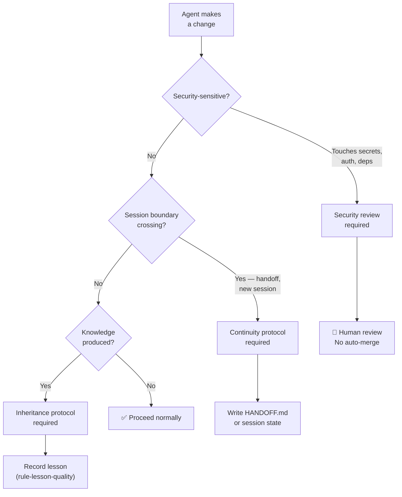

# RULE: Security, Continuity & Inheritance (The Fortress Mandate)

> **Security is not a feature. It is a property that exists or doesn't.**

This rule governs three inseparable concerns: protecting the system, ensuring
it survives across sessions, and enabling knowledge inheritance.

---

## Decision Flowchart



---

## 1. Security

### Secrets Management

| Rule | Enforcement |
|:---|:---|
| No secrets in source code | Guard + `.gitignore` |
| No API keys in commits | Pre-commit check |
| `.env` files never committed | `.gitignore` entry |
| Secrets in CI via GitHub Secrets | Never hardcoded in `.yml` |

### Dependency Security

| Rule | Enforcement |
|:---|:---|
| Maximum 3 production dependencies | `rule-consistency.md` §8 |
| No `eval()`, no `Function()` constructor | Code review |
| No dynamic `require()` from user input | Code review |
| `npm audit` clean in CI | CI pipeline |

### Security-Sensitive Changes (Always Human Review)

| Change | Why |
|:---|:---|
| Adding a new dependency | Attack surface expansion |
| Modifying guard bypass logic | Governance weakening |
| Changing file access patterns | Data exposure risk |
| Modifying CI pipeline | Supply chain risk |
| Changing authentication/authorization | Access control risk |

---

## 2. Continuity (Surviving Session Boundaries)

### The Problem

AI agent sessions are ephemeral. Knowledge gained in session N is lost in session N+1
unless explicitly persisted.

### The HANDOFF Protocol

When a session ends with incomplete work:

```markdown
# HANDOFF.md

## Current State
- What was accomplished

## Next Action
- What should happen next

## Blockers
- What's blocking progress

## Key Files
- Which files are relevant
```

### Session State Preservation

| Mechanism | Where | What |
|:---|:---|:---|
| HANDOFF.md | Project root or ticket folder | Cross-session state |
| Lessons (lessons.jsonl) | Project root | Long-term knowledge |
| Private workspace | `.gemini/`, `.claude/` | Platform memory |
| Git history | `.git/` | Code evolution record |

### Continuity Rules

1. **Fresh context > stale context** — New session + HANDOFF.md beats tired session
2. **Explicit > implicit** — Write state down, never assume next session "remembers"
3. **Git is the universal journal** — If it's not committed, it didn't happen
4. **HANDOFF.md has expiry** — Delete after consumed by next session

---

## 3. Inheritance (Knowledge Flowing Forward)

### The Inheritance Chain

```
Session work → Lessons → Guards → Rules → Philosophy
       ↑                                      │
       └──────── Applied in next session ──────┘
```

### What Gets Inherited

| Artifact | Lifespan | Mechanism |
|:---|:---|:---|
| Code (guards, engine) | Permanent | Git + npm |
| Lessons | Long-term | `lessons.jsonl` + semantic recall |
| Rules | Permanent (versioned) | `.agents/rules/` |
| Guards | Permanent (versioned) | `src/guards/` |
| Session state | Ephemeral | HANDOFF.md (consumed + deleted) |

### Inheritance Quality

Not all inherited knowledge is equal:

| Quality | Signal | Action |
|:---|:---|:---|
| **High** | Lesson with `[RUNTIME]` evidence, used ≥2 times | Keep, promote to rule if pattern |
| **Medium** | Lesson with `[INFER]` evidence, used once | Keep, verify on next occurrence |
| **Low** | Lesson with `[HYPO]` only, never recalled | Review — deprecate if stale |

### Version-Controlled Evolution

Rules and guards evolve through proper versioning:

```yaml
# In YAML frontmatter
version: 1.0.0  # Initial
version: 1.1.0  # Added new criterion
version: 2.0.0  # Breaking change (requires human review)
```

## Anti-Patterns

| ❌ Violation | ✅ Correct |
|:---|:---|
| Hardcoded API key in source | Use environment variables |
| Session ends with no HANDOFF | Write HANDOFF.md before stopping |
| Lesson never gets recalled | Add searchTerms for discoverability |
| Rule changed without version bump | Update version in frontmatter |
| Assuming next session knows context | Write explicit state |

## Executable Logic

```javascript
WARN_IF_MATCHES: /api.*key.*=|password.*=|secret.*=|eval\(|Function\(|assume.*remember/i
```
