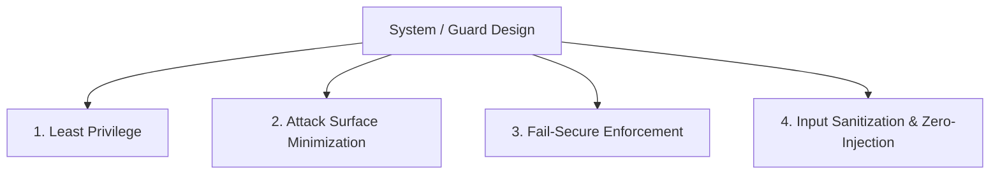

# RULE: System & Security Design Principles

> **Defense-in-depth is a security-first system. All components must embody defensive engineering principles from day one.**

---

## 1. Core Principles

### 1. Principle of Least Privilege
- **CI / Actions**: Workflows must declare minimum required permissions (`permissions: contents: read`).
- **Filesystem Access**: Core guards must only read files relevant to their checks and never write outside isolated cache directories.
- **Git Operations**: Hooks and CLI tools must use non-mutating Git commands (`git rev-list`, `git diff`) and never force state updates.

### 2. Attack Surface Minimization
- **Zero Third-Party Dependencies in Tier 0 Core**: Deterministic guards must rely strictly on Node.js built-in modules and `yaml`. No arbitrary npm packages are allowed in the critical verification path.
- **Pure Functions**: Tier 0 guards must never make network calls or spawn background threads.

### 3. Fail-Secure (Fail-Closed) vs Fail-Open
- **Crash Safety**: When a guard encounters an unexpected runtime exception, the pipeline wraps the error in `GuardCrashError` and records a hard `BLOCK` finding.
- **Degradation Policy**: Optional enhancements (such as DSPy semantic ranking or external audit endpoints) degrade to `WARN` with clear diagnostic banners, but deterministic baseline checks must always enforce `BLOCK` on violation.

### 4. Input Sanitization & Subprocess Hardening
- **No `execSync` with String Interpolation**: Always use `execFileSync` with discrete argument arrays to prevent shell injection (`sh -c` vulnerabilities).
- **Path Normalization**: All file paths from user inputs or Git diffs must be normalized and checked against directory traversal attacks (`..`).

---

## 2. Red-Teaming & Negative Contract Testing

Every guard and CLI subcommand must ship with negative contract tests that verify resistance against adversary bypasses:
1. **Shell Injection Attempts**: Verify that malformed branch names, commit messages, or filenames with shell metacharacters (`$(...)`, `;`, `&&`, `|`) do not execute arbitrary commands.
2. **Path Traversal Attacks**: Verify that paths referencing parent directories (`../../etc/passwd`) are safely contained.
3. **Regex ReDoS Resistance**: Guard patterns must use linear-time regular expressions to prevent denial-of-service on long staged inputs.
