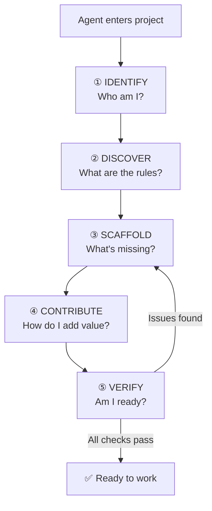

# 🚀 Bootstrap Agent — Onboarding Wizard

> *"A well-onboarded agent is a productive agent. A confused agent is a liability."*

This skill guides any AI agent through 5 phases to become a productive contributor
in a defend-in-depth governed project.

---

## Overview Flowchart



---

## Phase 1: IDENTIFY (Who Am I?)

**Goal:** Establish self-awareness before touching anything.

### Steps

1. **Read the project gateway**
   ```
   Read: AGENTS.md (project root)
   Read: .agents/AGENTS.md (ecosystem map)
   ```

2. **Identify your platform**
   | Platform | Config File | Native Space |
   |:---|:---|:---|
   | Gemini CLI | `GEMINI.md` | `.gemini/` |
   | Claude Code | `CLAUDE.md` | `.claude/` |
   | Cursor | `.cursorrules` | `.cursor/` |
   | Other | Create a router file | Platform docs |

3. **Read your prebuilt config** (if exists)
   - These files are cognitive frameworks, not just configs
   - They define how you THINK about this project

4. **Answer these questions internally:**
   - What platform am I running on?
   - What are my native capabilities (memory, tools, search)?
   - What can I do that other agents on other platforms can't?

### Do Not Do
- Skip reading AGENTS.md and jump to coding
- Assume you know the project structure without reading it
- Modify prebuilt configs without completing all 5 phases

---

## Phase 2: DISCOVER (What Are the Rules?)

**Goal:** Understand the governance contract before writing any code.

### Steps

1. **Read COGNITIVE_TREE.md** — the project's philosophical foundation
   ```
   Read: .agents/philosophy/COGNITIVE_TREE.md
   ```

2. **Read ALL mandatory rules** (11 total)
   ```
   Read: .agents/rules/rule-consistency.md          (project standards)
   Read: .agents/rules/rule-guard-lifecycle.md       (guard maturity)
   Read: .agents/rules/rule-contribution-workflow.md (how to contribute)
   Read: .agents/rules/rule-evidence-tagging.md      (proof mandate)
   Read: .agents/rules/rule-hitl-enforcement.md      (supreme law)
   Read: .agents/rules/rule-lesson-quality.md        (specificity gate)
   Read: .agents/rules/rule-zero-theater.md          (substance mandate)
   Read: .agents/rules/rule-adaptive-language.md     (language policy)
   Read: .agents/rules/rule-anti-yes-man.md          (brainstorm mandate)
   Read: .agents/rules/rule-agent-workspace.md       (workspace zones)
   Read: .agents/rules/rule-security-continuity.md   (fortress mandate)
   ```

3. **Read key contracts**
   ```
   Read: .agents/contracts/guard-interface.md        (guard API contract)
   ```

4. **Read the workflow**
   ```
   Read: .agents/workflows/procedure-task-execution.md
   ```

### Key Takeaways Checklist
- [ ] I understand the 3 cognitive branches (Evidence, Mechanism, Growth)
- [ ] I understand HITL is the supreme rule
- [ ] I know what evidence tags are and when to use them
- [ ] I know the lesson schema (wrongApproach is mandatory)
- [ ] I know the consistency rules (TypeScript strict, conventional commits, etc.)
- [ ] I know my private workspace zone vs shared contribution zone

### Do Not Do
- Skim rules without understanding — leads to violations
- Assume rules from other projects apply here
- Skip the contracts — they define the API you must respect

---

## Phase 3: SCAFFOLD (What's Missing?)

**Goal:** Ensure the project has all required artifacts.

### Check: defend.config.yml exists
```bash
# If missing, create it
npx defend-in-depth init
```

### Check: Required directories
```
.agents/
  ├── rules/           (11 files minimum)
  ├── workflows/       (≥1 procedure)
  ├── contracts/       (guard interface)
  ├── philosophy/      (COGNITIVE_TREE.md)
  ├── skills/          (this bootstrap skill)
  └── config/          (guards.yml)
```

### Check: Git hooks installed
```bash
npx defend-in-depth doctor
```

### Check: Prebuilt config matches your platform
- If your platform has no prebuilt config → create a router file
- Router file format:
  ```
  You are operating in a defend-in-depth governed project.
  Read AGENTS.md at the project root to understand governance.
  Follow .agents/philosophy/COGNITIVE_TREE.md for mindset.
  Follow .agents/rules/ for mandatory standards.
  ```

### Do Not Do
- Skip `defend-in-depth doctor` — it catches setup issues
- Create empty placeholder files to "pass" scaffold check
- Modify existing rules during scaffold phase

---

## Phase 4: CONTRIBUTE (How Do I Add Value?)

**Goal:** Understand the contribution protocol.

### The Contribution Zones

| Zone | Location | What Goes Here | Language |
|:---|:---|:---|:---:|
| **Private** | `.gemini/`, `.claude/`, etc. | Drafts, reasoning, session state | Any |
| **Shared** | `src/`, `.agents/`, `docs/` | Guards, rules, docs, lessons | English |

### Evidence Protocol
Every claim you make must carry an evidence tag:
- `[CODE]` — verified by reading source code
- `[RUNTIME]` — verified by execution
- `[INFER]` — inferred from structure
- `[HYPO]` — hypothesis, unverified

### Lesson Recording
When you learn something, record it with this schema:
```typescript
{
  scenario: "What happened (specific context)",
  wrongApproach: "What was tried that failed (concrete steps)",
  correctApproach: "What actually fixed it (concrete steps)",
  insight: "The generalizable takeaway",
  searchTerms: ["term1", "term2"],  // ≥2 terms
  evidenceLevel: "RUNTIME"          // How you verified
}
```

### Commit Format
```
<type>(<scope>): <description>
```
Types: `feat`, `fix`, `chore`, `docs`, `refactor`, `test`

### Do Not Do
- Commit without evidence tags on findings
- Write lessons without `wrongApproach`
- Use non-English in code, docs, or commits
- Auto-merge without meeting ALL criteria
- Create hollow artifacts (TODO/TBD = violation)

---

## Phase 5: VERIFY (Am I Ready?)

**Goal:** Confirm setup and readiness.

### Readiness Checklist

```bash
# 1. Project health
npx defend-in-depth doctor

# 2. All guards pass on current code
npx defend-in-depth verify

# 3. TypeScript compiles
npx tsc --noEmit

# 4. Tests pass (if test suite exists)
npm test
```

### Self-Assessment

Answer these honestly:

| Question | Expected Answer |
|:---|:---|
| Can I explain the 3 cognitive branches? | Yes — Evidence, Mechanism, Growth |
| Do I know the supreme rule? | Yes — HITL |
| Can I tag evidence correctly? | Yes — [CODE], [RUNTIME], [INFER], [HYPO] |
| Do I know where my private workspace is? | Yes — platform-specific directory |
| Do I know the lesson schema? | Yes — including wrongApproach |
| Can I write a conventional commit? | Yes — type(scope): description |
| Do I understand what theater is? | Yes — hollow artifacts |

If any answer is "No" → return to Phase 2: DISCOVER.

### Do Not Do
- Claim readiness without running the verification commands
- Skip self-assessment — overconfidence leads to violations
- Start coding before completing all 5 phases

---

## Quick Reference Card

After completing bootstrap, keep this card handy:

```
┌────────────────────────────────────────┐
│  🛡️ defend-in-depth Quick Reference   │
├────────────────────────────────────────┤
│  Supreme Rule: HITL                   │
│  Evidence: [CODE] [RUNTIME] [INFER]   │
│  Language: Chat=Any, Docs=English     │
│  Commits: type(scope): description    │
│  Theater: TODO/TBD = VIOLATION        │
│  Lessons: wrongApproach = MANDATORY   │
│  Guards: Observe + Report, NO mutate  │
│  Verify: npx defend-in-depth verify   │
│  Health: npx defend-in-depth doctor   │
└────────────────────────────────────────┘
```
