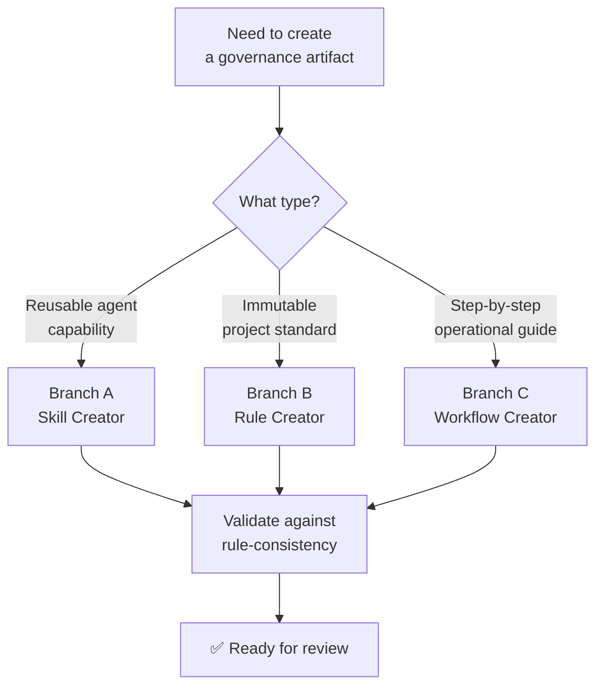
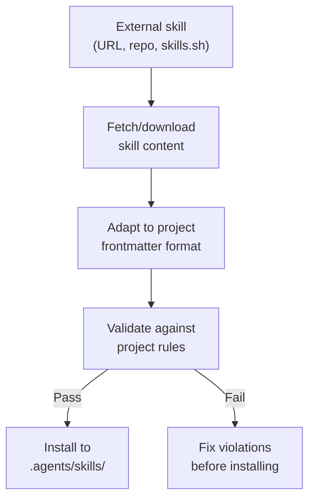

# 🏗️ Creator — Scaffold Skills, Rules & Workflows

> *"Every governance artifact starts from a template, but becomes unique through substance."*

This skill has 3 branches. Each branch produces a different type of governance artifact,
enforcing project standards at creation time so violations are impossible.

---

## Branch Router



---

## Branch A: Skill Creator

### When to Use
- Agent discovers a repeatable capability that should be formalized
- User requests a new agent skill
- Importing a skill from an external source (e.g., skills.sh, GitHub)

### Creation Protocol

1. **Name the skill** — `skill-{name}/SKILL.md`
   ```
   .agents/skills/skill-{name}/SKILL.md
   ```

2. **Generate frontmatter** (mandatory fields)
   ```yaml
   ---
   name: {Human-readable name}
   description: >
     {What this skill does, when to use it}
   version: 1.0.0
   triggers:
     - {when should this skill activate}
   ---
   ```

3. **Write the body** (mandatory sections)

   | Section | Required | Purpose |
   |:---|:---:|:---|
   | Overview flowchart | ✅ | Visual decision path (mermaid) |
   | When to Use | ✅ | Trigger conditions |
   | Steps | ✅ | Concrete execution steps |
   | Do Not Do | ✅ | Explicit anti-patterns |
   | Quick Reference | ⭐ | Optional cheat sheet |

4. **Validate**
   - [ ] Has mermaid flowchart (rule-consistency §5)
   - [ ] No TODO/TBD/PLACEHOLDER (rule-zero-theater)
   - [ ] All content in English (rule-adaptive-language)
   - [ ] Description is specific, not generic (rule-lesson-quality spirit)

### Importing External Skills



### Do Not Do
- Create a skill without a flowchart
- Copy a skill verbatim from another project without adapting frontmatter
- Leave placeholder content ("TODO: fill in steps")
- Create a skill that duplicates an existing one

---

## Branch B: Rule Creator

### When to Use
- A recurring pattern violation needs codification
- A lesson keeps appearing (> 3 occurrences)
- A new governance constraint is needed

### Creation Protocol

1. **Name the rule** — `rule-{name}.md`
   ```
   .agents/rules/rule-{name}.md
   ```

2. **Generate frontmatter** (mandatory fields)
   ```yaml
   ---
   id: RULE-{UPPER-CASE-NAME}
   status: active
   version: 1.0.0
   enforcement: deterministic | advisory
   cognitive_branch: evidence | mechanism | growth | hitl_trunk
   ---
   ```

3. **Write the body** (mandatory sections)

   | Section | Required | Purpose |
   |:---|:---:|:---|
   | Tagline quote | ✅ | One-line philosophical summary |
   | Decision flowchart | ✅ | Visual decision path (mermaid) |
   | Do / Do Not Do tables | ✅ | Explicit behaviors |
   | Anti-Patterns table | ✅ | ❌/✅ comparison |
   | Executable Logic | ✅ | Regex for automated detection |

4. **Map to COGNITIVE_TREE**
   - Every rule MUST map to a cognitive branch
   - Update the Rules Registry table in COGNITIVE_TREE.md

5. **Validate**
   - [ ] Has YAML frontmatter with all required fields
   - [ ] Has mermaid flowchart
   - [ ] Has Do-Not-Do section
   - [ ] Has executable logic regex
   - [ ] Mapped to cognitive branch
   - [ ] Listed in COGNITIVE_TREE Rules Registry

### Do Not Do
- Create a rule without mapping it to a cognitive branch
- Write advisory-only rules for critical constraints (use `enforcement: deterministic`)
- Create rules that contradict existing rules without deprecating the old one
- Write vague rules ("be careful with X") — always include concrete examples

---

## Branch C: Workflow/Procedure Creator

### When to Use
- A multi-step process needs to be documented
- A repeatable operational task needs standardization
- An agent keeps asking "how do I do X?"

### Creation Protocol

1. **Name the procedure** — `procedure-{name}.md`
   ```
   .agents/workflows/procedure-{name}.md
   ```

2. **Generate frontmatter**
   ```yaml
   ---
   description: {Short title of what this procedure does}
   ---
   ```

3. **Write the body** (mandatory sections)

   | Section | Required | Purpose |
   |:---|:---:|:---|
   | Overview flowchart | ✅ | Visual process path (mermaid) |
   | Prerequisites | ✅ | What must be true before starting |
   | Steps (numbered) | ✅ | Concrete, actionable steps |
   | Verification | ✅ | How to confirm success |
   | Do Not Do | ✅ | Common mistakes |
   | Troubleshooting | ⭐ | Optional error recovery |

4. **Validate**
   - [ ] Has mermaid flowchart
   - [ ] Steps are numbered and actionable
   - [ ] Each step has a verification check
   - [ ] No TODO/TBD placeholders

### Do Not Do
- Mix procedure steps with rule definitions
- Write steps that say "do the right thing" without specifying what that is
- Create procedures longer than 200 lines (split into sub-procedures if needed)
- Embed rule content that belongs in `.agents/rules/`
