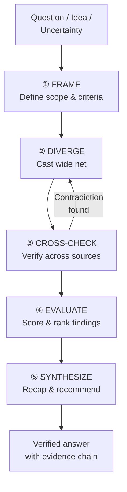
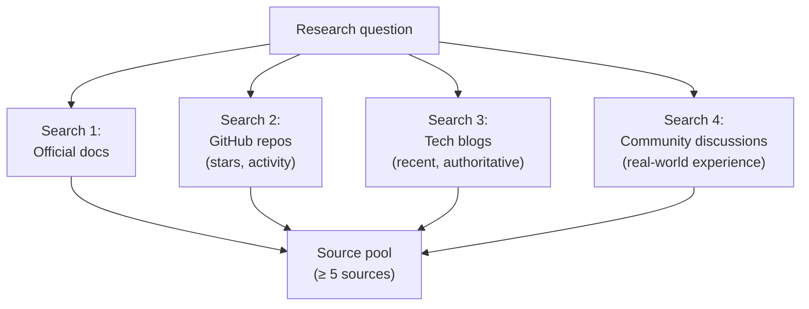
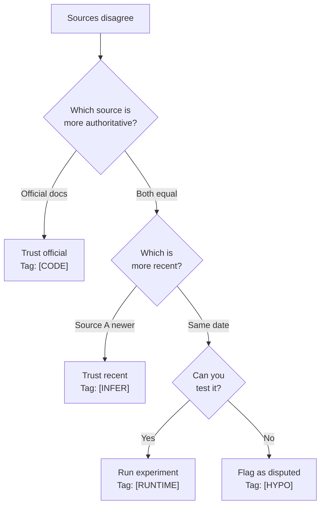

# 🔬 Deep Research — From Question to Verified Answer

> *"A question without research is an opinion. Research without cross-checking is propaganda."*

This skill transforms questions, ideas, and uncertainties into verified,
evidence-tagged intelligence through a structured research pipeline.

---

## Research Pipeline



---

## Phase ①: FRAME — Define the Research Scope

Before searching anything, define what you're looking for and how you'll judge it.

### Scope Template

```markdown
**Question:** {The precise question to answer}
**Type:** comparison | evaluation | exploration | fact-check
**Criteria:** {What makes an answer good?}
**Constraints:** {Time, language, recency, domain}
**Anti-Goals:** {What we're NOT trying to learn}
```

### Evaluation Criteria (pick relevant ones)

| Criterion | Description | Weight |
|:---|:---|:---:|
| **Recency** | When was this published/updated? | 🔴 High |
| **Authority** | Who published it? (official docs > blog > forum) | 🔴 High |
| **Relevance** | Does it answer the actual question? | 🔴 High |
| **Adoption** | How widely used/starred/downloaded? | 🟡 Medium |
| **Consensus** | Do multiple independent sources agree? | 🟡 Medium |
| **Depth** | Surface overview vs deep technical detail? | 🟢 Low |

### Do Not Do
- Start searching before defining what you're looking for
- Search with vague queries ("best framework 2024")
- Set no criteria — you'll drown in results without a filter

---

## Phase ②: DIVERGE — Cast a Wide Net

Search broadly across multiple source categories:

### Source Categories

| Category | Sources | Trust Level |
|:---|:---|:---:|
| **Official** | Docs, specs, RFCs, GitHub repos | 🟢 High |
| **Academic** | Papers, conferences, research labs | 🟢 High |
| **Industry** | Tech blogs (major cos), benchmark reports | 🟡 Medium |
| **Community** | Stack Overflow, Reddit, HN, Discord | 🟠 Low-Med |
| **Individual** | Personal blogs, tutorials, tweets | 🔴 Low |

### Search Strategy



### For Each Source, Record

| Field | Description |
|:---|:---|
| URL | The source link |
| Title | Article/doc title |
| Author/Org | Who published it |
| Date | When published/updated |
| Category | Official/Academic/Industry/Community/Individual |
| Key Claims | What does this source say? (summarize in ≤ 3 points) |

### Do Not Do
- Rely on a single source — minimum 5 sources for any research
- Search only one category — always include at least 2 categories
- Ignore publication date — a 2020 article about 2024 tech is dangerously outdated
- Accept the first result — the best answer is rarely the first one

---

## Phase ③: CROSS-CHECK — Verify Across Sources

The most critical phase. No claim is accepted until verified by ≥ 2 independent sources.

### Cross-Check Matrix

| Claim | Source A | Source B | Source C | Verdict |
|:---|:---:|:---:|:---:|:---|
| {Claim 1} | ✅ Confirms | ✅ Confirms | — | **Verified** |
| {Claim 2} | ✅ Confirms | ❌ Contradicts | ✅ Confirms | **Disputed** — investigate |
| {Claim 3} | ✅ Confirms | — | — | **Unverified** — needs more sources |

### Contradiction Resolution



### Do Not Do
- Accept a claim from a single source as fact
- Ignore contradictions — they are the most valuable signals
- Trust a blog post over official documentation
- Skip date verification — tech information has a half-life

---

## Phase ④: EVALUATE — Score & Rank

Score each finding against the criteria defined in Phase ①.

### Scoring Template

| Finding | Recency | Authority | Relevance | Adoption | Consensus | Total |
|:---|:---:|:---:|:---:|:---:|:---:|:---:|
| {Finding A} | 5/5 | 4/5 | 5/5 | 3/5 | 4/5 | **21/25** |
| {Finding B} | 3/5 | 5/5 | 4/5 | 5/5 | 5/5 | **22/25** |
| {Finding C} | 2/5 | 2/5 | 3/5 | 1/5 | 2/5 | **10/25** |

### Evidence Level Assignment

| Score Range | Evidence Level | Meaning |
|:---:|:---|:---|
| 20-25 | `[RUNTIME]` or `[CODE]` | Strong, verified evidence |
| 15-19 | `[INFER]` | Reasonable confidence, pattern-based |
| 10-14 | `[HYPO]` | Hypothesis, needs more verification |
| < 10 | Drop | Not trustworthy enough to include |

### Do Not Do
- Include low-score findings without flagging their evidence level
- Let personal preference override scoring data
- Skip scoring because "the answer is obvious"

---

## Phase ⑤: SYNTHESIZE — Recap & Recommend

Produce a structured research report.

### Output Template

```markdown
## Research Report: {Question}

### Executive Summary
{2-3 sentences answering the original question}

### Methodology
- Sources consulted: {N}
- Source categories: {list}
- Cross-checks performed: {N}

### Key Findings

| # | Finding | Evidence | Sources |
|:---|:---|:---:|:---|
| 1 | {finding} | [RUNTIME] | {source links} |
| 2 | {finding} | [INFER] | {source links} |

### Contradictions & Disputes
{Any unresolved disagreements between sources}

### Recommendation
{What the agent recommends, with reasoning}

### Confidence Level
{HIGH / MEDIUM / LOW — justified by evidence quality}

### Source Registry
| # | Source | Category | Date | Trust |
|:---|:---|:---|:---|:---:|
| 1 | {URL} | Official | 2024-01 | 🟢 |
| 2 | {URL} | Community | 2023-11 | 🟠 |
```

### Do Not Do
- Present findings without citing sources
- Give a recommendation without explaining the reasoning
- Hide low confidence behind assertive language
- Skip the contradictions section — honesty builds trust
- Present research as exhaustive when time-boxed — state limitations

---

## Quick Reference

```
┌────────────────────────────────────┐
│  🔬 Deep Research Pipeline         │
├────────────────────────────────────┤
│  ① FRAME    — Define question      │
│  ② DIVERGE  — ≥5 sources, ≥2 cats │
│  ③ CROSS    — ≥2 sources per claim│
│  ④ EVALUATE — Score & evidence tag │
│  ⑤ SYNTH    — Report + recommend  │
├────────────────────────────────────┤
│  Trust: Docs > Papers > Blogs     │
│  Min sources: 5                   │
│  Cross-check: 2+ per claim        │
│  Evidence: [CODE] [RUNTIME]       │
│            [INFER] [HYPO]         │
└────────────────────────────────────┘
```
