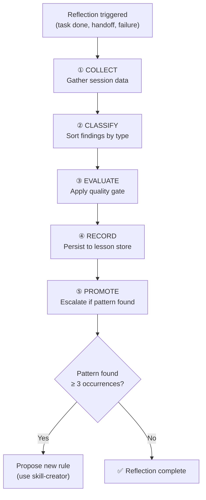
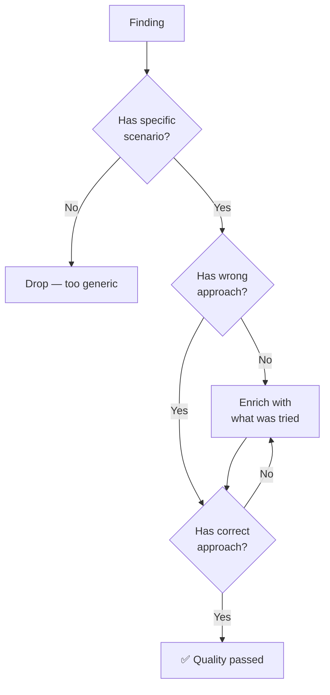
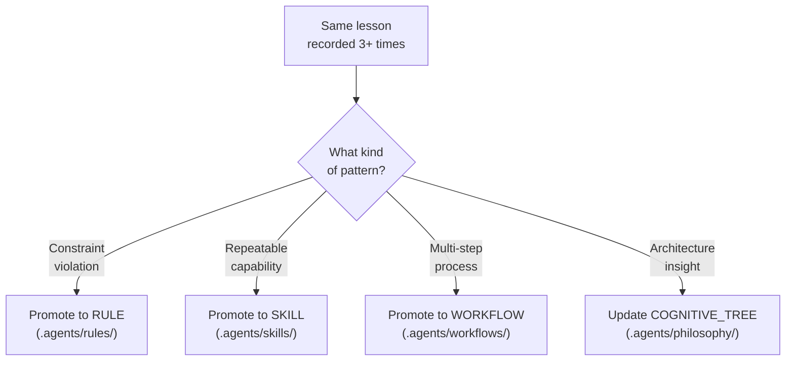

# 🪞 Self Reflection — The Growth Engine

> *"An unreflected session is a wasted session. Friction that isn't captured is friction repeated."*

This skill operationalizes the **Growth Flywheel** from [COGNITIVE_TREE.md](../../philosophy/COGNITIVE_TREE.md):
ACCEPT → SLAP → TRUST → GROW.

---

## Reflection Flowchart



---

## Phase ①: COLLECT — Gather Session Data

Review the work done and answer these questions:

| Question | Evidence Source |
|:---|:---|
| What was the task? | Ticket/task description |
| What did I plan to do? | Implementation plan |
| What did I actually do? | Git diff, file changes |
| What went wrong? | Error logs, failed attempts |
| What went right? | Successful verifications |
| What surprised me? | Unexpected behaviors, edge cases |
| What took longer than expected? | Time/effort observations |

### Do Not Do
- Skip collection because "nothing interesting happened"
- Rely on memory instead of evidence (check actual diffs)
- Collect only successes — failures are the richest learning source

---

## Phase ②: CLASSIFY — Sort Findings

Each finding gets classified into exactly one category:

| Tag | Meaning | Example |
|:---|:---|:---|
| `[DEBT]` | Technical debt introduced | "Used `any` type to bypass strict mode" |
| `[NUGGET]` | Valuable pattern discovered | "BOM stripping must happen before regex" |
| `[GAP]` | Missing capability or documentation | "No guard for YAML syntax validation" |
| `[FRICTION]` | Process that slowed work | "Had to read 5 files to understand config flow" |
| `[WIN]` | Something that worked well | "Evidence tagging caught a false assumption early" |

### Do Not Do
- Tag everything as `[NUGGET]` — be honest about debt and gaps
- Use generic descriptions — be specific about file, line, context
- Skip `[FRICTION]` items — they are seeds for process improvement

---

## Phase ③: EVALUATE — Apply Quality Gate

Every finding must pass the quality gate from [rule-lesson-quality](../../rules/rule-lesson-quality.md):



### Quality Score (required ≥ 3)

| Score | Criteria |
|:---:|:---|
| ❌ 0 | Generic, no context |
| ❌ 1 | Has context but no wrong/correct approach |
| ⚠️ 2 | Has approaches but vague |
| ✅ 3 | Specific scenario + concrete wrong + correct approaches |

### Do Not Do
- Record "always test your code" — rejected (score 0)
- Record "the guard failed" without explaining WHY — rejected (score 1)
- Skip the quality gate because "it's obvious" — nothing is obvious

---

## Phase ④: RECORD — Persist to Lesson Store

Format each qualified finding as a lesson:

```typescript
{
  scenario: "Guard hollow-artifact failed on UTF-8 files with BOM",
  wrongApproach: "Applied regex pattern at position 0, BOM shifted content by 3 bytes, false negative",
  correctApproach: "Added BOM detection (0xEF,0xBB,0xBF) and strip step in normalize() before pattern matching",
  insight: "Always normalize text encoding before applying content-matching patterns",
  searchTerms: ["BOM", "UTF-8", "regex", "hollow-artifact", "normalize"],
  tags: ["guard", "encoding", "false-negative"],
  evidenceLevel: "RUNTIME",
  relatedFiles: ["src/guards/hollow-artifact.ts"]
}
```

### Storage Location

| Project Has | Store In |
|:---|:---|
| `lessons.jsonl` | Append to file |
| Memory MCP | Call `record_lesson` tool |
| Neither | Create `lessons.jsonl` at project root |

### Do Not Do
- Store lessons in private workspace only — they must be git-tracked
- Skip `searchTerms` — a lesson that can't be recalled doesn't exist
- Use `[HYPO]` evidence level for verified findings — promote to `[RUNTIME]`

---

## Phase ⑤: PROMOTE — Escalate Patterns

When a pattern appears ≥ 3 times across sessions:



### Promotion Protocol
1. Count occurrences of similar lessons
2. If ≥ 3 → identify the pattern
3. Use [skill-creator](../skill-creator/SKILL.md) to create the appropriate artifact
4. Cross-reference the original lessons as evidence

### Do Not Do
- Promote after just 1 occurrence — wait for the pattern to confirm
- Create a rule that contradicts an existing one — update the existing rule instead
- Promote without evidence — the lesson chain IS the evidence

---

## Reflection Output Template

```markdown
## Session Reflection — {date}

### Summary
{1-2 sentences on what was accomplished}

### Findings

| # | Tag | Finding | Quality |
|:---|:---|:---|:---:|
| 1 | [NUGGET] | {specific finding} | ✅ 3 |
| 2 | [DEBT] | {specific debt} | ✅ 3 |
| 3 | [FRICTION] | {specific friction} | ✅ 3 |

### Lessons Recorded
- {lesson 1 — scenario + insight}
- {lesson 2 — scenario + insight}

### Promotion Candidates
- {pattern seen N times — candidate for rule/skill/workflow}

### HANDOFF (if session ending)
- Current state: {what's done}
- Next action: {what should happen next}
- Key files: {relevant paths}
```
