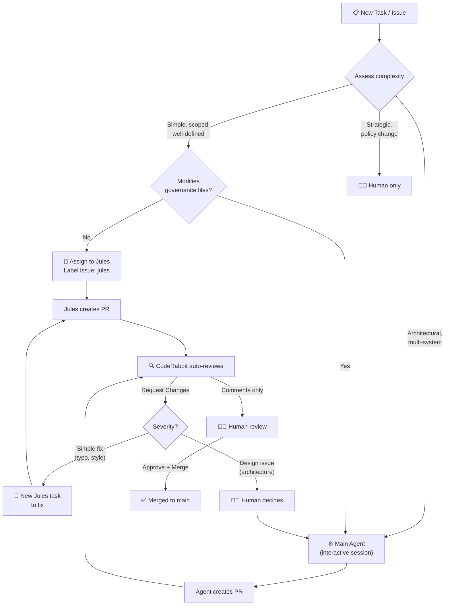
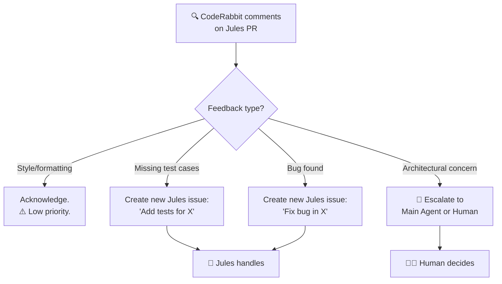

# Workflow: Multi-Agent Coordination

> **Scope: DiD Internal Operational Strategy**
>
> This workflow documents how defense-in-depth's development team (human +
> operational agents) leverages external AI tools (Jules, CodeRabbit) to
> optimize the development pipeline. NOT a requirement for DiD users.

## Agent Classification

- **Operational Agents** (Human + Main Agent): Core team. Human commands,
  Main Agent (Gemini/Claude) executes. Interactive, real-time, trusted.
- **External Agents** (Jules, CodeRabbit): Third-party tools. Async,
  autonomous within boundaries, constrained by config files.

## Decision Flowchart: Who Should Do This Task?

## Task Suitability Matrix

| Task Type | Jules | Main Agent | Human |
|---|:---:|:---:|:---:|
| Write new tests | ✅ Best | ✅ OK | ⚠️ Slow |
| Fix bug (clear repro) | ✅ Best | ✅ OK | ⚠️ Slow |
| Add JSDoc/TSDoc | ✅ Best | ✅ OK | ❌ Waste |
| Update docs | ✅ Best | ✅ OK | ⚠️ Slow |
| Simple refactoring | ✅ Best | ✅ OK | ⚠️ Slow |
| New guard (template) | ⚠️ Maybe | ✅ Best | ⚠️ Slow |
| Architectural change | ❌ Avoid | ✅ Best | ✅ Oversight |
| Type system changes | ❌ Avoid | ✅ Best | ✅ Oversight |
| Governance changes | ❌ Avoid | ❌ Avoid | ✅ Only |
| Security patches | ❌ Avoid | ⚠️ Maybe | ✅ Best |
| Breaking changes | ❌ Avoid | ⚠️ Maybe | ✅ Required |

## Jules Task Lifecycle

### Creating a Jules Task

1. **Create GitHub Issue** with clear, specific description:
   - ✅ "Add edge-case tests for `HttpTicketProvider.resolve()` covering timeout and malformed JSON"
   - ❌ "Improve test coverage" (too vague)

2. **Add label `jules`** to the issue

3. **Jules auto-detects** the issue, reads `AGENTS.md`, generates a plan

4. **Review the plan** on [jules.google.com](https://jules.google.com) — approve or revise

5. **Jules executes**, runs tests, creates branch + PR

6. **CodeRabbit reviews** the PR automatically

7. **Human reviews** and merges (if all checks pass)

### Handling CodeRabbit Feedback on Jules PRs

## Conflict Resolution

### Branch Conflicts

If Jules and Main Agent create PRs that touch the same files:
1. **Main Agent PR takes priority** (architectural authority)
2. Close the Jules PR
3. Re-create Jules issue to work on top of the merged Main Agent changes

### Review Disagreements

If CodeRabbit and human disagree:
1. **Human always wins** (HITL enforcement)
2. CodeRabbit's feedback is logged but overridable
3. Human documents rationale in PR comment for audit trail

---

## Anti-Patterns

| ❌ Don't | ✅ Do Instead |
|---|---|
| Give Jules vague tasks | Write specific, scoped issue descriptions |
| Let Jules modify governance files | Use `feat/jules-<description>` for non-governance tasks |
| Auto-merge Jules PRs | Always require human review |
| Ignore CodeRabbit feedback | Address or explicitly acknowledge each comment |
| Run multiple Jules tasks on overlapping files | Serialize related tasks |
| Use Jules for exploratory/research work | Use Main Agent interactively |
