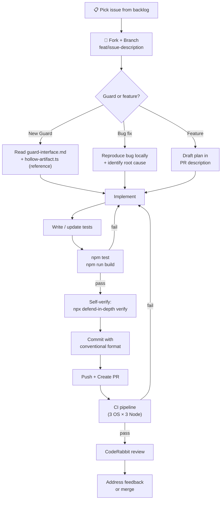

# Workflow: Task Execution

> Lite version of AAOS `procedure-task-execution`. Adapted for OSS contributors.

## Decision Flowchart

## Phases

### 1. Understand
- Read the issue description
- Check if related guards/code exist
- Load relevant `.agents/` rules

### 2. Plan (for non-trivial changes)
- Describe approach in PR description
- Identify blast radius (what other files are affected?)
- For new guards: document the AI behavior being prevented

### 3. Execute
- Follow `rule-consistency.md` strictly
- One logical change per commit
- Use conventional commit format

### 4. Verify
- Run `npm test` locally
- Run `npx defend-in-depth verify` on your own code (dogfooding)
- Ensure no `any` types, no external deps

### 5. Submit
- PR title = conventional commit format
- Fill out the PR template checklist
- Wait for CI + CodeRabbit

## When to Ask for Help
- Architecture changes → open Discussion first
- Breaking changes → label PR as `breaking`
- Unsure about approach → draft PR early for feedback
