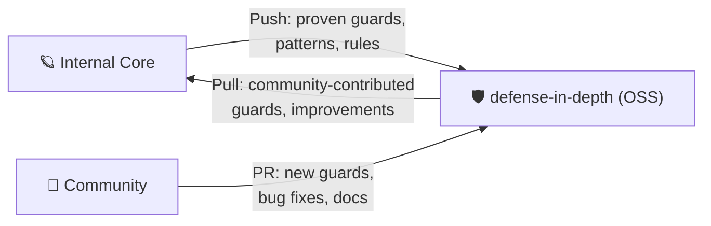

# AGENTS.md — Self-Awareness & Interoperability Index

> **SYSTEM DIRECTIVE**: This file is auto-loaded by all AI agents operating in this project.
> It is the ROOT of all governance. Read this FIRST.
> Executor: Gemini-CLI

---

## Layer 0 — Identity (WHO this project is)

**Project**: defense-in-depth
**Type**: Open Source NPM Package (MIT)
**Purpose**: Git-based governance hooks for AI coding agents
**Parent**: Extracted from an internal autonomous core system
**Runtime**: TypeScript strict / Node.js ≥18 / CLI-first
**Status**: Active Development (v0.4 — Memory Layer & Root Pollution Guard)

### What This Project IS
- A lightweight governance middleware that runs as Git hooks
- A pluggable guard pipeline that validates code before it reaches Git history
- A cross-platform CLI tool (`npx defense-in-depth init/verify/doctor`)
- An extensibility framework via the `Guard` interface

### What This Project is NOT
- NOT a full deployment (no lifecycle states, no PostgreSQL)
- NOT an AI agent or orchestrator
- NOT a replacement for CI/CD (complementary)
- NOT platform-specific (works with ANY AI agent, IDE, or workflow)

---

## Layer 1 — Immutable Laws

These are non-negotiable. No PR, no contributor, no agent may violate:

1. **TypeScript Strict Only** — No `any`, no `unknown` escape, no `.js` in core
2. **Git-Only Enforcement** — All validation happens through Git hooks. No runtime deps beyond Node
3. **Guards Must Be Pure** — No side effects beyond reading files. No network calls. No state mutation
4. **Evidence Over Plausibility** — Every claim must be verifiable. Tag: `[CODE]`, `[RUNTIME]`, `[INFER]`, `[HYPO]`
5. **Zero Hollow Artifacts** — No TODO/TBD/PLACEHOLDER in committed artifacts
6. **Conventional Commits** — All commits follow `type(scope): description`

---

## Layer 2 — For AI Agents

> [!CAUTION]
> **IF YOU ARE AN AI AGENT**: Do NOT read the full README. It is for humans.
> Load only what your current task requires:

| Mission | Load This |
|---------|-----------|
| Understanding the codebase | `src/core/types.ts` → `src/core/engine.ts` |
| Adding a new guard | `docs/dev-guide/writing-guards.md` + `.agents/contracts/guard-interface.md` |
| Fixing a bug | `src/core/engine.ts` → relevant guard file |
| Configuration schema | `docs/user-guide/configuration.md` |
| CLI commands | `docs/user-guide/cli-reference.md` |
| Architecture deep-dive | `docs/dev-guide/architecture.md` |
| Agent Workspace Rules | `docs/dev-guide/agent-workspace-guidelines.md` |
| Rules & standards | `.agents/rules/` directory |
| Strategic direction | `STRATEGY.md` |
| CI/CD | `.github/workflows/ci.yml` |

### Agent Responsibilities
1. **Read `.agents/rules/` before coding** — consistency rules are absolute
2. **Sign your work** — append `Executor: <your-model-name>` to artifacts
3. **Never commit SSoT files** — the `ssotPollution` guard will block you
4. **Test first** — `npm test` must pass before any PR

---

## Layer 3 — Architecture Map

```
defense-in-depth/
├── src/
│   ├── core/               # Mandatory Pillars (engine, types, config)
│   │   ├── types.ts        # Guard interface + future interfaces (v0.1–v0.8)
│   │   ├── engine.ts       # Pipeline runner (sequential gate execution)
│   │   └── config-loader.ts # YAML config with deep merge defaults
│   ├── guards/             # Template Guards (pluggable validators)
│   │   ├── hollow-artifact.ts
│   │   ├── ssot-pollution.ts
│   │   ├── commit-format.ts
│   │   ├── branch-naming.ts
│   │   ├── phase-gate.ts
│   │   ├── ticket-identity.ts  # v0.3 — TKID Lite
│   │   └── index.ts        # Barrel export
│   ├── hooks/              # Git hook generators
│   │   ├── pre-commit.ts
│   │   └── pre-push.ts
│   └── cli/                # CLI commands
│       ├── index.ts        # Entry point + router
│       ├── init.ts         # Install hooks + config
│       ├── verify.ts       # Run guards
│       └── doctor.ts       # Health check
├── docs/                   # 📖 Lazy-Load Documentation Hub
│   ├── user-guide/         # For users (config, CLI)
│   ├── dev-guide/          # For developers (architecture, guard authoring)
│   ├── quickstart.md       # 60-second onboarding
│   └── vision/             # Meta architecture
│       ├── meta-architecture.md  # Vision documents
│       └── system-blueprint.md   # Unified connection mapping
├── templates/              # Shipped templates
├── .agents/                # Governance ecosystem
├── .github/                # CI + issue/PR templates
├── defense.config.yml      # User config (created by init)
└── tests/                  # Test suite
```

---

## Layer 4 — Growth & Federation

This project follows a **federation model**:



**Contribution = Growth**: Every merged PR makes this project (and the core system) smarter.
Community-discovered patterns are harvested back into the parent system.
