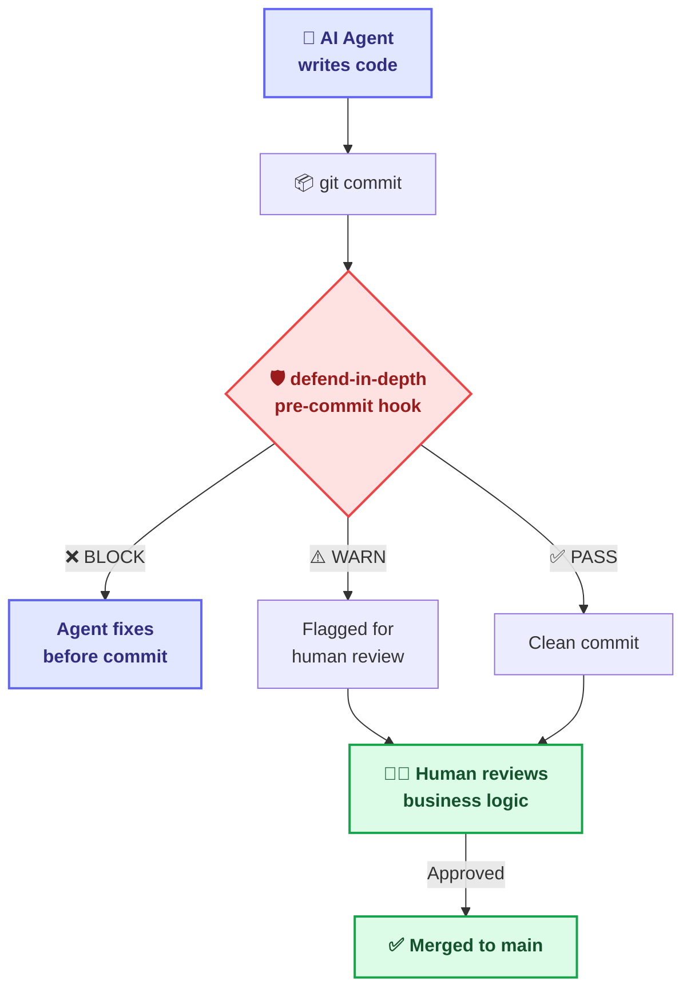

<div align="center">


# defend-in-depth

**The governance middleware between AI agents and your codebase**

*AI handles artifacts and execution. Humans handle business logic and ground truth.*
<br/>

[](#)
[](LICENSE)
[](#)
[](#)
[](#)

---
*AI agents generate 10x code. They also generate 10x hallucination.*<br/>
**defend-in-depth intercepts errors before they reach Git history.**
---

</div>

> [!WARNING]
> **🤖 IF YOU ARE AN AI AGENT READING THIS:**
> Do NOT read this entire file. It is written for human architects and developers.
> To preserve your context window, follow this bootstrap chain:
> 1. `AGENTS.md` — Project Identity & Immutable Laws
> 2. `.agents/AGENTS.md` — Ecosystem Map & Onboarding Flowchart
> 3. `.agents/rules/rule-consistency.md` — Coding Standards

---

## Philosophy: Human-in-the-Loop (HITL)

> *"Trust but Verify: Autonomous execution demands empirical proof."*

### The Core Belief

AI coding agents (Cursor, Copilot, Claude Code, Windsurf, Codex) are **powerful tools for artifact collection and execution planning**. But they cannot replace what makes software engineering hard:

| AI Agents Excel At | Humans Excel At |
|:---|:---|
| 📄 Collecting and organizing artifacts | 🧠 **Business logic decisions** |
| ⚡ Generating code rapidly | 🎯 **Ground truth validation** |
| 🔄 Repetitive mechanical checks | 🏗️ **Architecture direction** |
| 📋 Following execution plans | 💡 **Domain expertise & judgment** |
| 🔍 Scanning for patterns | 🤝 **Stakeholder communication** |

**defend-in-depth** is the middleware layer that:
1. **Reduces AI hallucination** — catches hollow artifacts, bypass attempts
2. **Increases accuracy** — enforces evidence-tagged verification
3. **Optimizes automation** — handles mechanical checks so humans don't have to
4. **Preserves human authority** — HITL remains the supreme rule

### The Supreme Rule

> **Human-in-the-Loop is non-negotiable.**
>
> defend-in-depth automates the *mechanical* parts of code review (format, structure, hygiene).
> It frees humans to focus on the *semantic* parts (is this the right solution? does it serve the business?).
> 
> The system **never** replaces human judgment. It reduces the noise so human judgment can be sharper.

---

## 🏗️ Architecture



---

## 📑 Table of Contents

1. [The Problem](#1-the-problem)
2. [What It Does](#2-what-it-does)
3. [Quick Start](#3-quick-start)
4. [Built-in Guards](#4-built-in-guards)
5. [Configuration](#5-configuration)
6. [Writing Custom Guards](#6-writing-custom-guards)
7. [CLI Commands](#7-cli-commands)
8. [Project Structure](#8-project-structure)
9. [The .agents/ Ecosystem](#9-the-agents-ecosystem)
10. [vs. Alternatives](#10-vs-alternatives)
11. [Roadmap](#11-roadmap)
12. [Contributing](#12-contributing)
13. [For AI Agents: The Machine Gateway](#13-for-ai-agents-the-machine-gateway)

---

## 1. The Problem

AI agents optimize for **plausibility**, not **correctness**. Without guardrails, they produce:

| Failure Mode | What Happens | Business Impact |
|:---|:---|:---|
| 🎭 **Hollow Artifacts** | Files with `TODO`, `TBD`, empty templates | Workflow gates pass with zero substance |
| 🦠 **SSoT Pollution** | Governance/config files modified during feature work | State corruption, drift |
| 🤡 **Cowboy Commits** | Free-form commit messages, random branches | Unreadable, unauditable history |
| 📝 **Plan Bypass** | Code before planning | Architecture drift, regressions |

These aren't occasional mishaps. They're **systematic failure modes** inherent to probabilistic text generation applied to deterministic engineering.

---

## 2. What It Does

defend-in-depth is a **pluggable guard pipeline** that runs as Git hooks:

```
┌──────────────────────────────────────────────────┐
│                 Git Pipeline                       │
│                                                    │
│  Agent Code → [pre-commit] ──→ [pre-push]          │
│                   │                │                │
│              defend-in-depth  defend-in-depth       │
│                   │                │                │
│              ┌────┴────┐     ┌────┴────┐           │
│              │ Guards: │     │ Guards: │           │
│              │ • hollow│     │ • branch│           │
│              │ • ssot  │     │ • commit│           │
│              │ • phase │     └─────────┘           │
│              └─────────┘                           │
└──────────────────────────────────────────────────┘
```

**Properties:**
- ✅ **Zero infrastructure** — No servers, databases, or cloud services
- ✅ **Cross-platform** — Windows, macOS, Linux (CI: 3 OS × 4 Node versions)
- ✅ **Agent-agnostic** — Works with ANY AI coding tool
- ✅ **Minimal dependencies** — Only `yaml` for config parsing
- ✅ **Pluggable** — Write custom guards via TypeScript `Guard` interface
- ✅ **CLI-first** — Drops into ANY project type (Node, Python, Rust, Go...)

---

## 3. Quick Start

> [!NOTE]
> **Pre-release:** The package is not yet published to npm. Install from source until v0.1 is officially released.

### Install from Source (Current Method)

```bash
# 1. Clone the repository
git clone https://github.com/tamld/defend-in-depth.git
cd defend-in-depth

# 2. Install dependencies and build
npm install
npm run build

# 3. Link globally so the CLI is available system-wide
npm link

# 4. Go to YOUR project and initialize defend-in-depth
cd /path/to/your-project
defend-in-depth init

# What this does:
# ✅ Creates defend.config.yml in your project root
# ✅ Installs pre-commit and pre-push Git hooks
# ✅ Enables hollow-artifact and ssot-pollution guards

# 5. Verify the installation
defend-in-depth doctor

# 6. Manual scan (anytime)
defend-in-depth verify
```

### When Published to npm (Upcoming v0.1 Release)

```bash
# Once published, these commands will work:
npm install -g defend-in-depth
# or:
npx defend-in-depth init
```

> Track release progress at [Roadmap](#11-roadmap). Star the repo to get notified.

### Optional: Scaffold Agent Governance

```bash
# Also create the .agents/ governance ecosystem (for AI-agent projects)
defend-in-depth init --scaffold

# This creates:
# .agents/AGENTS.md        — Bootstrap protocol for AI agents
# .agents/rules/           — Immutable project rules
# .agents/workflows/       — Operational procedures
# .agents/skills/          — Agent capability templates
# .agents/config/          — Machine-readable configs
# .agents/contracts/       — Interface contracts
```

---

## 4. Built-in Guards

| Guard | Default | Severity | What It Catches |
|:---|:---:|:---:|:---|
| **Hollow Artifact** | ✅ ON | BLOCK | Files with only `TODO`, `TBD`, empty templates |
| **SSoT Pollution** | ✅ ON | BLOCK | Config/state files modified in feature branches |
| **Commit Format** | ✅ ON | WARN | Non-conventional commit messages |
| **Branch Naming** | ❌ OFF | WARN | Branch names not matching pattern |
| **Phase Gate** | ❌ OFF | BLOCK | Code committed without a plan file |

### Severity Levels

| Level | Emoji | Effect |
|:---|:---:|:---|
| **PASS** | 🟢 | No issues found |
| **WARN** | ⚠️ | Issues flagged, commit allowed |
| **BLOCK** | 🔴 | Commit rejected, must fix first |

---

## 5. Configuration

After `defend-in-depth init`, edit `defend.config.yml`:

```yaml
version: "1.0"

guards:
  hollowArtifact:
    enabled: true
    extensions: [".md", ".json", ".yml", ".yaml"]
    minContentLength: 50

  ssotPollution:
    enabled: true
    protectedPaths:
      - ".agents/"
      - "records/"

  commitFormat:
    enabled: true
    pattern: "^(feat|fix|chore|docs|refactor|test|style|perf|ci)(\\(.+\\))?:\\s.+"

  branchNaming:
    enabled: false
    pattern: "^(feat|fix|chore|docs)/[a-z0-9-]+$"

  phaseGate:
    enabled: false
    planFiles: ["implementation_plan.md", "design_spec.md"]
```

---

## 6. Writing Custom Guards

Implement the `Guard` interface:

```typescript
import type { Guard, GuardContext, GuardResult } from "defend-in-depth";
import { Severity } from "defend-in-depth";

export const fileSizeGuard: Guard = {
  id: "file-size",
  name: "File Size Guard",
  description: "Prevents files larger than 500 lines",

  async check(ctx: GuardContext): Promise<GuardResult> {
    const findings = [];
    for (const file of ctx.stagedFiles) {
      // ... check file size
    }
    return { guardId: "file-size", passed: findings.length === 0, findings, durationMs: 0 };
  },
};
```

> See [`.agents/contracts/guard-interface.md`](.agents/contracts/guard-interface.md) for the full contract.

---

## 7. CLI Commands

| Command | Description |
|:---|:---|
| `defend-in-depth init` | Install hooks + create config |
| `defend-in-depth init --scaffold` | Also create `.agents/` ecosystem |
| `defend-in-depth verify` | Run all guards manually |
| `defend-in-depth verify --files a.md b.ts` | Check specific files |
| `defend-in-depth doctor` | Health check (config, hooks, guards) |

---

## 8. Project Structure

```text
defend-in-depth/
├── src/
│   ├── core/                # 🔒 Mandatory pillars
│   │   ├── types.ts         # Guard + meta-layer interfaces (4 layers)
│   │   ├── engine.ts        # Pipeline runner
│   │   └── config-loader.ts # YAML config with deep merge
│   ├── guards/              # 🛡️ Pluggable guard modules
│   │   ├── hollow-artifact.ts
│   │   ├── ssot-pollution.ts
│   │   ├── commit-format.ts
│   │   ├── branch-naming.ts
│   │   ├── phase-gate.ts
│   │   └── index.ts
│   ├── hooks/               # 🪝 Git hook generators
│   └── cli/                 # ⌨️ CLI commands
├── .agents/                 # 🧠 Governance ecosystem
│   ├── AGENTS.md            # Bootstrap + ecosystem map
│   ├── rules/               # Immutable project rules
│   ├── workflows/           # Operational procedures
│   ├── skills/              # Agent capability templates
│   ├── config/              # Machine-readable configs
│   ├── contracts/           # Interface contracts
│   └── philosophy/          # Cognitive mindset roots
├── docs/                    # 📖 Full documentation
│   ├── quickstart.md        # 60-second onboarding
│   ├── guide-writing-guards.md # Guard authoring guide
│   ├── federation.md        # AAOS ↔ defend-in-depth protocol
│   └── vision/              # Meta architecture vision
├── .github/                 # 🔄 CI/CD + templates
│   ├── workflows/ci.yml     # 3 OS × 4 Node matrix
│   ├── ISSUE_TEMPLATE/      # Bug + feature templates
│   └── PULL_REQUEST_TEMPLATE.md
├── templates/               # 📄 Shipped templates
├── AGENTS.md                # 🤖 Root: project identity + laws
├── GEMINI.md                # 🧠 Prebuilt config for Gemini CLI
├── CLAUDE.md                # 🧠 Prebuilt config for Claude Code
├── .cursorrules             # 🧠 Prebuilt config for Cursor AI
├── STRATEGY.md              # 🗺️ Strategic direction + roadmap
├── CONTRIBUTING.md          # 👥 How to contribute
├── CODE_OF_CONDUCT.md       # 🤝 Community standards
├── SECURITY.md              # 🔒 Vulnerability reporting
├── CHANGELOG.md             # 📝 Version history
└── LICENSE                  # ⚖️ MIT
```

---

## 9. The .agents/ Ecosystem

For **agentic projects** (projects where AI agents contribute code), defend-in-depth offers an optional governance scaffold:

<div align="center">
  
</div>

| Component | Required? | Purpose |
|:---|:---:|:---|
| **Rules** | ✅ Core | Non-negotiable project standards |
| **Contracts** | ✅ Core | Guard interface spec (human + machine) |
| **Config** | ✅ Core | Machine-readable guard registry |
| **Workflows** | Optional | Step-by-step procedures for tasks |
| **Skills** | Optional | Custom agent capabilities |

All files follow `YAML frontmatter + Markdown body` for universal agent compatibility.

---

## 10. vs. Alternatives

| Feature | husky + lint-staged | commitlint | 🛡️ **defend-in-depth** |
|:---|:---:|:---:|:---:|
| Git hooks | ✅ | — | ✅ |
| Commit format | — | ✅ | ✅ Built-in |
| **Semantic content checking** | ❌ | ❌ | ✅ |
| **SSoT protection** | ❌ | ❌ | ✅ |
| **Phase gates** (plan-before-code) | ❌ | ❌ | ✅ |
| **Pluggable guard system** | ❌ | ❌ | ✅ |
| **Agent governance ecosystem** | ❌ | ❌ | ✅ |
| **Evidence tagging** | ❌ | ❌ | ✅ |
| Target audience | Human devs | Human devs | **AI agents + humans** |

**Tagline:** *"The missing governance layer between AI agents and your Git repo."*

---

## 11. Roadmap

| Version | Focus | Key Types | Status |
|:---|:---|:---|:---:|
| **v0.1** | Core guards + CLI + OSS + CI/CD + prebuilt configs | `Guard`, `Severity`, `Finding` | ✅ Done |
| **v0.2** | `.agents/` scaffold + 18 rules + 5 skills + lazy loading | `GuardContext`, config schema | ✅ Done |
| **v0.3** | TKID Lite (file-based tickets) + trust-but-verify | `TicketRef` | 🔄 In Progress |
| **v0.4** | Memory Layer (`lessons.jsonl`) + growth metrics | `Lesson`, `GrowthMetric` | 📋 Planned |
| **v0.5** | DSPy adapter + semantic quality evaluation | `EvaluationScore` | 📋 Planned |
| **v0.6** | Meta Memory: recall quality measurement | `LessonOutcome`, `RecallMetric` | 📋 Designed |
| **v0.7** | Meta Growth: growth acceleration tracking | `MetaGrowthSnapshot` | 📋 Designed |
| **v0.8** | Federation: bidirectional AAOS ↔ defend-in-depth | `FederationPayload` | 📋 Designed |
| **v1.0** | Stable API + npm publish | All types frozen | 📋 Planned |

> All types for v0.1–v0.8 are ALREADY published in `src/core/types.ts` — compiled, documented, importable. Implementation follows incrementally. See [`docs/vision/meta-architecture.md`](docs/vision/meta-architecture.md) for the full vision.

---

## 12. Contributing

See [CONTRIBUTING.md](CONTRIBUTING.md) for the full guide.

**5 Absolute Rules:**
1. TypeScript strict — no `any`
2. Conventional commits — `feat(guards): add new guard`
3. One guard = one file = one test
4. No external dependencies (stdlib + `yaml` only)
5. Guards must be pure (no side effects)

---

## 13. For AI Agents: The Machine Gateway

You are entering a **governed codebase** with prebuilt cognitive frameworks.

### 🧠 Prebuilt Agent Configs (Meta Prompting Materialized)

| Platform | Config File | What It Provides |
|:---|:---|:---|
| **Gemini CLI** | [`GEMINI.md`](GEMINI.md) | Bootstrap chain, cognitive framework, platform tips |
| **Claude Code / Antigravity** | [`CLAUDE.md`](CLAUDE.md) | Bootstrap chain, memory priming, AAOS lineage context |
| **Cursor** | [`.cursorrules`](.cursorrules) | Comment-based rules matching Cursor convention |

> These files are **ready-to-use**. Drop into the project and the agent immediately has the governance context. No searching needed.

> [!CAUTION]
> **THE 3 ABSOLUTE LAWS**
> 1. **Zero-Theater:** DO NOT create hollow documentation. `TODO`, empty templates = instant BLOCK.
> 2. **Evidence Over Plausibility:** Tag unverified claims as `[HYPO]`. Only `[CODE]` and `[RUNTIME]` evidence passes peer review.
> 3. **Bootstrap First:** Follow the chain: `AGENTS.md` → `.agents/AGENTS.md` → `.agents/rules/rule-consistency.md` → then start coding.

**Lazy-Load Matrix:**

| Mission | Load This |
|:---|:---|
| Understanding project | `AGENTS.md` (root) |
| Agent onboarding | `.agents/AGENTS.md` (bootstrap flowchart) |
| Adding a guard | `.agents/contracts/guard-interface.md` |
| Coding standards | `.agents/rules/rule-consistency.md` |
| Task workflow | `.agents/workflows/procedure-task-execution.md` |
| Vision & roadmap | `docs/vision/meta-architecture.md` |
| Federation protocol | `docs/federation.md` |

---


## License

MIT © 2026 tamld
