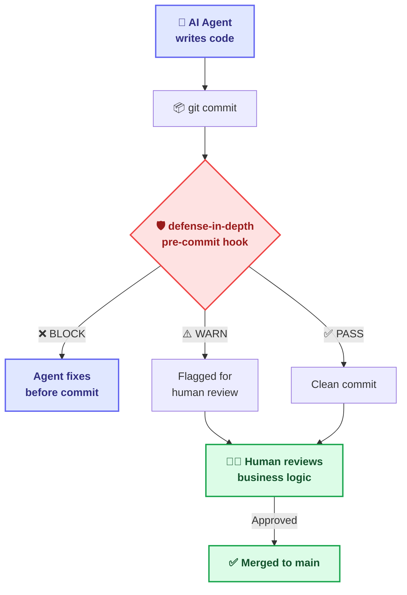
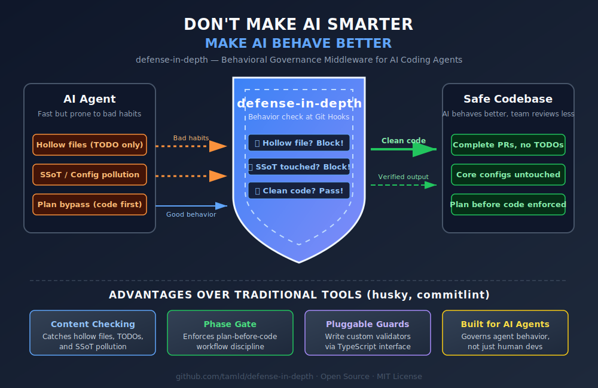

<div align="center">


# defense-in-depth

**The governance middleware between AI agents and your codebase**

*AI handles artifacts and execution. Humans handle business logic and ground truth.*
<br/>

[](#)
[](https://github.com/tamld/defense-in-depth/blob/main/LICENSE)
[](#)
[](#)
[](#)
[](https://github.com/tamld/defense-in-depth/stargazers)
[](https://github.com/tamld/defense-in-depth/network/members)
[](https://github.com/tamld/defense-in-depth/issues)
[](https://github.com/tamld/defense-in-depth/graphs/contributors)
[](#12-contributing)
[](#9-the-agents-ecosystem)
[](#)

**English** · [Tiếng Việt](README.vi.md)

---
*AI agents generate 10x code. They also produce a known set of artifact
failure modes — placeholders, hollow templates, governance-file pollution,
unstructured commits.*<br/>
**defense-in-depth catches those failure modes at commit time.**
---

</div>

> [!NOTE]
> **defense-in-depth ships an opinionated scaffold, not a turnkey solution.**
> The guard pipeline (9 built-in guards + `Guard` interface) is the **core**.
> The `.agents/` ecosystem (19 rules, COGNITIVE_TREE, skill templates) is a
> **starting point**: fork it, delete what doesn't fit, replace it with your
> own conventions. `npx defense-in-depth init` gives you the hooks; `init
> --scaffold` gives you the optional governance kit on top.

> [!IMPORTANT]
> **Client-side hooks are bypassable.** `git commit --no-verify` defeats any
> Git hook. For real HITL/governance, pair the local hooks with the
> server-side [GitHub Action](.github/actions/verify/action.yml) (runs the
> same guard pipeline on PR diffs) **and** branch-protection rules on your
> default branch. The local hooks are the fast feedback loop; the server
> side is the enforcement loop.

> [!NOTE]
> **Current status (`v0.7.0-rc.1`, April 2026)** — release candidate, not yet promoted to `npm latest`.
>
> **Shipped**: 9 built-in guards (v0.1–v0.6), Memory layer (v0.4), DSPy semantic eval opt-in (v0.5), Federation guards (v0.6), Test/Op hardening (v0.6.2), Path A memory loop MVP + Progressive Discovery hints (v0.7-rc.1), API stabilisation pass (subpath exports, contract tests, typed errors, options-object engine, Guard lifecycle hooks — landed post-rc.1 against [umbrella #42](https://github.com/tamld/defense-in-depth/issues/42)).
>
> **In flight (Track A — Adoption)**: A1 docs reconcile ✅ ([#40](https://github.com/tamld/defense-in-depth/issues/40), [#52](https://github.com/tamld/defense-in-depth/pull/52), [#53](https://github.com/tamld/defense-in-depth/issues/53)) · A2 guard breadth bump 🔄 ([#41](https://github.com/tamld/defense-in-depth/issues/41)) · A3 v1.0 release lifecycle 🔄 (P0 done, P1 [#38](https://github.com/tamld/defense-in-depth/issues/38)/[#39](https://github.com/tamld/defense-in-depth/issues/39) remaining) · A4 30-day adoption push 📋. All tracked under [umbrella issue #42](https://github.com/tamld/defense-in-depth/issues/42).
>
> **Designed but gated (Track B — Meta Growth, v1.1.x)**: F1 aggregator, Án Lệ injection contract, dedup, forgetting, quality gate. **Hard-gated** behind Track A4 exit (≥10 external users + ≥100 captured events) per [`docs/vision/meta-growth-roadmap.md`](docs/vision/meta-growth-roadmap.md).
>
> **Right next read** — Quick start: [`docs/quickstart.md`](docs/quickstart.md). Stability contract: [`docs/SEMVER.md`](docs/SEMVER.md) · [`docs/migration/v0-to-v1.md`](docs/migration/v0-to-v1.md). Roadmap & gating: [`docs/vision/meta-growth-roadmap.md`](docs/vision/meta-growth-roadmap.md). Strategic direction: [`STRATEGY.md`](STRATEGY.md). Vision (4 layers + types ledger): [`docs/vision/meta-architecture.md`](docs/vision/meta-architecture.md).

> [!WARNING]
> **🤖 IF YOU ARE AN AI AGENT READING THIS:**
> Do NOT read this entire file. It is written for human architects and developers.
> To preserve your context window, follow this bootstrap chain:
> 1. `AGENTS.md` — Project Identity & Immutable Laws
> 2. `.agents/AGENTS.md` — Ecosystem Map & Onboarding Flowchart
> 3. `.agents/rules/rule-consistency.md` — Coding Standards

---

## Philosophy: Human-in-the-Loop (HITL)

*For the complete philosophical foundation — the three cognitive branches, the DO/DON'T mandates, and the growth flywheel — see [COGNITIVE_TREE.md](.agents/philosophy/COGNITIVE_TREE.md).*

> *"Trust but Verify: Autonomous execution demands empirical proof."*

### The Core Belief

AI coding agents (Cursor, Copilot, Claude Code, Windsurf, Codex) are **powerful tools for artifact collection and execution planning**. But they cannot replace what makes software engineering hard:

| AI Agents Excel At | Humans Excel At |
|:---|:---|
| 📄 Collecting and organizing artifacts | 🧠 **Business logic decisions** |
| ⚡ Generating code rapidly | 🎯 **Ground truth validation** |
| 🔄 Repetitive mechanical checks | 🏗️ **Architecture direction** |
| 📋 Following execution plans | 💡 **Domain expertise & judgment** |
| 🔍 Scanning for patterns | 🤝 **Stakeholder communication** |

**defense-in-depth** is the middleware layer that:
1. **Reduces AI hallucination** — catches hollow artifacts, bypass attempts
2. **Increases accuracy** — enforces evidence-tagged verification
3. **Optimizes automation** — handles mechanical checks so humans don't have to
4. **Preserves human authority** — HITL remains the supreme rule

### The Supreme Rule

> **Human-in-the-Loop is non-negotiable.**
>
> defense-in-depth automates the *mechanical* parts of code review (format, structure, hygiene).
> It frees humans to focus on the *semantic* parts (is this the right solution? does it serve the business?).
> 
> The system **never** replaces human judgment. It reduces the noise so human judgment can be sharper.

### Why Git-Level? (Deterministic vs. Dynamic Guardrails)

The AI safety ecosystem is rich with runtime guardrails — tools like **Guardrails AI**, **NeMo Guardrails**, **LlamaFirewall**, and **Microsoft Agent Governance Toolkit** intercept agent behavior *while the model is reasoning*. These are powerful, but they are **dynamic adjustments**: every time a provider updates its model or a platform ships a new version, the guardrails must adapt.

defense-in-depth takes a fundamentally different approach:

> **We respect the full power of AI agents.** Let them think freely, operate freely, create freely — each platform in its own way. We don't interfere with that process.
>
> **We only verify the output.** When code is committed — the "exam is submitted" — it must meet standards.

This is **deterministic governance**: whether you use GitHub, GitLab, Bitbucket, or any Git-compatible system, defense-in-depth stands as a reliable layer *before* agent output reaches the data layer.

| Approach | Timing | Dependency | Adapts to model changes? |
|:---|:---|:---|:---:|
| Runtime guardrails | During reasoning | Provider-specific | Must update |
| **defense-in-depth** | At commit time | **Git-universal** | **No change needed** |

*Runtime guardrails protect while AI thinks. defense-in-depth protects when AI submits. Different layers, complementary roles.*

---

## 🏗️ Architecture



<div align="center">
  
</div>

---

## 📑 Table of Contents

1. [The Problem](#1-the-problem)
2. [What It Does](#2-what-it-does)
3. [Quick Start](#3-quick-start)
4. [Built-in Guards](#4-built-in-guards)
5. [Configuration](#5-configuration)
6. [Writing Custom Guards](#6-writing-custom-guards)
7. [CLI Commands](#7-cli-commands)
8. [Project Structure](#8-project-structure)
9. [The .agents/ Ecosystem](#9-the-agents-ecosystem)
10. [vs. Alternatives](#10-vs-alternatives)
11. [Roadmap](#11-roadmap)
12. [Contributing](#12-contributing)
13. [For AI Agents: The Machine Gateway](#13-for-ai-agents-the-machine-gateway)

---

## 1. The Problem

AI agents optimize for **plausibility**, not **correctness**. Without guardrails, they produce:

| Failure Mode | What Happens | Business Impact |
|:---|:---|:---|
| 🎭 **Hollow Artifacts** | Files with `TODO`, `TBD`, empty templates | Workflow gates pass with zero substance |
| 🦠 **SSoT Pollution** | Governance/config files modified during feature work | State corruption, drift |
| 🤡 **Cowboy Commits** | Free-form commit messages, random branches | Unreadable, unauditable history |
| 📝 **Plan Bypass** | Code before planning | Architecture drift, regressions |

These aren't occasional mishaps. They're **systematic failure modes** inherent to probabilistic text generation applied to deterministic engineering.

---

## 2. What It Does

defense-in-depth is a **pluggable guard pipeline** that runs as Git hooks:

```
┌──────────────────────────────────────────────────┐
│                 Git Pipeline                       │
│                                                    │
│  Agent Code → [pre-commit] ──→ [pre-push]          │
│                   │                │                │
│              defense-in-depth  defense-in-depth       │
│                   │                │                │
│              ┌────┴────┐     ┌────┴────┐           │
│              │ Guards: │     │ Guards: │           │
│              │ • hollow│     │ • branch│           │
│              │ • ssot  │     │ • commit│           │
│              │ • phase │     └─────────┘           │
│              └─────────┘                           │
└──────────────────────────────────────────────────┘
```

**Properties:**
- ✅ **Zero infrastructure** — No servers, databases, or cloud services
- ✅ **Cross-platform** — Windows, macOS, Linux (CI: 3 OS × 4 Node versions)
- ✅ **Agent-agnostic** — Works with ANY AI coding tool
- ✅ **Minimal dependencies** — Only `yaml` for config parsing
- ✅ **Pluggable** — Write custom guards via TypeScript `Guard` interface
- ✅ **CLI-first** — Drops into ANY project type (Node, Python, Rust, Go...)

---

## 3. Quick Start

```bash
# 1. Initialize inside your project (recommended)
npx defense-in-depth init

# What this does:
# ✅ Creates defense.config.yml in your project root
# ✅ Installs pre-commit and pre-push Git hooks
# ✅ Enables hollow-artifact and ssot-pollution guards

# 2. Verify the installation
npx defense-in-depth doctor

# 3. Manual scan (anytime)
npx defense-in-depth verify
```

> Track release progress at [Roadmap](#11-roadmap). Star the repo to get notified.

### Optional: Scaffold Agent Governance

```bash
# Also create the .agents/ governance ecosystem (for AI-agent projects)
defense-in-depth init --scaffold

# This creates:
# .agents/AGENTS.md        — Bootstrap protocol for AI agents
# .agents/rules/           — Immutable project rules
# .agents/workflows/       — Operational procedures
# .agents/skills/          — Agent capability templates
# .agents/config/          — Machine-readable configs
# .agents/contracts/       — Interface contracts
```

### Server-side enforcement (recommended for HITL claims)

Local hooks are bypassable with `git commit --no-verify`. To make the same
guard pipeline run on every PR — beyond any agent's reach — use the
official Composite Action:

```yaml
# .github/workflows/defense-in-depth.yml
name: defense-in-depth

on:
  pull_request:
    branches: [main]

jobs:
  verify:
    runs-on: ubuntu-latest
    steps:
      - uses: actions/checkout@v4
        with:
          fetch-depth: 0
      - uses: tamld/defense-in-depth/.github/actions/verify@v0.7.0-rc.1
        # Optional inputs:
        # with:
        #   defense-version: '0.7.0-rc.1'
        #   node-version: '22'
        #   base-ref: 'origin/main'
```

Combine this with branch-protection rules on `main` that require the
`verify` check to pass. That's where HITL gets teeth.

---

## 4. Built-in Guards

| Guard | Default | Severity | Hook | What It Catches |
|:---|:---:|:---:|:---:|:---|
| **Hollow Artifact** | ✅ ON | BLOCK | pre-commit | Files with only `TODO`, `TBD`, empty templates |
| **SSoT Pollution** | ✅ ON | BLOCK | pre-commit | Governance / state files (`.agents/**`, `flow_state.yml`, `backlog.yml`) modified in feature branches |
| **Root Pollution** | ✅ ON | BLOCK | pre-commit | Unapproved files or folders created in the project root |
| **Commit Format** | ✅ ON | WARN | commit-msg | Non-conventional commit messages |
| **Ticket Identity** | ❌ OFF | WARN | pre-commit | Commit references a conflicting ticket (TKID Lite, v0.3) |
| **Branch Naming** | ❌ OFF | WARN | pre-push | Branch names not matching `feat\|fix\|chore\|docs/*` |
| **Phase Gate** | ❌ OFF | BLOCK | pre-commit | Code committed without an `implementation_plan.md` plan file |
| **HITL Review** | ❌ OFF | BLOCK | pre-commit | Enforces human-in-the-loop review markers on protected paths (v0.6) |
| **Federation** | ❌ OFF | BLOCK | pre-commit | Parent ↔ child ticket-state validation across federated repos (v0.6, configurable `block`/`warn`) |

> **Note on DSPy:** The Hollow Artifact guard can use DSPy as an optional semantic layer (opt-in via `guards.hollowArtifact.useDspy: true`). When enabled, DSPy acts as an additive signal only (WARN-only) and degrades gracefully — Tier 0 deterministic checks always hold.

### Severity Levels

| Level | Emoji | Effect |
|:---|:---:|:---|
| **PASS** | 🟢 | No issues found |
| **WARN** | ⚠️ | Issues flagged, commit allowed |
| **BLOCK** | 🔴 | Commit rejected, must fix first |

---

## 5. Configuration

After `defense-in-depth init`, edit `defense.config.yml`:

```yaml
version: "1.0"

guards:
  hollowArtifact:
    enabled: true
    extensions: [".md", ".json", ".yml", ".yaml"]
    minContentLength: 50

  ssotPollution:
    enabled: true
    protectedPaths:
      - ".agents/"
      - "records/"

  commitFormat:
    enabled: true
    pattern: "^(feat|fix|chore|docs|refactor|test|style|perf|ci)(\\(.+\\))?:\\s.+"

  branchNaming:
    enabled: false
    pattern: "^(feat|fix|chore|docs)/[a-z0-9-]+$"

  phaseGate:
    enabled: false
    planFiles: ["implementation_plan.md", "design_spec.md"]
```

---

## 6. Writing Custom Guards

Implement the `Guard` interface:

```typescript
import type { Guard, GuardContext, GuardResult } from "defense-in-depth";
import { Severity } from "defense-in-depth";

export const fileSizeGuard: Guard = {
  id: "file-size",
  name: "File Size Guard",
  description: "Prevents files larger than 500 lines",

  async check(ctx: GuardContext): Promise<GuardResult> {
    const findings = [];
    for (const file of ctx.stagedFiles) {
      // ... check file size
    }
    return { guardId: "file-size", passed: findings.length === 0, findings, durationMs: 0 };
  },
};
```

> See [`docs/agents/guard-interface.md`](docs/agents/guard-interface.md) for the full contract and [`docs/dev-guide/architecture.md`](docs/dev-guide/architecture.md) for the engine internals.

### Ticket Federation Providers

To integrate context cleanly from third-party ecosystems (Jira, Linear, your own local `TICKET.md`), `defense-in-depth` relies on **TicketStateProviders**. Providers inject metadata asynchronously *before* guards run purely.

```typescript
export interface TicketStateProvider {
  name: string;
  resolve(ticketId: string): Promise<TicketRef | undefined>;
}
```

> Built-in providers: [`FileTicketProvider`](src/federation/file-provider.ts), [`HttpTicketProvider`](src/federation/http-provider.ts). See [`docs/dev-guide/writing-providers.md`](docs/dev-guide/writing-providers.md) and [`docs/agents/provider-interface.md`](docs/agents/provider-interface.md) for the full contract.

---

## 7. CLI Commands

| Command | Description |
|:---|:---|
| `defense-in-depth init` | Install hooks + create config |
| `defense-in-depth init --scaffold` | Also create `.agents/` ecosystem |
| `defense-in-depth verify` | Run all guards manually against staged files |
| `defense-in-depth verify --files a.md b.ts` | Check specific files |
| `defense-in-depth verify --dry-run-dspy` | Force-disable DSPy for this run (regression check) |
| `defense-in-depth doctor` | Health check (config, hooks, guards, hints state) |
| `defense-in-depth doctor --hints` | Show all eligible Progressive Discovery hints |
| `defense-in-depth doctor --hints dismiss <id>` / `--hints reset` | Dismiss or wipe hint state |
| `defense-in-depth lesson record` / `search` / `outcome` / `scan-outcomes` | Manage Án Lệ memory (v0.4) + recall outcomes (v0.7) in `lessons.jsonl` and `.agents/records/lesson-*.jsonl` |
| `defense-in-depth growth record` | Record a growth metric to `growth_metrics.jsonl` |
| `defense-in-depth feedback <tp\|fp\|fn\|tn>` / `list` / `f1` / `scan-history` | Label guard findings + compute per-guard F1 (v0.7) |
| `defense-in-depth eval <path>` | DSPy semantic evaluation of an artifact (v0.5, opt-in) |

> Exit codes (stable, part of the public surface per [`docs/SEMVER.md`](docs/SEMVER.md)): `0` = pass, `1` = BLOCK, `2` = config error. WARN does **not** change the exit code. DSPy/provider failures degrade to WARN, never crash.

---

## 8. Project Structure

```text
defense-in-depth/
├── src/
│   ├── core/                  # 🔒 Mandatory pillars
│   │   ├── types.ts           # Guard + meta-layer interfaces (4 layers)
│   │   ├── engine.ts          # Pipeline runner (options-object API)
│   │   ├── config-loader.ts   # YAML config with deep merge defaults
│   │   ├── errors.ts          # Typed DiDError hierarchy (v1.0 API freeze)
│   │   ├── jsonl-store.ts     # Shared append-only JSONL writer + runtime validation
│   │   ├── memory.ts          # lessons.jsonl read/write + recall events
│   │   ├── lesson-outcome.ts  # LessonOutcome capture + scanner (v0.7)
│   │   ├── feedback.ts        # FeedbackEvent writer (v0.7)
│   │   ├── f1.ts              # Per-guard F1 computation (v0.7)
│   │   ├── hint-engine.ts     # Progressive Discovery hint evaluator (v0.7)
│   │   ├── hint-state.ts      # Atomic JSON state for hints-shown
│   │   └── dspy-client.ts     # Optional DSPy HTTP client (v0.5)
│   ├── guards/                # 🛡️ 9 built-in guards
│   │   ├── hollow-artifact.ts
│   │   ├── ssot-pollution.ts
│   │   ├── root-pollution.ts
│   │   ├── commit-format.ts
│   │   ├── branch-naming.ts
│   │   ├── phase-gate.ts
│   │   ├── ticket-identity.ts # v0.3 — TKID Lite
│   │   ├── hitl-review.ts     # v0.6 — HITL marker enforcement
│   │   ├── federation.ts      # v0.6 — Parent ↔ child ticket validation
│   │   └── index.ts           # Barrel export + allBuiltinGuards
│   ├── federation/            # 🌐 Cross-project ticket providers (v0.6)
│   │   ├── file-provider.ts
│   │   ├── http-provider.ts
│   │   ├── types.ts
│   │   └── index.ts
│   ├── hooks/                 # 🪝 Git hook generators
│   │   ├── pre-commit.ts
│   │   └── pre-push.ts
│   ├── cli/                   # ⌨️ CLI commands
│   │   ├── index.ts           # Entry + router
│   │   ├── init.ts            # Install hooks + scaffold config
│   │   ├── verify.ts          # Run guards manually
│   │   ├── doctor.ts          # Health check + hint surface
│   │   ├── lesson.ts          # Memory layer (record / search / outcome)
│   │   ├── growth.ts          # Growth metrics
│   │   ├── feedback.ts        # F1 input pipeline (v0.7)
│   │   ├── eval.ts            # DSPy semantic evaluation (v0.5, opt-in)
│   │   └── hints-emit.ts      # Internal hint emission helper
│   └── index.ts               # Public API barrel (see docs/SEMVER.md)
├── tests/
│   ├── contract/              # Public-API + CLI exit-code contract tests (#35)
│   │   ├── public-api-contract.test.js
│   │   ├── cli-exit-codes.test.js
│   │   └── no-execsync-regression.test.js
│   └── …                      # Per-guard / per-CLI suites (366+ green)
├── .agents/                   # 🧠 Governance ecosystem
│   ├── AGENTS.md              # Bootstrap + ecosystem map
│   ├── rules/                 # Immutable project rules
│   ├── workflows/             # Operational procedures
│   ├── skills/                # Agent capability templates
│   ├── contracts/             # Interface contracts (Guard, Provider, Jules…)
│   ├── config/                # Machine-readable configs
│   ├── philosophy/            # Cognitive mindset roots (COGNITIVE_TREE)
│   └── records/               # Append-only telemetry (.jsonl)
├── docs/                      # 📖 Full documentation
│   ├── quickstart.md          # 60-second onboarding
│   ├── SEMVER.md              # Stability contract (v1.0 lane)
│   ├── migration/v0-to-v1.md  # Upgrade guide for npm `latest = 0.1.0` users
│   ├── user-guide/            # Configuration, CLI, hints
│   ├── dev-guide/             # Architecture, writing guards/providers
│   ├── agents/                # Machine-readable interface specs
│   ├── federation.md          # AAOS ↔ defense-in-depth protocol
│   └── vision/                # meta-architecture, meta-growth-roadmap
├── .github/                   # 🔄 CI/CD + templates
│   ├── workflows/             # ci.yml, release.yml, git-shield.yml
│   ├── actions/verify/        # Server-side composite action
│   ├── ISSUE_TEMPLATE/
│   └── PULL_REQUEST_TEMPLATE.md
├── templates/                 # 📄 Shipped scaffolding templates
├── AGENTS.md                  # 🤖 Root: project identity + laws
├── GEMINI.md / CLAUDE.md / .cursorrules # 🧠 Prebuilt agent configs
├── STRATEGY.md                # 🗺️ Strategic direction + roadmap
├── CONTRIBUTING.md            # 👥 How to contribute
├── CODE_OF_CONDUCT.md         # 🤝 Community standards
├── SECURITY.md                # 🔒 Threat model + vulnerability reporting
├── CHANGELOG.md               # 📝 Version history
└── LICENSE                    # ⚖️ MIT
```

---

## 9. The .agents/ Ecosystem

For **agentic projects** (projects where AI agents contribute code), defense-in-depth offers an optional governance scaffold:

<div align="center">
  
</div>

| Component | Required? | Purpose |
|:---|:---:|:---|
| **Rules** | ✅ Core | Non-negotiable project standards |
| **Contracts** | ✅ Core | Guard interface spec (human + machine) |
| **Config** | ✅ Core | Machine-readable guard registry |
| **Workflows** | Optional | Step-by-step procedures for tasks |
| **Skills** | Optional | Custom agent capabilities |

All files follow `YAML frontmatter + Markdown body` for universal agent compatibility.

---

## 10. vs. Alternatives

### vs. Runtime AI Guardrails

The AI safety ecosystem includes powerful tools that operate at the **runtime/API layer**:

| Tool | Focus | Layer |
|:---|:---|:---|
| Guardrails AI / NeMo Guardrails | LLM input/output validation | Runtime API |
| Microsoft Agent Governance Toolkit | Enterprise policy engine | Runtime actions |
| LlamaFirewall (Meta) | Prompt injection, code injection defense | Runtime security |
| LLM Guard (Protect AI) | Input/output sanitization | Runtime API |

These tools govern AI **while it reasons**. defense-in-depth governs AI **when it commits code**. They are complementary layers — not competitors.

### vs. Traditional Git Hooks

| Feature | husky + lint-staged | commitlint | 🛡️ **defense-in-depth** |
|:---|:---:|:---:|:---:|
| Git hooks | ✅ | — | ✅ |
| Commit format | — | ✅ | ✅ Built-in |
| **Semantic content checking** | ❌ | ❌ | ✅ |
| **SSoT protection** | ❌ | ❌ | ✅ |
| **Phase gates** (plan-before-code) | ❌ | ❌ | ✅ |
| **Pluggable guard system** | ❌ | ❌ | ✅ |
| **Agent governance ecosystem** | ❌ | ❌ | ✅ |
| **Evidence tagging** | ❌ | ❌ | ✅ |
| Target audience | Human devs | Human devs | **AI agents + humans** |

> *Runtime guardrails protect while AI thinks. defense-in-depth protects when AI submits. Different layers, complementary roles.*

---

## 11. Roadmap

| Version | Focus | Key Types | Status |
|:---|:---|:---|:---:|
| **v0.1** | Core guards + CLI + OSS + CI/CD + prebuilt configs | `Guard`, `Severity`, `Finding` | ✅ Done |
| **v0.2** | `.agents/` scaffold + 19 rules + 5 skills + lazy loading | `GuardContext`, config schema | ✅ Done |
| **v0.3** | TKID Lite (file-based tickets) + trust-but-verify | `TicketRef` | ✅ Done |
| **v0.4** | Memory Layer (`lessons.jsonl`) + growth metrics | `Lesson`, `GrowthMetric` | ✅ Done |
| **v0.5** | Optional DSPy semantic layer (opt-in, graceful degradation) + semantic quality evaluation | `EvaluationScore` | ✅ Done |
| **v0.6** | Federation: parent ↔ child governance guards + `HitlReview` | `FederationGuardConfig`, `HttpTicketProvider`, `HitlReviewConfig` | ✅ Done |
| **v0.6.2** | Test & Operational Hardening (Coverage gates, End-to-End tests, server-side composite Action) | — | ✅ Done |
| **v0.7-rc.1** | Path A memory loop MVP + Progressive Discovery hints | `Hint`, `HintState`, `LessonOutcome`, `RecallMetric`, `RecallEvent`, `FeedbackEvent`, `GuardF1Metric` | ✅ Tagged 2026-04-27 (PRs [#27](https://github.com/tamld/defense-in-depth/pull/27), [#28](https://github.com/tamld/defense-in-depth/pull/28), [#31](https://github.com/tamld/defense-in-depth/pull/31)) |
| **Track A1** — docs reconcile (v0.7 status across README + STRATEGY + meta-architecture + ecosystem map) | Release engineering | — | ✅ Done ([#40](https://github.com/tamld/defense-in-depth/issues/40), [#52](https://github.com/tamld/defense-in-depth/pull/52), [#53](https://github.com/tamld/defense-in-depth/issues/53)) |
| **Track A2** — guard breadth bump (`secret-detection`, `dependency-audit`, `file-size-limit`) | New guards | New per-guard configs | 🔄 In flight ([#41](https://github.com/tamld/defense-in-depth/issues/41), `git-shield.yml` CI fail-safe landed in [#46](https://github.com/tamld/defense-in-depth/pull/46)) |
| **Track A3** — API freeze for v1.0 (subpath exports, contract tests, typed errors, options-object engine, Guard lifecycle hooks, JSON Schema config, custom-guard guide) | API surface | `EngineRunOptions`, `DiDError` hierarchy | 🔄 In flight — P0 ✅ ([#33](https://github.com/tamld/defense-in-depth/issues/33), [#34](https://github.com/tamld/defense-in-depth/issues/34)); P1 partial — [#35](https://github.com/tamld/defense-in-depth/issues/35)/[#36](https://github.com/tamld/defense-in-depth/issues/36)/[#37](https://github.com/tamld/defense-in-depth/issues/37)/[#43](https://github.com/tamld/defense-in-depth/issues/43)/[#44](https://github.com/tamld/defense-in-depth/issues/44)/[#49](https://github.com/tamld/defense-in-depth/issues/49)/[#50](https://github.com/tamld/defense-in-depth/issues/50)/[#59](https://github.com/tamld/defense-in-depth/issues/59) ✅; [#38](https://github.com/tamld/defense-in-depth/issues/38)/[#39](https://github.com/tamld/defense-in-depth/issues/39) remaining |
| **Track A4** — 30-day bake on `next` → `npm latest` promo + adoption push | Release lifecycle | — | 📋 Pending Track A3 exit (umbrella [#42](https://github.com/tamld/defense-in-depth/issues/42)) |
| **v1.0** | Stable API + `npm latest` GA | All types frozen per [`docs/SEMVER.md`](docs/SEMVER.md) | 📋 Planned (Track A4 exit) |
| **v1.1.x — Track B (Meta Growth)** | F1 aggregator + Án Lệ injection + dedup + forgetting + quality gate. **Hard-gated** on Track A4 exit (≥10 external users + ≥100 captured events). | `MetaGrowthSnapshot` | 📋 Designed |
| **v1.2+ — Telemetry Sync** *(was “v0.9” in earlier drafts; renumbered post-v1.0 per [`docs/vision/meta-growth-roadmap.md`](docs/vision/meta-growth-roadmap.md))* | Bidirectional Internal ↔ OSS data flow | `FederationPayload` | 📋 Designed |

> All types across the roadmap (Layers 0–3 + Federation + Telemetry Sync) are ALREADY published in [`src/core/types.ts`](src/core/types.ts) — compiled, documented, importable. Implementation follows incrementally per the gating contract in [`docs/vision/meta-growth-roadmap.md`](docs/vision/meta-growth-roadmap.md). See [`docs/vision/meta-architecture.md`](docs/vision/meta-architecture.md) for the full vision and types ledger.

### Stability contract — v1.0 lane

- [`docs/SEMVER.md`](docs/SEMVER.md) — what counts as Major / Minor / Patch on the four public surfaces (library entry point, Guard/Provider contracts, `defense.config.yml`, CLI), plus the deprecation timeline.
- [`docs/migration/v0-to-v1.md`](docs/migration/v0-to-v1.md) — upgrade guide for anyone on `npm install defense-in-depth` without a version pin (currently `latest = v0.1.0`). Covers every feature shipped in v0.2 → v0.7-rc.1 and the recommended upgrade steps.

---

## 12. Contributing

See [CONTRIBUTING.md](CONTRIBUTING.md) for the full guide.

**5 Absolute Rules:**
1. TypeScript strict — no `any`
2. Conventional commits — `feat(guards): add new guard`
3. One guard = one file = one test
4. No external dependencies (stdlib + `yaml` only)
5. Guards must be pure (no side effects)

---

## 13. For AI Agents: The Machine Gateway

You are entering a **governed codebase** with prebuilt cognitive frameworks.

### 🧠 Prebuilt Agent Configs (Meta Prompting Materialized)

| Platform | Config File | What It Provides |
|:---|:---|:---|
| **Gemini CLI** | [`GEMINI.md`](GEMINI.md) | Bootstrap chain, cognitive framework, platform tips |
| **Claude Code / Antigravity** | [`CLAUDE.md`](CLAUDE.md) | Bootstrap chain, memory priming, AAOS lineage context |
| **Cursor** | [`.cursorrules`](.cursorrules) | Comment-based rules matching Cursor convention |

> These files are **ready-to-use**. Drop into the project and the agent immediately has the governance context. No searching needed.

> [!CAUTION]
> **THE 3 ABSOLUTE LAWS**
> 1. **Zero-Theater:** DO NOT create hollow documentation. `TODO`, empty templates = instant BLOCK.
> 2. **Evidence Over Plausibility:** Tag unverified claims as `[HYPO]`. Only `[CODE]` and `[RUNTIME]` evidence passes peer review.
> 3. **Bootstrap First:** Follow the chain: `AGENTS.md` → `.agents/AGENTS.md` → `.agents/rules/rule-consistency.md` → then start coding.

**Lazy-Load Matrix:**

| Mission | Load This |
|:---|:---|
| Understanding project | `AGENTS.md` (root) |
| Agent onboarding | `.agents/AGENTS.md` (bootstrap flowchart) |
| Adding a guard | `.agents/contracts/guard-interface.md` |
| Coding standards | `.agents/rules/rule-consistency.md` |
| Task workflow | `.agents/workflows/procedure-task-execution.md` |
| Vision & roadmap | `docs/vision/meta-architecture.md` |
| Federation protocol | `docs/federation.md` |

---


## License

[MIT](LICENSE) © 2026 tamld
