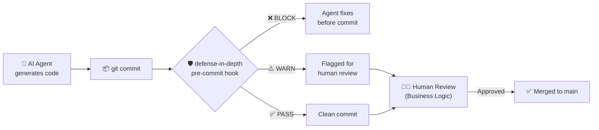

<div align="center">


# defense-in-depth

**Git-based governance middleware for AI coding agents**

*AI handles artifacts and execution. Humans handle business logic and ground truth.*
<br/>

[](#)
[](https://github.com/tamld/defense-in-depth/releases)
[](LICENSE)
[](#)
[](#)
[](#)
[](#contributing)

**English** · [Tiếng Việt](README.vi.md)

---
*AI coding agents generate 10x code, but also introduce failure modes: hollow templates, SSoT corruption, cowboy commits, and plan bypasses.*<br/>
**defense-in-depth catches these failure modes deterministically at commit time.**
---

</div>

> [!NOTE]
> **defense-in-depth ships an opinionated scaffold, not a turnkey black box.**  
> The deterministic guard pipeline (9 built-in guards + pure `Guard` interface) is the **core**. The optional `.agents/` ecosystem (20 rules, cognitive tree, skill templates) is a **starting point**: fork it, delete what doesn't fit, and adapt it to your team's conventions.

> [!IMPORTANT]
> **Client-side hooks are bypassable with `--no-verify`.** For real enterprise governance, pair local hooks with the official [GitHub Action](.github/actions/verify/action.yml) and branch protection rules on your default branch.

---

## ⚡ 60-Second Quickstart

```bash
# 1. Initialize inside any existing Git repository
npx defense-in-depth init

# What this does:
# ✅ Creates defense.config.yml with sensible defaults
# ✅ Installs pre-commit and pre-push Git hooks
# ✅ Enables hollow-artifact and ssot-pollution guards

# 2. Verify repository health
npx defense-in-depth doctor

# 3. Manually scan your staged files
npx defense-in-depth verify
```

### Optional: Scaffold AI Agent Governance Kit

```bash
# Set up the full .agents/ governance framework for AI-driven workflows
npx defense-in-depth init --scaffold
```

### Server-Side Enforcement (CI/CD)

Add the official GitHub Action to validate pull requests beyond any agent's reach:

```yaml
# .github/workflows/defense.yml
name: defense-in-depth
on: [pull_request]

jobs:
  verify:
    runs-on: ubuntu-latest
    steps:
      - uses: actions/checkout@v4
        with:
          fetch-depth: 0
      - uses: tamld/defense-in-depth/.github/actions/verify@v0.8.0
```

---

## 🛡️ Built-in Guards

| Guard | Default | Severity | Hook Trigger | What It Catches |
|:---|:---:|:---:|:---:|:---|
| **Hollow Artifact** | ✅ ON | `BLOCK` | `pre-commit` | Unfilled stub markers and empty scaffolding |
| **SSoT Pollution** | ✅ ON | `BLOCK` | `pre-commit` | Unauthorized edits to governance files (`.agents/**`, `backlog.yml`) |
| **Root Pollution** | ✅ ON | `BLOCK` | `pre-commit` | Unapproved scratch files or folders placed in the repository root |
| **Commit Format** | ✅ ON | `WARN` | `commit-msg` | Non-conventional commit messages (`type(scope): description`) |
| **Branch Naming** | ❌ OFF | `WARN` | `pre-push` | Branch names not matching `feat/*`, `fix/*`, `chore/*`, `docs/*` |
| **Ticket Identity** | ❌ OFF | `WARN` | `pre-commit` | Conflicting or missing ticket IDs in commit metadata (TKID) |
| **Phase Gate** | ❌ OFF | `BLOCK` | `pre-commit` | Committing feature code without an `implementation_plan.md` |
| **HITL Review** | ❌ OFF | `BLOCK` | `pre-commit` | Committing protected files without human review sign-off markers |
| **Federation** | ❌ OFF | `BLOCK` | `pre-commit` | Ticket state validation across federated/parent-child repositories |

> 📖 *For complete configuration options and customization, see [Configuration Guide](docs/user-guide/configuration.md).*

---

## 🏗️ Architecture: Progressive Enhancement

`defense-in-depth` is engineered with a strict 3-tier layering model:

```
Tier 0 — Deterministic Core (Zero dependencies, stdlib + yaml only)
  Regex/AST heuristics, Git hooks, sequential engine, <100ms execution
  → Guarantees: BLOCK/WARN on known anti-patterns anywhere

Tier 1 — Optional Intelligence (Opt-in plugins)
  DSPy semantic evaluation, Án Lệ (Case Law) memory loop, hints engine
  → Guarantees: Enhanced signal when available; Tier 0 holds when offline

Tier 2 — Multi-Agent Governance (.agents/ directory)
  Lazy-loaded rules, cognitive framework, and multi-agent contracts (Cursor, Jules, Claude)
  → Guarantees: Consistent behavioral standards across all AI contributors
```


```mermaid
flowchart LR
    A["🤖 AI Agent<br/>generates code"] --> B["📦 git commit"]
    B --> C{"🛡️ defense-in-depth<br/>pre-commit hook"}
    C -->|"❌ BLOCK"| D["Agent fixes<br/>before commit"]
    C -->|"⚠️ WARN"| E["Flagged for<br/>human review"]
    C -->|"✅ PASS"| F["Clean commit"]
    E --> G["👨‍💼 Human Review<br/>(Business Logic)"]
    F --> G
    G -->|"Approved"| H["✅ Merged to main"]
```

---

## 💻 CLI Commands

| Command | Purpose |
|:---|:---|
| `npx defense-in-depth init [--scaffold]` | Install Git hooks and initialize `defense.config.yml` |
| `npx defense-in-depth verify [--staged] [--all]` | Execute the guard pipeline on staged or workspace files |
| `npx defense-in-depth doctor` | Run comprehensive environment and hook health checks |
| `npx defense-in-depth feedback --file <path>` | Ingest human feedback into the Án Lệ memory loop |
| `npx defense-in-depth lesson --tag <tag>` | Query recorded lessons and past failure patterns |
| `npx defense-in-depth eval` | Run semantic evaluation on artifacts via DSPy |
| `npx defense-in-depth hints-emit` | Emit context-aware progressive hints for agents |

> 📖 *Full CLI reference: [CLI Reference Manual](docs/user-guide/cli-reference.md).*

---

## 📚 Documentation Hub

Explore our comprehensive 5-pillar documentation:

- 🚀 **[Getting Started](docs/quickstart.md)** — Quickstart guide, [SemVer Contract](docs/SEMVER.md), and [Migration Guide](docs/migration/v0-to-v1.md).
- ⚙️ **[User Guide](docs/user-guide/configuration.md)** — [Configuration](docs/user-guide/configuration.md), [CLI Reference](docs/user-guide/cli-reference.md), [Providers](docs/user-guide/providers.md), and [Hints](docs/user-guide/hints.md).
- 🛠️ **[Developer Guide](docs/dev-guide/architecture.md)** — [Architecture](docs/dev-guide/architecture.md), [Writing Custom Guards](docs/dev-guide/writing-guards.md), [DSPy Layer](docs/dev-guide/dspy-providers.md), and [Fail-Fast Policy](docs/dev-guide/fail-fast-policy.md).
- 🤖 **[Ecosystem & Governance](docs/ecosystem/agent-workspace-guidelines.md)** — [Agent Guidelines](docs/ecosystem/agent-workspace-guidelines.md) and [Multi-Agent Coordination](docs/ecosystem/ai-agent-coordination.md).
- 🔭 **[Vision & Roadmap](docs/vision/meta-architecture.md)** — [Meta-Architecture](docs/vision/meta-architecture.md), [System Blueprint](docs/vision/system-blueprint.md), and [STRATEGY.md](STRATEGY.md).
---

## 🛠️ Development

```bash
npm run dev          # Watch mode compilation
npm test             # Run test suite
npm run test:watch   # Run tests in watch mode
npm run coverage     # Run tests with strict coverage gate
npm run lint         # TypeScript strict type check
npm run sync:wiki    # Sync wiki/ directory to GitHub Wiki repo
```

---

## 🤝 Contributing

We welcome contributions from both humans and AI agents operating under human direction!

1. Read the [Immutable Consistency Rules](.agents/rules/rule-consistency.md).
2. Check open issues on [GitHub Issues](https://github.com/tamld/defense-in-depth/issues).
3. Fork, create a branch (`feat/*`, `fix/*`, `docs/*`), and open a Pull Request.
4. Ensure all tests pass: `npm test` and `npx defense-in-depth verify`.

---

## 📄 License

Distributed under the **MIT License**. See [LICENSE](LICENSE) for more information.
