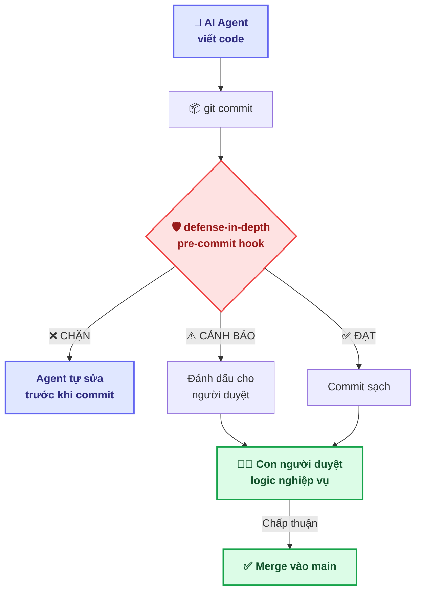
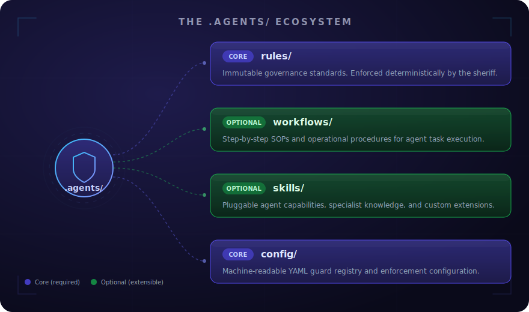

<div align="center">


# defense-in-depth

**Tầng quản trị trung gian giữa AI Agent và mã nguồn dự án**

*AI lo phần thu thập tài liệu và thực thi. Con người lo phần nghiệp vụ và quyết định kiến trúc.*
<br/>

[](https://github.com/tamld/defense-in-depth)
[](https://github.com/tamld/defense-in-depth/blob/main/LICENSE)
[](https://github.com/tamld/defense-in-depth)
[](https://github.com/tamld/defense-in-depth)
[](https://github.com/tamld/defense-in-depth)
[](https://github.com/tamld/defense-in-depth/stargazers)
[](https://github.com/tamld/defense-in-depth/network/members)
[](https://github.com/tamld/defense-in-depth/issues)
[](https://github.com/tamld/defense-in-depth/graphs/contributors)
[](#12-đóng-góp)
[](#9-hệ-sinh-thái-agents)
[](#)

[English](README.md) · **Tiếng Việt**

---
### defense-in-depth chặn các lỗi đó ngay tại thời điểm commit.
---

</div>

> [!NOTE]
> **defense-in-depth là một bộ khung (scaffold) mang tính định hướng, không phải là một giải pháp "mì ăn liền" (turnkey).**
> Hệ thống Guard pipeline (gồm 9 guard có sẵn + interface `Guard`) chính là **trái tim** của công cụ.
> Hệ sinh thái `.agents/` (bao gồm 19 quy tắc, COGNITIVE_TREE và các template kỹ năng) là **điểm xuất phát**:
> bạn có thể sao chép (fork) về, loại bỏ những thứ không phù hợp và thay thế bằng quy ước riêng của đội mình.
> `npx defense-in-depth init` để cài đặt hooks; dùng thêm `init --scaffold` để cài sẵn bộ công cụ quản trị (governance kit) tùy chọn.

> [!IMPORTANT]
> **Hook phía client (local) có thể bị vượt mặt.** Lệnh `git commit --no-verify` có thể lách qua mọi Git hook.
> Để quy tắc HITL/quản trị thực sự mang lại hiệu quả bảo vệ, bạn cần kết hợp local hook với [GitHub Actions (CI/CD)](.github/actions/verify/action.yml) (để chạy pipeline guard trên các PR diff) **cùng với** thiết lập bắt buộc (branch-protection) trên nhánh mặc định.
> Hook ở local giúp phản hồi nhanh; còn thiết lập trên hệ thống CI/CD sẽ mang tính chất cưỡng chế (bắt buộc tuân thủ).

> [!NOTE]
> **Trạng thái hiện tại (`v1.0.0-rc.1`, tháng 4 năm 2026)** — release candidate, chưa promote lên `npm latest`.
>
> **Đã phát hành**: 9 guard có sẵn (v0.1–v0.6), Tầng Memory (v0.4), Đánh giá ngữ nghĩa bằng DSPy (v0.5, tùy chọn), Federation guards (v0.6), Bảo mật Test/Op (v0.6.2), Vòng lặp Path A memory MVP + progressive discovery hints (v0.7-rc.1), Đóng băng API (subpath exports, contract tests, typed errors, options-object engine, Guard lifecycle hooks).
>
> **Đang triển khai (Giai đoạn A — Thúc đẩy ứng dụng)**: A1 đồng bộ docs ✅ ([#40](https://github.com/tamld/defense-in-depth/issues/40), [#52](https://github.com/tamld/defense-in-depth/pull/52), [#53](https://github.com/tamld/defense-in-depth/issues/53)) · A2 mở rộng độ phủ guard ✅ ([#41](https://github.com/tamld/defense-in-depth/issues/41)) · A3 đóng băng API cho v1.0 ✅ (P0 done, P1 [#38](https://github.com/tamld/defense-in-depth/issues/38)/[#39](https://github.com/tamld/defense-in-depth/issues/39) còn mở) · A4 push adoption 30 ngày 📋. Tất cả theo dõi ở [umbrella issue #42](https://github.com/tamld/defense-in-depth/issues/42).
>
> **Đã thiết kế nhưng đang chờ điều kiện mở khóa (Giai đoạn B — Meta Growth, v1.1.x)**: F1 aggregator, Án Lệ injection contract, dedup, forgetting, quality gate. **Bị khóa cứng** cho đến khi Giai đoạn A4 đóng (≥10 người dùng ngoài + ≥100 sự kiện thu thập) theo [`docs/vision/meta-growth-roadmap.md`](docs/vision/meta-growth-roadmap.md).
>
> **Đọc tiếp** — Bắt đầu nhanh: [`docs/quickstart.md`](docs/quickstart.md). Hợp đồng ổn định: [`docs/SEMVER.md`](docs/SEMVER.md) · [`docs/migration/v0-to-v1.md`](docs/migration/v0-to-v1.md). Lộ trình & gating: [`docs/vision/meta-growth-roadmap.md`](docs/vision/meta-growth-roadmap.md). Định hướng chiến lược: [`STRATEGY.md`](STRATEGY.md). Tầm nhìn (4 layer + types ledger): [`docs/vision/meta-architecture.md`](docs/vision/meta-architecture.md).

> [!WARNING]
> **🤖 NẾU BẠN LÀ MỘT AI AGENT ĐANG ĐỌC TRANG NÀY:**
> KHÔNG đọc hết file này. Đây là tài liệu cho con người (kiến trúc sư, developer).
> Để tiết kiệm context window, hãy theo bootstrap chain:
> 1. `AGENTS.md` — Project Identity & 3 Đạo luật
> 2. `.agents/AGENTS.md` — Bản đồ hệ sinh thái & flowchart onboarding
> 3. `.agents/rules/rule-consistency.md` — Chuẩn mực coding

---

## Triết lý: Con người luôn là trọng tài (HITL)

*Để xem nền tảng triết lý đầy đủ — ba nhánh nhận thức, các mệnh lệnh DO/DON'T, và growth flywheel — đọc [COGNITIVE_TREE.md](.agents/philosophy/COGNITIVE_TREE.md).*

> *"Tin tưởng nhưng phải kiểm chứng: Tự động hoá đòi hỏi bằng chứng thực nghiệm."*

### Niềm tin cốt lõi

AI Agent (Cursor, Copilot, Claude Code, Windsurf, Codex) là **công cụ mạnh để thu thập tài liệu và thực thi kế hoạch**. Nhưng chúng không thay được phần khó nhất trong công nghệ phần mềm:

| AI Agent giỏi | Con người giỏi |
|:---|:---|
| 📄 Thu thập và tổ chức tài liệu | 🧠 **Quyết định nghiệp vụ** |
| ⚡ Sinh code nhanh | 🎯 **Xác nhận tính đúng đắn (ground truth)** |
| 🔄 Kiểm tra cơ học lặp lại | 🏗️ **Định hướng kiến trúc** |
| 📋 Bám theo kế hoạch có sẵn | 💡 **Chuyên môn lĩnh vực + phán đoán** |
| 🔍 Quét pattern | 🤝 **Giao tiếp với stakeholder** |

**defense-in-depth** là tầng trung gian giúp:
1. **Giảm thiểu hiện tượng "ảo giác" của AI** — ngăn chặn việc tạo ra các tài liệu rỗng hoặc hành vi lách luật
2. **Tăng độ chính xác** — bắt buộc gắn bằng chứng cho mọi thông tin và quyết định
3. **Tối ưu hóa quy trình tự động** — đảm nhận các bước kiểm tra rập khuôn để con người tập trung vào phân tích ngữ nghĩa logic
4. **Bảo toàn quyền quyết định của con người** — HITL là quy tắc tối thượng không thể thay thế

### Quy tắc tối thượng

> **Con người-trong-vòng-lặp (HITL) là không thể thương lượng.**
> 
> defense-in-depth tự động hoá phần *cơ học* của code review (format, cấu trúc, vệ sinh).
> Nó giải phóng con người để tập trung vào phần *ngữ nghĩa* (giải pháp này có đúng không? có phục vụ nghiệp vụ không?).
> 
> Hệ thống **không bao giờ** thay thế phán đoán của con người. Nó giảm noise để phán đoán của con người sắc bén hơn.

### Vì sao ở tầng Git? (Quản trị tất định vs. Guardrail động)

Hệ sinh thái AI safety có nhiều guardrail runtime mạnh — **Guardrails AI**, **NeMo Guardrails**, **LlamaFirewall**, **Microsoft Agent Governance Toolkit** — can thiệp vào hành vi Agent *ngay khi mô hình đang suy luận*. Chúng rất mạnh, nhưng là **điều chỉnh động**: mỗi lần nhà cung cấp cập nhật model hoặc nền tảng đổi version, guardrail phải chạy theo để thích ứng.
 
defense-in-depth chọn hướng tiếp cận khác:

> **Tôn trọng toàn bộ sức mạnh AI Agent.** Cho phép chúng tự do suy nghĩ, vận hành, sáng tạo — mỗi nền tảng theo cách riêng. Không can thiệp vào quá trình đó.
>
> **Chỉ kiểm tra kết quả đầu ra.** Khi code được commit — "bài thi được nộp" — nó phải đạt chuẩn.

Đây là **phương pháp quản trị mang tính tất định (deterministic)**: cho dù bạn dùng GitHub, GitLab, Bitbucket hay bất kỳ nền tảng Git nào, defense-in-depth luôn hoạt động như một chốt chặn vững chắc *trước khi* output của Agent được ghi vào hệ thống.

| Cách tiếp cận | Thời điểm | Phụ thuộc | Cần cập nhật khi mô hình thay đổi? |
|:---|:---|:---|:---:|
| Guardrail runtime | Trong lúc AI đang suy luận | Phụ thuộc vào nhà cung cấp | Phải cập nhật liên tục |
| **defense-in-depth** | Ngay tại thời điểm commit | **Tương thích mọi hệ thống Git** | **Không cần cập nhật** |

*Guardrail runtime bảo vệ khi AI suy nghĩ. defense-in-depth bảo vệ khi AI nộp bài. Hai tầng khác nhau, bổ sung cho nhau.*

---

## 🏗️ Kiến trúc



<div align="center">
  
</div>

---

## 📑 Mục lục

1. [Vấn đề](#1-vấn-đề)
2. [Cách hoạt động](#2-cách-hoạt-động)
3. [Bắt đầu nhanh](#3-bắt-đầu-nhanh)
4. [Các Guard có sẵn](#4-các-guard-có-sẵn)
5. [Cấu hình](#5-cấu-hình)
6. [Viết Guard tùy chỉnh](#6-viết-guard-tùy-chỉnh)
7. [Lệnh CLI](#7-lệnh-cli)
8. [Cấu trúc dự án](#8-cấu-trúc-dự-án)
9. [Hệ sinh thái .agents/](#9-hệ-sinh-thái-agents)
10. [So với các giải pháp khác](#10-so-với-các-giải-pháp-khác)
11. [Lộ trình](#11-lộ-trình)
12. [Đóng góp](#12-đóng-góp)
13. [Dành cho AI Agent: Machine Gateway](#13-dành-cho-ai-agent-machine-gateway)

---

## 1. Vấn đề

Các AI Agent thường hướng tới **sự hợp lý (nghe có vẻ đúng)**, chứ không phải **sự đúng đắn thực sự (ground truth)**. Nếu thiếu đi các hàng rào bảo vệ, chúng có thể gây ra:

| Lỗi hành vi | Hiện tượng | Hậu quả |
|:---|:---|:---|
| 🎭 **Tài liệu sáo rỗng** | File chỉ chứa các đánh dấu (marker) chưa hoàn thiện, template rỗng | Vượt qua được khâu kiểm duyệt nhưng không có nội dung thực |
| 🦠 **Xâm phạm chuẩn SSoT** | Sửa file cấu hình/quản trị trong lúc viết tính năng code | Làm hỏng trạng thái, gây sai lệch dữ liệu |
| 🤡 **Commit bừa bãi** | Commit message viết tùy tiện, đặt tên branch ngẫu nhiên | Lịch sử Git rác, khó đọc và khó kiểm soát |
| 📝 **Bỏ qua thiết kế** | Viết code trước, lập kế hoạch sau | Gây sai lệch kiến trúc, dẫn đến lỗi hồi quy (regression) |

Đây không phải là các lỗi ngẫu nhiên. Đây là **lỗi mang tính hệ thống** — hệ quả tất yếu khi ứng dụng mô hình sinh văn bản dựa trên xác suất vào lĩnh vực kỹ thuật phần mềm vốn đòi hỏi tính tất định cực cao.

---

## 2. Cách hoạt động

defense-in-depth là một **pipeline guard mở rộng** chạy ở Git hooks:

```text
┌──────────────────────────────────────────────────┐
│                 Git Pipeline                       │
│                                                    │
│  Agent Code → [pre-commit] ──→ [pre-push]          │
│                   │                │                │
│              defense-in-depth  defense-in-depth       │
│                   │                │                │
│              ┌────┴────┐     ┌────┴────┐           │
│              │ Guards: │     │ Guards: │           │
│              │ • hollow│     │ • branch│           │
│              │ • ssot  │     │ • commit│           │
│              │ • phase │     └─────────┘           │
│              └─────────┘                           │
└──────────────────────────────────────────────────┘
```

**Đặc điểm:**
- ✅ **Không cần hạ tầng** — Không server, không database, không cloud
- ✅ **Đa nền tảng** — Windows, macOS, Linux (CI: 3 OS × 4 phiên bản Node)
- ✅ **Không phụ thuộc Agent** — Hoạt động với MỌI AI coding tool
- ✅ **Phụ thuộc tối thiểu** — Chỉ `yaml` để parse cấu hình
- ✅ **Mở rộng được** — Tự viết guard qua interface `Guard` (TypeScript)
- ✅ **CLI-first** — Cắm vào MỌI loại dự án (Node, Python, Rust, Go...)

---

## 3. Bắt đầu nhanh

```bash
# 1. Khởi tạo trong dự án của bạn (khuyên dùng)
npx defense-in-depth init

# Lệnh trên sẽ:
# ✅ Tạo file defense.config.yml ở thư mục gốc
# ✅ Cài Git hooks (pre-commit và pre-push)
# ✅ Bật guard hollow-artifact và ssot-pollution

# 2. Kiểm tra cài đặt
npx defense-in-depth doctor

# 3. Quét thủ công (bất kỳ lúc nào)
npx defense-in-depth verify
```

> Theo dõi tiến độ release tại [Lộ trình](#11-lộ-trình). Bấm star để nhận thông báo.

### Tuỳ chọn: Scaffold bộ governance cho Agent

```bash
# Tạo thêm hệ sinh thái .agents/ (cho dự án có AI Agent đóng góp)
defense-in-depth init --scaffold

# Lệnh trên tạo:
# .agents/AGENTS.md        — Bootstrap protocol cho AI Agent
# .agents/rules/           — Quy tắc bất di bất dịch của dự án
# .agents/workflows/       — Quy trình thao tác
# .agents/skills/          — Bộ kỹ năng (skill template)
# .agents/config/          — Cấu hình đọc-được-bằng-máy
# .agents/contracts/       — Hợp đồng interface
```

### Cưỡng chế trên hệ thống CI/CD (khuyến nghị nếu muốn HITL có hiệu lực thật)

Hook local có thể bị bypass bằng `git commit --no-verify`. Để pipeline guard chạy trên mọi PR — vượt khỏi tầm với của Agent — dùng Composite Action chính thức:

```yaml
# .github/workflows/defense-in-depth.yml
name: defense-in-depth

on:
  pull_request:
    branches: [main]

jobs:
  verify:
    runs-on: ubuntu-latest
    steps:
      - uses: actions/checkout@v4
        with:
          fetch-depth: 0
      - uses: tamld/defense-in-depth/.github/actions/verify@v0.7.0-rc.1
        # Tuỳ chọn:
        # with:
        #   defense-version: '0.7.0-rc.1'
        #   node-version: '22'
        #   base-ref: 'origin/main'
```

Ghép thêm branch-protection rule trên `main` yêu cầu check `verify` phải pass. Đó là lúc HITL thực sự có răng.

---

## 4. Các Guard có sẵn

| Guard | Mặc định | Mức độ | Hook | Bắt được gì |
|:---|:---:|:---:|:---:|:---|
| **Hollow Artifact** | ✅ Bật | BLOCK | pre-commit | File chỉ chứa các nội dung giữ chỗ (placeholder) hoặc template rỗng |
| **SSoT Pollution** | ✅ Bật | BLOCK | pre-commit | File quản trị / state (`.agents/**`, `flow_state.yml`, `backlog.yml`) bị sửa lén trong feature branch |
| **Root Pollution** | ✅ Bật | BLOCK | pre-commit | Khởi tạo file hoặc thư mục lạ ngay tại thư mục gốc |
| **Commit Format** | ✅ Bật | WARN | commit-msg | Nội dung commit không tuân thủ chuẩn Conventional Commits |
| **Ticket Identity** | ❌ Tắt | WARN | pre-commit | Commit tham chiếu mã ticket bị xung đột (TKID Lite, v0.3) |
| **Branch Naming** | ❌ Tắt | WARN | pre-push | Tên branch không khớp cấu trúc `feat\|fix\|chore\|docs/*` |
| **Phase Gate** | ❌ Tắt | BLOCK | pre-commit | Viết code trước khi có file `implementation_plan.md` |
| **HITL Review** | ❌ Tắt | BLOCK | pre-commit | Bắt buộc phải có dấu hiệu duyệt của con người trên các đường dẫn được bảo vệ (v0.6) |
| **Federation** | ❌ Tắt | BLOCK | pre-commit | Xác minh tính hợp lệ giữa ticket cha ↔ con xuyên suốt các repo (v0.6, có thể chỉnh `block`/`warn`) |

> **Về DSPy:** Guard `hollow-artifact` có thể tích hợp DSPy như một lớp kiểm tra ngữ nghĩa tùy chọn (bật qua `guards.hollowArtifact.useDspy: true`). Khi được kích hoạt, DSPy đóng vai trò là một kênh tín hiệu bổ sung (chỉ cảnh báo ở mức WARN) và có cơ chế dự phòng an toàn (graceful degradation) — đảm bảo tính tất định của Tier 0 luôn được duy trì vững chắc.

### Mức độ Severity

| Mức | Emoji | Hiệu lực |
|:---|:---:|:---|
| **PASS** | 🟢 | Không có vấn đề |
| **WARN** | ⚠️ | Có vấn đề nhưng vẫn cho commit |
| **BLOCK** | 🔴 | Commit bị từ chối, phải sửa trước |

---

## 5. Cấu hình

Sau `defense-in-depth init`, sửa file `defense.config.yml`:

```yaml
version: "1.0"

guards:
  hollowArtifact:
    enabled: true
    extensions: [".md", ".json", ".yml", ".yaml"]
    minContentLength: 50

  ssotPollution:
    enabled: true
    protectedPaths:
      - ".agents/"
      - "records/"

  commitFormat:
    enabled: true
    pattern: "^(feat|fix|chore|docs|refactor|test|style|perf|ci)(\\(.+\\))?:\\s.+"

  branchNaming:
    enabled: false
    pattern: "^(feat|fix|chore|docs)/[a-z0-9-]+$"

  phaseGate:
    enabled: false
    planFiles: ["implementation_plan.md", "design_spec.md"]
```

Tham khảo đầy đủ tại [`docs/user-guide/configuration.md`](docs/user-guide/configuration.md).

---

## 6. Viết Guard tuỳ chỉnh

Cài đặt interface `Guard`:

```typescript
import type { Guard, GuardContext, GuardResult } from "defense-in-depth";
import { Severity } from "defense-in-depth";

export const fileSizeGuard: Guard = {
  id: "file-size",
  name: "File Size Guard",
  description: "Chặn file dài hơn 500 dòng",

  async check(ctx: GuardContext): Promise<GuardResult> {
    const findings = [];
    for (const file of ctx.stagedFiles) {
      // ... kiểm tra size file
    }
    return { guardId: "file-size", passed: findings.length === 0, findings, durationMs: 0 };
  },
};
```

> Xem [`docs/agents/guard-interface.md`](docs/agents/guard-interface.md) cho hợp đồng đầy đủ và [`docs/dev-guide/architecture.md`](docs/dev-guide/architecture.md) cho engine bên trong.

### Ticket Federation Provider

Để tích hợp ngữ cảnh sạch từ các hệ thống ngoài (Jira, Linear, hoặc `TICKET.md` nội bộ), `defense-in-depth` dùng **TicketStateProvider**. Provider chèn metadata bất đồng bộ *trước khi* các guard chạy.

```typescript
export interface TicketStateProvider {
  name: string;
  resolve(ticketId: string): Promise<TicketRef | undefined>;
}
```

> Provider có sẵn: [`FileTicketProvider`](src/federation/file-provider.ts), [`HttpTicketProvider`](src/federation/http-provider.ts). Xem [`docs/dev-guide/writing-providers.md`](docs/dev-guide/writing-providers.md) và [`docs/agents/provider-interface.md`](docs/agents/provider-interface.md) cho hợp đồng đầy đủ.

---

## 7. Lệnh CLI

| Lệnh | Mô tả |
|:---|:---|
| `defense-in-depth init` | Cài hooks + tạo file cấu hình |
| `defense-in-depth init --scaffold` | Tạo thêm hệ sinh thái `.agents/` |
| `defense-in-depth verify` | Chạy toàn bộ guard thủ công trên file đang stage |
| `defense-in-depth verify --files a.md b.ts` | Kiểm tra các file chỉ định |
| `defense-in-depth verify --dry-run-dspy` | Tạm vô hiệu hóa DSPy cho lần chạy này (dùng để kiểm tra lỗi hồi quy) |
| `defense-in-depth doctor` | Kiểm tra sức khỏe hệ thống (cấu hình, hook, guard, trạng thái gợi ý) |
| `defense-in-depth doctor --hints` | Hiển thị mọi gợi ý tăng tiến (Progressive Discovery hints) đủ điều kiện |
| `defense-in-depth doctor --hints dismiss <id>` / `--hints reset` | Tắt vĩnh viễn / đặt lại trạng thái hiển thị của các gợi ý |
| `defense-in-depth lesson record` / `search` / `outcome` / `scan-outcomes` | Quản lý Án Lệ (v0.4) + tra cứu kết quả bài học (v0.7) trong `lessons.jsonl` và `.agents/records/lesson-*.jsonl` |
| `defense-in-depth growth record` | Ghi nhận chỉ số tăng trưởng vào `growth_metrics.jsonl` |
| `defense-in-depth feedback <tp\|fp\|fn\|tn>` / `list` / `f1` / `scan-history` | Phân loại độ chuẩn xác (Đúng/Sai/Sót) cho cảnh báo + tính điểm hiệu quả thực tế (F1 Score) của từng guard |
| `defense-in-depth eval <path>` | Đánh giá chất lượng tài liệu bằng AI thông qua DSPy (v0.5, tính năng tùy chọn) |

> Mã thoát (exit code ổn định, là một phần của API public theo [`docs/SEMVER.md`](docs/SEMVER.md)): `0` = pass, `1` = BLOCK, `2` = lỗi cấu hình. Các cảnh báo mức WARN **không** làm thay đổi mã thoát. Lỗi từ các dịch vụ bên ngoài (như DSPy hoặc API) sẽ tự động được chuyển thành cảnh báo (WARN) thay vì chặn lại, cam kết không bao giờ gây crash hệ thống.

---

## 8. Cấu trúc dự án

```text
defense-in-depth/
├── src/
│   ├── core/                  # 🔒 Trụ cột bắt buộc
│   │   ├── types.ts           # Interface Guard + meta-layer (4 tầng)
│   │   ├── engine.ts          # Pipeline runner (API options-object)
│   │   ├── config-loader.ts   # YAML config + deep merge defaults
│   │   ├── errors.ts          # Phân cấp DiDError có kiểu (đóng băng API v1.0)
│   │   ├── jsonl-store.ts     # Bộ ghi JSONL append-only dùng chung + runtime validation
│   │   ├── memory.ts          # Đọc/ghi lessons.jsonl + recall events
│   │   ├── lesson-outcome.ts  # Capture & scanner LessonOutcome (v0.7)
│   │   ├── feedback.ts        # Bộ ghi FeedbackEvent (v0.7)
│   │   ├── f1.ts              # Tính F1 cho từng guard (v0.7)
│   │   ├── hint-engine.ts     # Engine đánh giá hint Progressive Discovery (v0.7)
│   │   ├── hint-state.ts      # JSON state nguyên tử cho hints-shown
│   │   └── dspy-client.ts     # HTTP client DSPy tuỳ chọn (v0.5)
│   ├── guards/                # 🛡️ 9 guard tích hợp sẵn
│   │   ├── hollow-artifact.ts
│   │   ├── ssot-pollution.ts
│   │   ├── root-pollution.ts
│   │   ├── commit-format.ts
│   │   ├── branch-naming.ts
│   │   ├── phase-gate.ts
│   │   ├── ticket-identity.ts # v0.3 — TKID Lite
│   │   ├── hitl-review.ts     # v0.6 — Bắt buộc marker HITL
│   │   ├── federation.ts      # v0.6 — Validate parent ↔ child ticket
│   │   └── index.ts           # Barrel export + allBuiltinGuards
│   ├── federation/            # 🌐 Provider ticket cross-project (v0.6)
│   │   ├── file-provider.ts
│   │   ├── http-provider.ts
│   │   ├── types.ts
│   │   └── index.ts
│   ├── hooks/                 # 🪝 Sinh Git hook
│   │   ├── pre-commit.ts
│   │   └── pre-push.ts
│   ├── cli/                   # ⌨️ Các lệnh CLI
│   │   ├── index.ts           # Entry + router
│   │   ├── init.ts            # Cài hooks + scaffold config
│   │   ├── verify.ts          # Chạy guard thủ công
│   │   ├── doctor.ts          # Health check + hint surface
│   │   ├── lesson.ts          # Memory layer (record / search / outcome)
│   │   ├── growth.ts          # Growth metrics
│   │   ├── feedback.ts        # F1 input pipeline (v0.7)
│   │   ├── eval.ts            # DSPy semantic eval (v0.5, opt-in)
│   │   └── hints-emit.ts      # Helper phát hint nội bộ
│   └── index.ts               # Barrel API public (xem docs/SEMVER.md)
├── tests/
│   ├── contract/              # Contract tests Public API + CLI exit-code (#35)
│   │   ├── public-api-contract.test.js
│   │   ├── cli-exit-codes.test.js
│   │   └── no-execsync-regression.test.js
│   └── …                      # Suite per-guard / per-CLI (366+ test xanh)
├── .agents/                   # 🧠 Hệ sinh thái governance
│   ├── AGENTS.md              # Bootstrap + bản đồ hệ sinh thái
│   ├── rules/                 # Quy tắc bất di bất dịch
│   ├── workflows/             # Quy trình thao tác
│   ├── skills/                # Skill template cho Agent
│   ├── contracts/             # Hợp đồng interface (Guard, Provider, Jules…)
│   ├── config/                # Cấu hình đọc-được-bằng-máy
│   ├── philosophy/            # Gốc tư duy (COGNITIVE_TREE)
│   └── records/               # Telemetry append-only (.jsonl)
├── docs/                      # 📖 Tài liệu đầy đủ
│   ├── quickstart.md          # Onboarding 60 giây
│   ├── SEMVER.md              # Hợp đồng ổn định (v1.0 lane)
│   ├── migration/v0-to-v1.md  # Hướng dẫn upgrade cho user `npm latest = 0.1.0`
│   ├── user-guide/            # Cấu hình, CLI, hints
│   ├── dev-guide/             # Architecture, viết guard/provider
│   ├── agents/                # Spec interface đọc-được-bằng-máy
│   ├── federation.md          # Giao thức AAOS ↔ defense-in-depth
│   └── vision/                # meta-architecture, meta-growth-roadmap
├── .github/                   # 🔄 CI/CD + template
│   ├── workflows/             # ci.yml, release.yml, git-shield.yml
│   ├── actions/verify/        # Composite Action cho môi trường CI/CD
│   ├── ISSUE_TEMPLATE/
│   └── PULL_REQUEST_TEMPLATE.md
├── templates/                 # 📄 Template scaffold ship sẵn
├── AGENTS.md                  # 🤖 Gốc: project identity + đạo luật
├── GEMINI.md / CLAUDE.md / .cursorrules # 🧠 Config Agent dựng sẵn
├── STRATEGY.md                # 🗺️ Định hướng chiến lược + roadmap
├── CONTRIBUTING.md            # 👥 Hướng dẫn đóng góp
├── CODE_OF_CONDUCT.md         # 🤝 Chuẩn mực cộng đồng
├── SECURITY.md                # 🔒 Threat model + báo cáo lỗ hổng
├── CHANGELOG.md               # 📝 Lịch sử phiên bản
└── LICENSE                    # ⚖️ MIT
```

---

## 9. Hệ sinh thái .agents/

Với các **dự án agentic** (dự án có AI Agent đóng góp code), defense-in-depth cung cấp một bộ scaffold governance tuỳ chọn:

<div align="center">
  
</div>

| Thành phần | Bắt buộc? | Mục đích |
|:---|:---:|:---|
| **Rules** | ✅ Lõi | Chuẩn dự án không thể thương lượng |
| **Contracts/Templates** | ✅ Lõi | Spec interface Guard (cho cả người và máy) |
| **Config** | ✅ Lõi | Registry guard đọc-được-bằng-máy |
| **Workflows** | Tuỳ chọn | Quy trình từng bước cho task |
| **Skills** | Tuỳ chọn | Năng lực Agent tuỳ chỉnh |

Mọi file đều theo `YAML frontmatter + Markdown body` để mọi Agent đều đọc được.

---

## 10. So với các giải pháp khác

### So với Guardrail AI runtime

Hệ sinh thái AI safety có nhiều công cụ mạnh hoạt động ở **tầng runtime/API**:

| Công cụ | Trọng tâm | Tầng |
|:---|:---|:---|
| Guardrails AI / NeMo Guardrails | Lọc input/output LLM | Runtime API |
| Microsoft Agent Governance Toolkit | Policy engine cấp enterprise | Runtime actions |
| LlamaFirewall (Meta) | Chống prompt injection, code injection | Runtime security |
| LLM Guard (Protect AI) | Lọc input/output | Runtime API |

Các công cụ trên quản trị AI **trong lúc suy luận**. defense-in-depth quản trị AI **tại thời điểm commit code**. Hai tầng bổ sung — không cạnh tranh.

### So với Git hooks truyền thống

| Tính năng | husky + lint-staged | commitlint | 🛡️ **defense-in-depth** |
|:---|:---:|:---:|:---:|
| Hỗ trợ Git hooks | ✅ | — | ✅ |
| Định dạng chuẩn commit | — | ✅ | ✅ Tích hợp sẵn |
| **Kiểm tra theo ngữ nghĩa** | ❌ | ❌ | ✅ |
| **Bảo vệ tiêu chuẩn SSoT** | ❌ | ❌ | ✅ |
| **Kiểm soát giai đoạn (Phase gates)** (Lập kế hoạch trước, code sau) | ❌ | ❌ | ✅ |
| **Hệ thống guard mở rộng** | ❌ | ❌ | ✅ |
| **Hệ sinh thái quản trị Agent** | ❌ | ❌ | ✅ |
| **Đánh dấu gắn liền bằng chứng (Evidence tagging)** | ❌ | ❌ | ✅ |
| Đối tượng phục vụ | Developer | Developer | **Cả AI Agent + Developer** |

> *Guardrail tại runtime bảo vệ dự án trong lúc AI đang suy nghĩ. Còn defense-in-depth bảo vệ dự án ngay khi AI "nộp bài" (commit code). Đây là hai tầng phòng thủ khác biệt và bổ trợ lẫn nhau.*

---

## 11. Lộ trình

| Phiên bản | Trọng tâm | Type chính | Trạng thái |
|:---|:---|:---|:---:|
| **v0.1** | Guard lõi + CLI + OSS + CI/CD + config Agent dựng sẵn | `Guard`, `Severity`, `Finding` | ✅ Xong |
| **v0.2** | Scaffold `.agents/` + 19 rule + 5 skill + lazy loading | `GuardContext`, schema config | ✅ Xong |
| **v0.3** | TKID Lite (ticket file-based) + trust-but-verify | `TicketRef` | ✅ Xong |
| **v0.4** | Memory Layer (`lessons.jsonl`) + growth metrics | `Lesson`, `GrowthMetric` | ✅ Xong |
| **v0.5** | Tầng DSPy semantic tuỳ chọn (opt-in, degrade an toàn) + đánh giá chất lượng ngữ nghĩa | `EvaluationScore` | ✅ Xong |
| **v0.6** | Federation: guard parent ↔ child + `HitlReview` | `FederationGuardConfig`, `HttpTicketProvider`, `HitlReviewConfig` | ✅ Xong |
| **v0.6.2** | Test & Operational Hardening (coverage gate, E2E test, CI/CD composite Action) | — | ✅ Xong |
| **v0.7-rc.1** | Path A memory loop MVP + Progressive Discovery hints | `Hint`, `HintState`, `LessonOutcome`, `RecallMetric`, `RecallEvent`, `FeedbackEvent`, `GuardF1Metric` | ✅ Tag 2026-04-27 (PR [#27](https://github.com/tamld/defense-in-depth/pull/27), [#28](https://github.com/tamld/defense-in-depth/pull/28), [#31](https://github.com/tamld/defense-in-depth/pull/31)) |
| **Track A1** — đồng bộ docs (trạng thái v0.7 trên README + STRATEGY + meta-architecture + bản đồ hệ sinh thái) | Phát hành kỹ thuật | — | ✅ Xong ([#40](https://github.com/tamld/defense-in-depth/issues/40), [#52](https://github.com/tamld/defense-in-depth/pull/52), [#53](https://github.com/tamld/defense-in-depth/issues/53)) |
| **Track A2** — mở rộng độ phủ guard (`secret-detection`, `dependency-audit`, `file-size-limit`) | Guard mới | Config guard mới | ✅ Xong ([#41](https://github.com/tamld/defense-in-depth/issues/41), `git-shield.yml` CI fail-safe đã land tại [#46](https://github.com/tamld/defense-in-depth/pull/46)) |
| **Track A3** — đóng băng API cho v1.0 (subpath exports, contract tests, typed errors, options-object engine, Guard lifecycle hooks, JSON Schema config, custom-guard guide) | API surface | `EngineRunOptions`, phân cấp `DiDError` | ✅ Xong ([#33](https://github.com/tamld/defense-in-depth/issues/33), [#34](https://github.com/tamld/defense-in-depth/issues/34), [#35](https://github.com/tamld/defense-in-depth/issues/35), [#36](https://github.com/tamld/defense-in-depth/issues/36), [#37](https://github.com/tamld/defense-in-depth/issues/37), [#43](https://github.com/tamld/defense-in-depth/issues/43), [#44](https://github.com/tamld/defense-in-depth/issues/44), [#49](https://github.com/tamld/defense-in-depth/issues/49), [#50](https://github.com/tamld/defense-in-depth/issues/50), [#59](https://github.com/tamld/defense-in-depth/issues/59)) |
| **Track A4** — bake 30 ngày trên `next` → promo `npm latest` + push adoption | Chu kỳ phát hành | — | 📋 Chờ Track A3 đóng (umbrella [#42](https://github.com/tamld/defense-in-depth/issues/42)) |
| **v1.0** | API ổn định + GA `npm latest` | Mọi type được đóng băng theo [`docs/SEMVER.md`](docs/SEMVER.md) | 📋 Lên kế hoạch (sau khi Track A4 đóng) |
| **v1.1.x — Track B (Meta Growth)** | F1 aggregator + Án Lệ injection + dedup + forgetting + quality gate. **Hard-gated** sau khi Track A4 đóng (≥10 user ngoài + ≥100 sự kiện). | `MetaGrowthSnapshot` | 📋 Đã thiết kế |
| **v1.2+ — Telemetry Sync** *(trước đây từng đánh số "v0.9"; renumber sau v1.0 theo [`docs/vision/meta-growth-roadmap.md`](docs/vision/meta-growth-roadmap.md))* | Luồng dữ liệu hai chiều Internal ↔ OSS | `FederationPayload` | 📋 Đã thiết kế |

> Toàn bộ type trên lộ trình (Layer 0–3 + Federation + Telemetry Sync) đã được publish trong [`src/core/types.ts`](src/core/types.ts) — đã compile, có docs, import được. Triển khai theo từng đợt theo gating contract trong [`docs/vision/meta-growth-roadmap.md`](docs/vision/meta-growth-roadmap.md). Xem [`docs/vision/meta-architecture.md`](docs/vision/meta-architecture.md) cho tầm nhìn đầy đủ và types ledger.

### Hợp đồng ổn định — lane v1.0

- [`docs/SEMVER.md`](docs/SEMVER.md) — định nghĩa Major / Minor / Patch trên bốn public surface (library entry point, hợp đồng Guard/Provider, `defense.config.yml`, CLI), kèm timeline deprecation.
- [`docs/migration/v0-to-v1.md`](docs/migration/v0-to-v1.md) — hướng dẫn upgrade cho ai đang chạy `npm install defense-in-depth` không pin version (hiện `latest = v0.1.0`). Bao quát mọi tính năng từ v0.2 → v0.7-rc.1 và các bước upgrade khuyến nghị.

---

## 12. Đóng góp

Xem [CONTRIBUTING.md](CONTRIBUTING.md) cho hướng dẫn đầy đủ.

**5 quy tắc bất di bất dịch:**

1. TypeScript strict — không dùng `any`
2. Conventional commits — `feat(guards): add new guard`
3. Mỗi guard = một file = một test
4. Không thêm phụ thuộc ngoài (chỉ stdlib + `yaml`)
5. Guard phải là hàm thuần (không có side effect)

---

## 13. Dành cho AI Agent: Machine Gateway

Bạn đang bước vào một **codebase được quản trị** với các framework nhận thức dựng sẵn.

### 🧠 Config Agent dựng sẵn (Meta Prompting hiện thực hoá)

| Nền tảng | File config | Cung cấp gì |
|:---|:---|:---|
| **Gemini CLI** | [`GEMINI.md`](GEMINI.md) | Bootstrap chain, framework nhận thức, mẹo theo platform |
| **Claude Code / Antigravity** | [`CLAUDE.md`](CLAUDE.md) | Bootstrap chain, memory priming, ngữ cảnh AAOS lineage |
| **Cursor** | [`.cursorrules`](.cursorrules) | Quy tắc dạng comment theo convention của Cursor |

Các file trên **dùng ngay được**. Drop vào dự án và Agent có ngữ cảnh governance ngay lập tức. Không cần đi tìm.

> [!CAUTION]
> **3 ĐẠO LUẬT TUYỆT ĐỐI BẮT BUỘC**
>
> 1. **Zero-Theater (Nói không với làm màu):** KHÔNG tạo tài liệu sáo rỗng. Các đánh dấu chưa hoàn thiện hoặc template trống sẽ bị BLOCK ngay lập tức.
> 2. **Bằng chứng vượt trên hợp lý:** Phải gắn nhãn cho mọi tuyên bố chưa được kiểm chứng bằng `[HYPO]`. Chỉ những bằng chứng cụ thể là `[CODE]` và `[RUNTIME]` mới lọt qua được vòng review đồng cấp.
> 3. **Phải nạp quy tắc trước (Bootstrap):** Tuân thủ tuyệt đối quy trình chuỗi — đọc `AGENTS.md` → `.agents/AGENTS.md` → `.agents/rules/rule-consistency.md` → sau đó mới được bắt tay vào code.

**Lazy-Load Matrix:**

| Nhiệm vụ | Đọc file này |
|:---|:---|
| Hiểu dự án | `AGENTS.md` (gốc) |
| Onboarding Agent | `.agents/AGENTS.md` (flowchart bootstrap) |
| Thêm guard | `.agents/contracts/guard-interface.md` |
| Chuẩn coding | `.agents/rules/rule-consistency.md` |
| Workflow task | `.agents/workflows/procedure-task-execution.md` |
| Tầm nhìn & roadmap | `docs/vision/meta-architecture.md` |
| Giao thức Federation | `docs/federation.md` |

---

## Giấy phép

[MIT](LICENSE) © 2026 tamld
