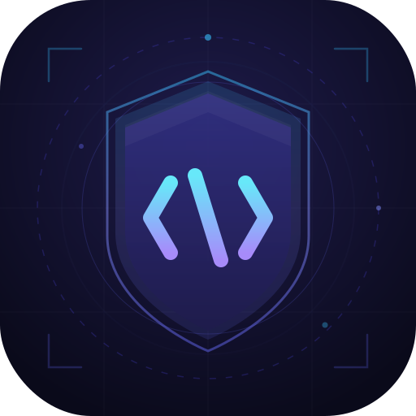
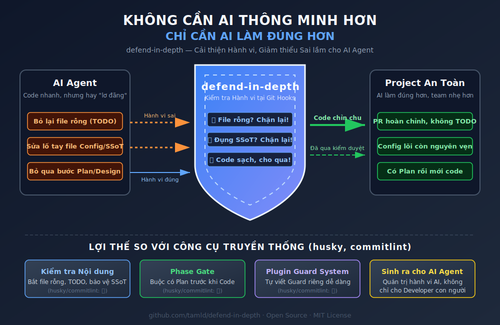
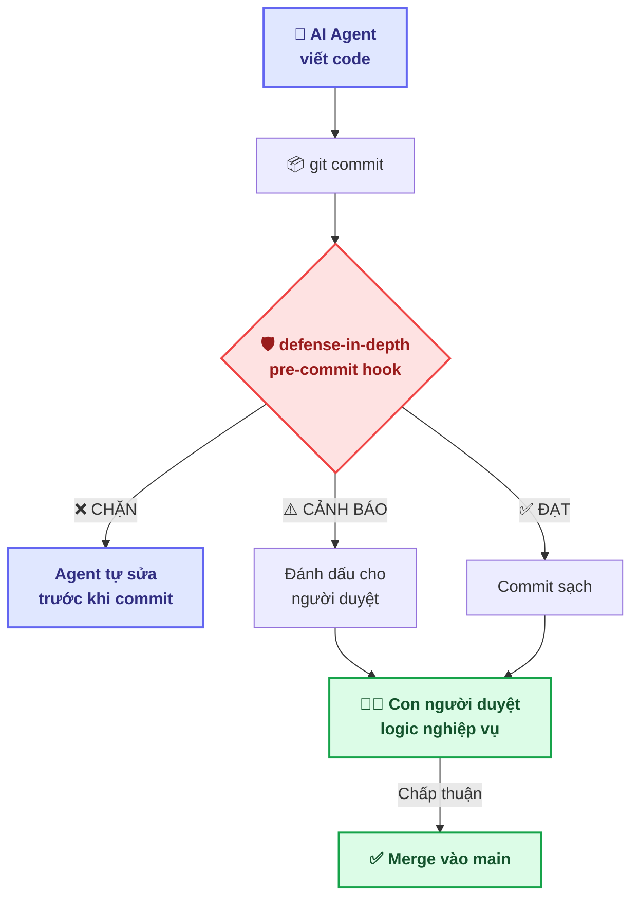

<div align="center">



# defense-in-depth

**Tầng quản trị trung gian giữa AI Agent và mã nguồn dự án**

*AI lo phần thu thập dữ liệu và thực thi. Con người lo phần nghiệp vụ và quyết định kiến trúc.*
<br/>

[](#)
[](LICENSE)
[](#)
[](#)
[](#)

[English](README.md) · **Tiếng Việt**

---
*AI Agent viết code nhanh gấp 10 lần. Nhưng cũng "ảo" gấp 10 lần.*<br/>
**defense-in-depth chặn lỗi trước khi chúng kịp vào lịch sử Git.**
---

</div>

<div align="center">
  
</div>

---

## Triết lý: Con người luôn là trọng tài (HITL)

> *"Tin tưởng nhưng phải kiểm chứng: Tự động hóa cần bằng chứng thực nghiệm."*

### Niềm tin cốt lõi

AI Agent (Cursor, Copilot, Claude Code, Windsurf, Codex) là **công cụ mạnh mẽ cho việc thu thập tài liệu và thực thi kế hoạch**. Nhưng chúng không thay thế được phần khó nhất trong công nghệ phần mềm:

| AI Agent giỏi | Con người giỏi |
|:---|:---|
| 📄 Thu thập và tổ chức tài liệu | 🧠 **Quyết định nghiệp vụ** |
| ⚡ Viết code nhanh | 🎯 **Xác nhận tính đúng đắn** |
| 🔄 Kiểm tra cơ học lặp đi lặp lại | 🏗️ **Định hướng kiến trúc** |
| 📋 Tuân theo kế hoạch có sẵn | 💡 **Chuyên môn lĩnh vực** |

**defense-in-depth** là tầng trung gian giúp:
1. **Giảm "ảo giác" của AI** — bắt file rỗng, nội dung giả, hành vi lách luật
2. **Tăng độ chính xác** — yêu cầu bằng chứng cho mọi kết quả
3. **Tối ưu tự động hóa** — xử lý kiểm tra cơ học, nhường phần sáng tạo cho con người
4. **Bảo toàn quyền quyết định** — Con người luôn là trọng tài cuối cùng

### Tại sao ở tầng Git? (Tất định vs. Điều chỉnh động)

Trên thị trường không thiếu các guardrail hoạt động ở tầng runtime — **Guardrails AI**, **NeMo Guardrails**, **LlamaFirewall**, **Microsoft Agent Governance Toolkit** — can thiệp vào hành vi Agent *ngay khi mô hình đang suy luận*. Chúng rất mạnh, nhưng là kiểu **điều chỉnh động**: mỗi lần nhà cung cấp cập nhật model hoặc nền tảng thay đổi phiên bản, guardrail cũng phải chạy theo để thích ứng.

defense-in-depth chọn hướng tiếp cận khác:

> **Tôn trọng toàn bộ sức mạnh AI Agent.** Cho phép chúng tự do suy nghĩ, tự do vận hành, tự do sáng tạo — mỗi nền tảng theo cách riêng. Chúng tôi không can thiệp vào quá trình đó.
>
> **Chỉ kiểm tra kết quả đầu ra.** Khi code được commit — "bài thi được nộp" — nó phải đạt chuẩn.

Đây là **quản trị tất định**: dù dùng GitHub, GitLab, Bitbucket hay bất kỳ hệ thống Git nào, defense-in-depth luôn là lớp bổ trợ vững chắc *trước khi* kết quả của Agent chạm vào tầng dữ liệu hệ thống.

| Cách tiếp cận | Thời điểm | Phụ thuộc | Cần cập nhật khi model đổi? |
|:---|:---|:---|:---:|
| Guardrail runtime | Trong lúc suy luận | Theo nhà cung cấp | Phải cập nhật |
| **defense-in-depth** | Tại thời điểm commit | **Mọi hệ thống Git** | **Không cần** |

*Guardrail runtime bảo vệ khi AI đang suy nghĩ. defense-in-depth bảo vệ khi AI nộp bài. Hai tầng khác nhau, bổ sung cho nhau.*

---

## 🏗️ Kiến trúc



---

## 📑 Mục lục

1. [Vấn đề](#1-vấn-đề)
2. [Cách hoạt động](#2-cách-hoạt-động)
3. [Bắt đầu nhanh](#3-bắt-đầu-nhanh)
4. [Guard tích hợp sẵn](#4-guard-tích-hợp-sẵn)
5. [So sánh](#5-so-sánh)
6. [Lộ trình phát triển](#6-lộ-trình-phát-triển)
7. [Đóng góp](#7-đóng-góp)

---

## 1. Vấn đề

AI Agent tối ưu cho **sự hợp lý**, không phải **sự đúng đắn**. Không có hàng rào, chúng tạo ra:

| Lỗi hành vi | Hiện tượng | Hậu quả |
|:---|:---|:---|
| 🎭 **File rỗng** | File chỉ toàn nội dung giữ chỗ, template trống | Gate quy trình cho qua nhưng không có nội dung |
| 🦠 **Xâm phạm SSoT** | Sửa file cấu hình/quản trị trong lúc viết tính năng | Hỏng trạng thái, lệch dữ liệu |
| 🤡 **Commit bừa** | Message tùy ý, branch đặt tên ngẫu nhiên | Lịch sử khó đọc, không kiểm soán được |
| 📝 **Bỏ qua thiết kế** | Code trước, lập kế hoạch sau | Lệch kiến trúc, lỗi hồi quy |

Đây không phải lỗi ngẫu nhiên. Đây là **lỗi hệ thống** — hệ quả tất yếu khi áp dụng sinh văn bản xác suất vào công nghệ cần tính tất định.

---

## 2. Cách hoạt động

defense-in-depth là **pipeline guard mở rộng** chạy tại Git hooks:

```
┌──────────────────────────────────────────────────┐
│                 Git Pipeline                       │
│                                                    │
│  AI Code → [pre-commit] ──→ [pre-push]             │
│                   │                │               │
│              defense-in-depth  defense-in-depth      │
│                   │                │               │
│              ┌────┴────┐     ┌────┴────┐          │
│              │ Guards: │     │ Guards: │          │
│              │ • hollow│     │ • branch│          │
│              │ • ssot  │     │ • commit│          │
│              │ • phase │     └─────────┘          │
│              └─────────┘                          │
└──────────────────────────────────────────────────┘
```

**Đặc điểm:**
- ✅ **Không cần hạ tầng** — Không server, database, hay dịch vụ cloud
- ✅ **Đa nền tảng** — Windows, macOS, Linux (CI: 3 OS × 4 phiên bản Node)
- ✅ **Không phụ thuộc Agent** — Hoạt động với MỌI AI coding tool
- ✅ **Tối thiểu phụ thuộc** — Chỉ cần `yaml` để đọc cấu hình
- ✅ **Mở rộng được** — Tự viết guard qua interface `Guard` (TypeScript)
- ✅ **CLI-first** — Dùng được với MỌI loại dự án (Node, Python, Rust, Go...)

---

## 3. Bắt đầu nhanh

```bash
# 1. Khởi tạo trong dự án của bạn (khuyên dùng)
npx defense-in-depth init

# Lệnh trên sẽ:
# ✅ Tạo file defense.config.yml
# ✅ Cài Git hooks (pre-commit và pre-push)
# ✅ Bật guard hollow-artifact và ssot-pollution

# 2. Kiểm tra cài đặt
npx defense-in-depth doctor

# 3. Quét thủ công (bất kỳ lúc nào)
npx defense-in-depth verify

# 4. Quản lý Memory Layer (v0.4)
npx defense-in-depth lesson record --data '{"title": "Bài học 1", ...}'
npx defense-in-depth lesson search "keyword"
npx defense-in-depth growth record --name "metric" --value 1 --unit "count"
```

---

## 4. Guard tích hợp sẵn

| Guard | Hook | Mặc định | Chức năng |
|:---|:---:|:---:|:---|
| `hollow-artifact` | pre-commit | ✅ Bật | Chặn file rỗng, chỉ chứa nội dung giữ chỗ |
| `ssot-pollution` | pre-commit | ✅ Bật | Bảo vệ file cấu hình/quản trị |
| `phase-gate` | pre-commit | ⚠️ Tắt | Buộc có plan trước khi code |
| `ticket-identity` | pre-commit | ⚠️ Tắt | Ngăn commit chứa sửa đổi của nhiều ticket cùng lúc |
| `branch-naming` | pre-push | ✅ Bật | Kiểm tra tên branch `feat/TK-*` |
| `commit-msg` | pre-push | ✅ Bật | Tuân thủ conventional commits |

---

## 5. So sánh

### So với Guardrail runtime

| Tool | Trọng tâm | Tầng |
|:---|:---|:---|
| Guardrails AI / NeMo Guardrails | Lọc input/output LLM | Runtime API |
| Microsoft Agent Governance Toolkit | Policy engine cấp enterprise | Runtime actions |
| LlamaFirewall (Meta) | Chống prompt injection, code injection | Runtime security |
| LLM Guard (Protect AI) | Lọc input/output | Runtime API |

Các tool trên quản trị AI **trong lúc suy luận**. defense-in-depth quản trị AI **tại thời điểm commit code**. Hai tầng bổ sung nhau, không cạnh tranh.

### So với Git hooks truyền thống

| Tính năng | husky | commitlint | 🛡️ **defense-in-depth** |
|:---|:---:|:---:|:---:|
| Git hooks | ✅ | — | ✅ |
| Kiểm tra format commit | — | ✅ | ✅ Tích hợp sẵn |
| **Kiểm tra nội dung file** | ❌ | ❌ | ✅ |
| **Bảo vệ SSoT** | ❌ | ❌ | ✅ |
| **Phase Gate** | ❌ | ❌ | ✅ |
| **Hệ thống Guard mở rộng** | ❌ | ❌ | ✅ |
| **Hệ sinh thái quản trị Agent** | ❌ | ❌ | ✅ |
| Đối tượng phục vụ | Developer | Developer | **AI Agent + Developer** |

> *Guardrail runtime bảo vệ khi AI đang suy nghĩ. defense-in-depth bảo vệ khi AI nộp bài. Hai tầng khác nhau, bổ sung cho nhau.*

---

## 6. Ticket Federation Providers (Tích hợp Ticket)

Để tích hợp ngữ cảnh sạch từ các hệ thống bên ngoài (như Jira, Linear hoặc `TICKET.md` nội bộ), `defense-in-depth` sử dụng **TicketStateProviders**. Providers chèn metadata bất đồng bộ *trước khi* các guard chạy.

```typescript
export interface TicketStateProvider {
  name: string;
  resolve(ticketId: string): Promise<TicketRef | undefined>;
}
```

> Xem [`docs/dev-guide/writing-providers.md`](docs/dev-guide/writing-providers.md) để biết thêm thông tin về cách kết nối hệ thống của bạn vào mô hình quản trị.

---

## 7. Lộ trình phát triển

| Phiên bản | Trọng tâm | Trạng thái |
|:---|:---|:---:|
| **v0.1** | Guard pipeline + CLI + CI/CD + cấu hình sẵn cho Agent | ✅ Hoàn thành |
| **v0.2** | `.agents/` scaffold + 19 rules + 5 skills | ✅ Hoàn thành |
| **v0.3** | TKID (Ticket-aware Guards) — cần Database làm SSoT | ✅ Hoàn thành |
| **v0.4** | Memory Layer — ghi nhận bài học (`lessons.jsonl`) | ✅ Hoàn thành |
| **v0.5** | DSPy — đánh giá chất lượng ngữ nghĩa | 📋 Lên kế hoạch |
| **v0.6–v0.8** | Meta Growth + Federation — kết nối hệ thống AAOS | 📋 Đã thiết kế |
| **v1.0** | API ổn định + publish lên npm | 📋 Lên kế hoạch |

> Chi tiết kiến trúc tầm nhìn: [`docs/vision/meta-architecture.md`](docs/vision/meta-architecture.md)

---

## 7. Đóng góp

Xem [CONTRIBUTING.md](CONTRIBUTING.md) để biết hướng dẫn đầy đủ.

**5 quy tắc tuyệt đối:**
1. TypeScript strict — không dùng `any`
2. Conventional commits — `feat(guards): add new guard`
3. Mỗi guard = một file = một test
4. Không thêm phụ thuộc ngoài (chỉ stdlib + `yaml`)
5. Guard phải là hàm thuần (không có tác dụng phụ)

---

## Giấy phép

[MIT](LICENSE) © 2026 tamld
