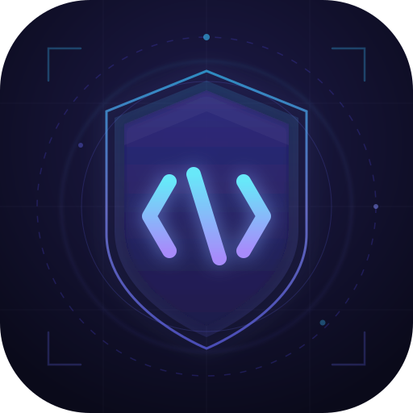
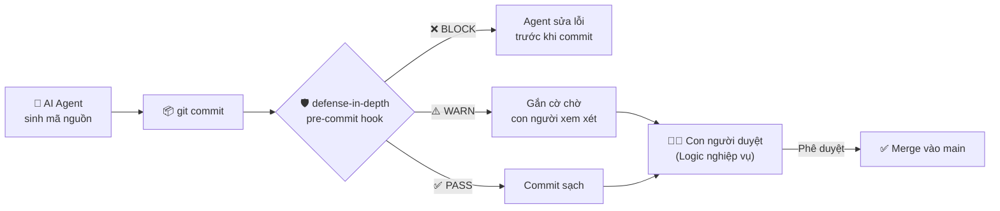

<div align="center">



# defense-in-depth

**Tầng quản trị trung gian tại tầng Git cho AI coding agents**

*AI đảm nhiệm thu thập tài liệu và thực thi. Con người làm chủ nghiệp vụ và quyết định kiến trúc.*
<br/>

[](#)
[](https://github.com/tamld/defense-in-depth/releases)
[](LICENSE)
[](#)
[](#)
[](#)
[](#đóng-góp)

[English](README.md) · **Tiếng Việt**

---
*AI coding agents giúp tăng tốc độ viết code gấp 10 lần, nhưng cũng sinh ra nhiều lỗi cố hữu: tài liệu rỗng, ô nhiễm SSoT, commit tự do không quy chuẩn và bỏ qua kế hoạch.*<br/>
**defense-in-depth ngăn chặn các lỗi này một cách tất định ngay tại thời điểm commit.**
---

</div>

> [!NOTE]
> **defense-in-depth là một bộ khung (scaffold) định hướng, không phải là hộp đen "mì ăn liền".**  
> Pipeline Guard tất định (gồm 9 guard tích hợp + interface `Guard` thuần khiết) là **trung tâm**. Hệ sinh thái `.agents/` tùy chọn (20 quy tắc, cây nhận thức, template kỹ năng) là **điểm xuất phát**: bạn có thể tùy biến, loại bỏ phần không cần và thiết lập theo văn hóa đội ngũ của mình.

> [!IMPORTANT]
> **Hook ở local có thể bị vượt qua với cờ `--no-verify`.** Để thiết lập quản trị doanh nghiệp thực thụ, hãy kết hợp local hook với [GitHub Action](.github/actions/verify/action.yml) chính thức và quy tắc bảo vệ nhánh (branch protection) trên nhánh mặc định.

---

## ⚡ Bắt đầu nhanh trong 60 giây

```bash
# 1. Khởi tạo bên trong bất kỳ repository Git nào
npx defense-in-depth init

# Những gì lệnh này thực hiện:
# ✅ Tạo tệp cấu hình defense.config.yml với thiết lập chuẩn
# ✅ Cài đặt pre-commit và pre-push Git hooks
# ✅ Kích hoạt các guard hollow-artifact và ssot-pollution

# 2. Kiểm tra sức khỏe môi trường và hook
npx defense-in-depth doctor

# 3. Quét thủ công các tệp đang staged
npx defense-in-depth verify
```

### Tùy chọn: Khởi tạo bộ khung quản trị AI Agent

```bash
# Thiết lập toàn bộ hệ sinh thái .agents/ cho quy trình làm việc với AI
npx defense-in-depth init --scaffold
```

### Cưỡng chế tại hệ thống CI/CD (Server-Side)

Thêm GitHub Action chính thức để kiểm tra Pull Request ngoài tầm can thiệp của AI:

```yaml
# .github/workflows/defense.yml
name: defense-in-depth
on: [pull_request]

jobs:
  verify:
    runs-on: ubuntu-latest
    steps:
      - uses: actions/checkout@v4
        with:
          fetch-depth: 0
      - uses: tamld/defense-in-depth/.github/actions/verify@v0.8.0
```

---

## 🛡️ Danh mục các Guard tích hợp sẵn

| Guard | Mặc định | Mức độ | Điểm kích hoạt | Lỗi phát hiện & ngăn chặn |
|:---|:---:|:---:|:---:|:---|
| **Hollow Artifact** | ✅ BẬT | `BLOCK` | `pre-commit` | Các đánh dấu chưa hoàn thiện (`TODO`, `TBD`, `PLACEHOLDER`) hoặc tệp khung rỗng |
| **SSoT Pollution** | ✅ BẬT | `BLOCK` | `pre-commit` | Chỉnh sửa trái phép vào tệp quản trị/trạng thái (`.agents/**`, `backlog.yml`) |
| **Root Pollution** | ✅ BẬT | `BLOCK` | `pre-commit` | Tạo tệp nháp hoặc thư mục không được cấp phép tại thư mục gốc |
| **Commit Format** | ✅ BẬT | `WARN` | `commit-msg` | Thông điệp commit không tuân thủ Conventional Commits (`type(scope): description`) |
| **Branch Naming** | ❌ TẮT | `WARN` | `pre-push` | Tên nhánh không đúng định dạng chuẩn (`feat/*`, `fix/*`, `chore/*`, `docs/*`) |
| **Ticket Identity** | ❌ TẮT | `WARN` | `pre-commit` | Thiếu hoặc xung đột mã định danh ticket trong metadata commit (TKID) |
| **Phase Gate** | ❌ TẮT | `BLOCK` | `pre-commit` | Commit mã nguồn khi chưa có tệp kế hoạch `implementation_plan.md` |
| **HITL Review** | ❌ TẮT | `BLOCK` | `pre-commit` | Chỉnh sửa tệp được bảo vệ khi chưa có chữ ký duyệt của con người |
| **Federation** | ❌ TẮT | `BLOCK` | `pre-commit` | Xác thực trạng thái ticket liên dự án qua các repository cha - con |

> 📖 *Xem hướng dẫn chi tiết và tùy biến: [Hướng dẫn Cấu hình](docs/user-guide/configuration.md).*

---

## 🏗️ Kiến trúc: Nâng cấp lũy tiến (3 Tiers)

`defense-in-depth` được xây dựng trên mô hình 3 tầng nghiêm ngặt:

```
Tier 0 — Lõi tất định (Không dependency ngoài, chỉ stdlib + yaml)
  Heuristics regex/AST, Git hooks, sequential engine, thời gian chạy <100ms
  → Cam kết: BLOCK/WARN chính xác các mẫu chống chỉ định ở mọi nơi

Tier 1 — Trí tuệ mở rộng (Plugin tùy chọn)
  Đánh giá ngữ nghĩa DSPy, vòng lặp Án Lệ (Case Law), engine gợi ý ngữ cảnh
  → Cam kết: Tăng cường tín hiệu khi có mạng; Tier 0 vẫn hoạt động trơn tru khi offline

Tier 2 — Quản trị đa Agent (.agents/ directory)
  Hệ thống quy tắc, cây nhận thức và hợp đồng phối hợp (Cursor, Jules, Claude)
  → Cam kết: Đồng nhất hành vi chuẩn mực giữa tất cả các AI tham gia dự án
```


```mermaid
flowchart LR
    A["🤖 AI Agent<br/>sinh mã nguồn"] --> B["📦 git commit"]
    B --> C{"🛡️ defense-in-depth<br/>pre-commit hook"}
    C -->|"❌ BLOCK"| D["Agent sửa lỗi<br/>trước khi commit"]
    C -->|"⚠️ WARN"| E["Gắn cờ chờ<br/>con người xem xét"]
    C -->|"✅ PASS"| F["Commit sạch"]
    E --> G["👨‍💼 Con người duyệt<br/>(Logic nghiệp vụ)"]
    F --> G
    G -->|"Phê duyệt"| H["✅ Merge vào main"]
```

---

## 💻 Danh mục lệnh CLI

| Lệnh | Mục đích |
|:---|:---|
| `npx defense-in-depth init [--scaffold]` | Cài đặt Git hooks và tạo cấu hình `defense.config.yml` |
| `npx defense-in-depth verify [--staged] [--all]` | Chạy pipeline guard kiểm tra tệp staged hoặc toàn bộ workspace |
| `npx defense-in-depth doctor` | Kiểm tra toàn diện sức khỏe môi trường và hook |
| `npx defense-in-depth feedback --file <path>` | Nạp phản hồi của con người vào vòng lặp Án Lệ (Case Law) |
| `npx defense-in-depth lesson --tag <tag>` | Tra cứu bài học và các mẫu lỗi trong quá khứ |
| `npx defense-in-depth eval` | Đánh giá ngữ nghĩa tài liệu thông qua mô hình DSPy |
| `npx defense-in-depth hints-emit` | Phát gợi ý ngữ cảnh lũy tiến cho AI agents |

> 📖 *Tra cứu CLI đầy đủ: [Tài liệu CLI Reference](docs/user-guide/cli-reference.md).*

---

## 📚 Trung tâm Tài liệu (Docs Hub)

Khám phá 5 trụ cột tài liệu hoàn chỉnh của dự án:

- 🚀 **[Bắt đầu](docs/quickstart.md)** — [Hướng dẫn nhanh](docs/quickstart.md), [Hợp đồng SemVer](docs/SEMVER.md), và [Hướng dẫn nâng cấp](docs/migration/v0-to-v1.md).
- ⚙️ **[Hướng dẫn sử dụng](docs/user-guide/configuration.md)** — [Cấu hình](docs/user-guide/configuration.md), [CLI](docs/user-guide/cli-reference.md), [Providers](docs/user-guide/providers.md), và [Gợi ý Hints](docs/user-guide/hints.md).
- 🛠️ **[Dành cho Lập trình viên](docs/dev-guide/architecture.md)** — [Kiến trúc](docs/dev-guide/architecture.md), [Viết Guard tùy biến](docs/dev-guide/writing-guards.md), [Tầng DSPy](docs/dev-guide/dspy-providers.md), và [Chính sách Fail-Fast](docs/dev-guide/fail-fast-policy.md).
- 🤖 **[Hệ sinh thái & Quản trị](docs/ecosystem/agent-workspace-guidelines.md)** — [Không gian làm việc Agent](docs/ecosystem/agent-workspace-guidelines.md) và [Phối hợp đa Agent](docs/ecosystem/ai-agent-coordination.md).
- 🔭 **[Tầm nhìn & Định hướng](docs/vision/meta-architecture.md)** — [Kiến trúc Meta-Memory](docs/vision/meta-architecture.md), [System Blueprint](docs/vision/system-blueprint.md), và [Chiến lược STRATEGY.md](STRATEGY.md).
- 📖 **[Master Docs Index](docs/index.md)** — Bản đồ điều hướng toàn diện cho lập trình viên và AI agents.

---

## 🤝 Đóng góp

Chúng tôi hoan nghênh đóng góp từ cả con người và AI agents dưới sự giám sát của con người!

1. Đọc [Quy tắc Nhất quán Bất biến](.agents/rules/rule-consistency.md).
2. Xem danh sách issue tại [GitHub Issues](https://github.com/tamld/defense-in-depth/issues).
3. Fork, tạo nhánh (`feat/*`, `fix/*`, `docs/*`), và mở Pull Request.
4. Đảm bảo toàn bộ kiểm thử thành công: `npm test` và `npx defense-in-depth verify`.

---

## 📄 Giấy phép

Phát hành dưới **Giấy phép MIT**. Xem chi tiết tại [LICENSE](LICENSE).
