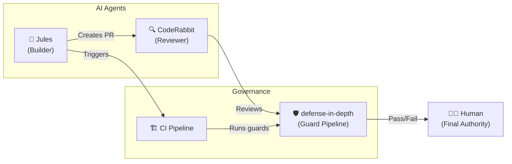

# AI Agent Coordination Guide

> **Scope: DiD Internal Development Strategy**
>
> This document describes how the defense-in-depth project ITSELF uses AI agents
> (Jules, CodeRabbit) to optimize its development workflow. This is the project's
> internal operational strategy — it is **NOT a requirement** for users of the
> defense-in-depth npm package.
>
> Users may adopt parts of this approach as a **reference architecture** if it
> suits their team, but there is no obligation to do so.

---

## Context: Why DiD Uses External AI Agents

defense-in-depth leverages two **external, third-party** AI services to optimize
routine development tasks:

- **Jules** (Google) — Handles async work like writing tests, fixing bugs, updating docs
- **CodeRabbit** — Auto-reviews PRs with path-specific architectural awareness

These are supplementary tools, not core dependencies. The project's **operational
agents** (Main Agent — Gemini, Claude, etc.) remain the primary builders, working
in interactive sessions under direct human command.



## What Is Jules?

[Jules](https://jules.google.com) is Google's autonomous coding agent that:

- Runs in an isolated cloud VM (Ubuntu, Node.js, Docker)
- Clones your repo, installs dependencies, and runs tests
- Creates branches and pull requests with full diffs
- Reads `AGENTS.md` for project-specific instructions
- Supports scheduled and proactive task discovery

**Jules is a Builder**, not a reviewer. It writes code and creates PRs.

## What Is CodeRabbit?

[CodeRabbit](https://coderabbit.ai) is an AI-powered PR reviewer that:

- Automatically reviews every PR on creation/update
- Provides architectural insights, bug detection, and style feedback
- Can block merges via `request_changes_workflow`
- Configured via `.coderabbit.yaml` with path-specific instructions

**CodeRabbit is a Critic**, not a builder. It reviews code, not writes it.

## Setting Up the Multi-Agent Pipeline

### 1. Configure AGENTS.md

defense-in-depth ships with an `AGENTS.md` that Jules automatically reads.
If you're using DiD in your own project, create an `AGENTS.md` in your repo root:

```markdown
# AGENTS.md

## Setup
npm ci
npm run build
npm test

## Guards
This project uses defense-in-depth for governance.
Run `npx defense-in-depth verify` before creating PRs.

## Boundaries
Do not modify: .agents/**, .github/**, package.json
```

### 2. Configure CodeRabbit

Create a `.coderabbit.yaml` in your repo root:

```yaml
reviews:
  profile: assertive
  request_changes_workflow: true
  high_level_summary: true
  path_instructions:
    - path: "src/guards/**"
      instructions: "Guards must be pure functions. No I/O."
    - path: "tests/**"
      instructions: "Check for edge cases and adversarial inputs."
  auto_review:
    enabled: true
    drafts: false
```

### 3. Configure Jules

1. Visit [jules.google.com](https://jules.google.com)
2. Connect your GitHub repository
3. Set the environment setup script:

   ```bash
   npm ci
   npm run build
   npm test
   ```

4. Jules will now respond to issues labeled `jules`

### 4. Set Up Branch Protection

In your GitHub repo settings → Branches → Branch protection rules for `main`:

- ✅ Require pull request reviews before merging
- ✅ Require status checks to pass (CI)
- ✅ Include administrators
- ❌ Do NOT enable auto-merge

## The Review Pipeline

```text
1. Create Issue → 2. Label "jules" → 3. Jules creates PR
                                          ↓
4. CI runs (npm test + defense-in-depth verify)
                                          ↓
5. CodeRabbit reviews (path-specific instructions)
                                          ↓
6. Human reviews → Merges (only human can merge)
```

### When CodeRabbit Requests Changes

1. Review CodeRabbit's feedback in the PR comments
2. Decide: Is this valid feedback?
   - **Yes, simple fix** → Create new Jules issue to fix it
   - **Yes, design issue** → Fix manually or with Main Agent
   - **No, false positive** → Override with human review comment

## Best Practices

### Do ✅

- Write specific, scoped issues for Jules
- Include reproduction steps for bug fixes
- Review Jules' plan before approving execution
- Address every CodeRabbit comment (even if just acknowledging)
- Use branch naming conventions (`feat/jules-*`, `fix/jules-*`)

### Don't ❌

- Give Jules vague tasks ("improve this code")
- Let Jules modify governance or configuration files
- Auto-merge any AI-authored PR
- Ignore CodeRabbit feedback without acknowledging it
- Run multiple Jules tasks on overlapping files

## Human-in-the-Loop (HITL) Enforcement

> **The Supreme Rule**: No AI agent has merge authority.

defense-in-depth is built on the principle that AI agents handle mechanical
tasks while humans retain decision authority. In the multi-agent model:

- **Jules** reduces human effort (writes code)
- **CodeRabbit** reduces human oversight burden (catches issues)
- **CI + Guards** provide deterministic gates (no human needed)
- **Human** makes the final judgment call (semantic correctness)

This creates a defense-in-depth security model for code contributions:
1. Jules operates in a sandboxed VM (environment isolation)
2. CodeRabbit reviews the output (adversarial review)
3. CI validates tests and guards (deterministic verification)
4. Human approves and merges (sovereign authority)

Four layers. No single point of failure.
