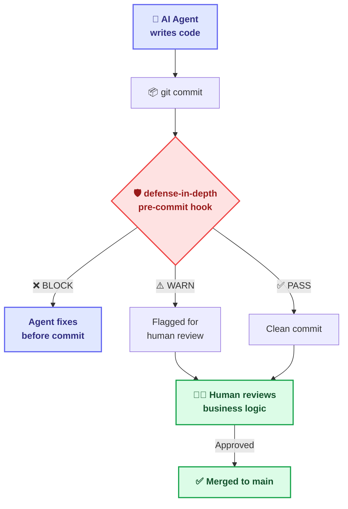

# Architecture & Alternatives

> Executor: Gemini-CLI

## 🏗️ Architecture

> **Looking for the big picture?** See the [Unified System Blueprint](../vision/system-blueprint.md) for how Guards connect with Memory, Identity, and AI models.



The pipeline runs as Git hooks:

```
┌──────────────────────────────────────────────────┐
│                 Git Pipeline                       │
│                                                    │
│  Agent Code → [pre-commit] ──→ [pre-push]          │
│                   │                │                │
│              defense-in-depth  defense-in-depth       │
│                   │                │                │
│              ┌────┴────┐     ┌────┴────┐           │
│              │ Guards: │     │ Guards: │           │
│              │ • hollow│     │ • branch│           │
│              │ • ssot  │     │ • commit│           │
│              │ • phase │     └─────────┘           │
│              └─────────┘                           │
└──────────────────────────────────────────────────┘
```

**Properties:**
- ✅ **Zero infrastructure** — No servers, databases, or cloud services
- ✅ **Cross-platform** — Windows, macOS, Linux (CI: 3 OS × 4 Node versions)
- ✅ **Agent-agnostic** — Works with ANY AI coding tool
- ✅ **Minimal dependencies** — Only `yaml` for config parsing
- ✅ **Pluggable** — Write custom guards via TypeScript `Guard` interface
- ✅ **CLI-first** — Drops into ANY project type (Node, Python, Rust, Go...)

---

## vs. Alternatives

### vs. Runtime AI Guardrails

The AI safety ecosystem includes powerful tools that operate at the **runtime/API layer**:

| Tool | Focus | Layer |
|:---|:---|:---|
| Guardrails AI / NeMo Guardrails | LLM input/output validation | Runtime API |
| Microsoft Agent Governance Toolkit | Enterprise policy engine | Runtime actions |
| LlamaFirewall (Meta) | Prompt injection, code injection defense | Runtime security |
| LLM Guard (Protect AI) | Input/output sanitization | Runtime API |

These tools govern AI **while it reasons**. `defense-in-depth` governs AI **when it commits code**. They are complementary layers — not competitors.

### vs. Traditional Git Hooks

| Feature | husky + lint-staged | commitlint | 🛡️ **defense-in-depth** |
|:---|:---:|:---:|:---:|
| Git hooks | ✅ | — | ✅ |
| Commit format | — | ✅ | ✅ Built-in |
| **Semantic content checking** | ❌ | ❌ | ✅ |
| **SSoT protection** | ❌ | ❌ | ✅ |
| **Phase gates** (plan-before-code) | ❌ | ❌ | ✅ |
| **Pluggable guard system** | ❌ | ❌ | ✅ |
| **Agent governance ecosystem** | ❌ | ❌ | ✅ |
| **Evidence tagging** | ❌ | ❌ | ✅ |
| Target audience | Human devs | Human devs | **AI agents + humans** |

> *Runtime guardrails protect while AI thinks. defense-in-depth protects when AI submits. Different layers, complementary roles.*
