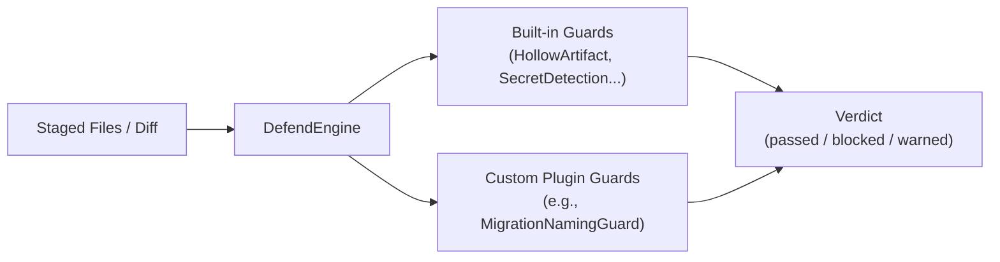

# Custom Guard Plugin Guide

> **A comprehensive guide to extending defense-in-depth with custom, project-specific validation guards.**

---

## 1. Overview

Defense-in-depth is designed from the ground up as an extensible governance middleware. While the core ships with 12 built-in guards, enterprise teams and open-source projects often require specialized domain policies—such as checking database migration naming, verifying protobuf schemas, or enforcing internal licensing headers.

Custom guards plug directly into the `DefendEngine` pipeline via the standard `Guard` interface.



---

## 2. The `Guard` Contract

Every guard implements the pure `Guard` interface defined in `defense-in-depth`:

```typescript
import {
  Guard,
  GuardContext,
  GuardResult,
  Severity,
  EvidenceLevel,
} from "defense-in-depth";

export const noConsoleLogGuard: Guard = {
  id: "noConsoleLog",
  name: "No Console Log Guard",
  description: "Disallows committing explicit console.log statements in production code",

  async check(ctx: GuardContext): Promise<GuardResult> {
    const findings = [];
    const sourceFiles = ctx.stagedFiles.filter(
      (f) => (f.endsWith(".ts") || f.endsWith(".js")) && !f.includes("tests/"),
    );

    for (const file of sourceFiles) {
      const fullPath = `${ctx.projectRoot}/${file}`;
      // Pure read operations only
      const content = await fs.promises.readFile(fullPath, "utf-8");
      const lines = content.split("\n");

      lines.forEach((line, idx) => {
        if (line.includes("console.log(") && !line.includes("// allow-log")) {
          findings.push({
            guardId: "noConsoleLog",
            severity: Severity.BLOCK,
            evidenceLevel: EvidenceLevel.DIRECT,
            filePath: file,
            line: idx + 1,
            message: "Unescaped console.log statement found",
            fix: "Remove console.log or append '// allow-log' if intentional.",
          });
        }
      });
    }

    return {
      passed: findings.length === 0,
      findings,
    };
  },
};
```

---

## 3. Four Immutable Guard Rules

All guards must strictly follow the core governance invariants:

| Rule | Requirement | Why |
| :--- | :--- | :--- |
| **1. Pure Functions** | Guards must only perform read operations. No state mutations, no network calls in Tier 0. | Ensures determinism and prevents race conditions during Git hook execution. |
| **2. Fast Execution** | Total check duration must complete in < 50ms per guard. | Git hooks run interactively on developer machines before commit/push. |
| **3. Crash-Safe** | Never throw unhandled exceptions. Handle missing files gracefully. | If a guard panics, the engine treats it as a `BLOCK` crash finding. |
| **4. Actionable Fixes** | Every finding must include a clear, copy-pasteable `fix` recommendation. | Prevents developer frustration and guides automated AI agents. |

---

## 4. Registering Custom Guards

You can execute custom guards either programmatically or via Node.js scripts:

```typescript
import { DefendEngine, hollowArtifactGuard } from "defense-in-depth";
import { noConsoleLogGuard } from "./guards/no-console-log.js";

const engine = new DefendEngine(process.cwd(), {
  version: "1.0",
  guards: {
    hollowArtifact: { enabled: true },
  },
})
  .use(hollowArtifactGuard)
  .use(noConsoleLogGuard);

const verdict = await engine.run({
  files: ["src/index.ts"],
});

if (!verdict.passed) {
  console.error("Governance check failed!");
  process.exit(1);
}
```

---

## 5. Testing Custom Guards

Ship adversarial test suites for your custom guard verifying both positive passes and bypass resistance:

```typescript
import { describe, it } from "node:test";
import { strict as assert } from "node:assert";
import * as fs from "node:fs";
import * as path from "node:path";
import * as os from "node:os";
import { noConsoleLogGuard } from "../src/guards/no-console-log.js";

describe("noConsoleLogGuard", () => {
  it("blocks unescaped console.log statements", async () => {
    const tmp = fs.mkdtempSync(path.join(os.tmpdir(), "did-custom-test-"));
    const filePath = path.join(tmp, "app.ts");
    fs.writeFileSync(filePath, "console.log('debug');", "utf-8");

    try {
      const res = await noConsoleLogGuard.check({
        projectRoot: tmp,
        stagedFiles: ["app.ts"],
        config: {},
      });

      assert.equal(res.passed, false);
      assert.equal(res.findings.length, 1);
      assert.ok(res.findings[0].fix.includes("Remove console.log"));
    } finally {
      fs.rmSync(tmp, { recursive: true, force: true });
    }
  });
});
```
