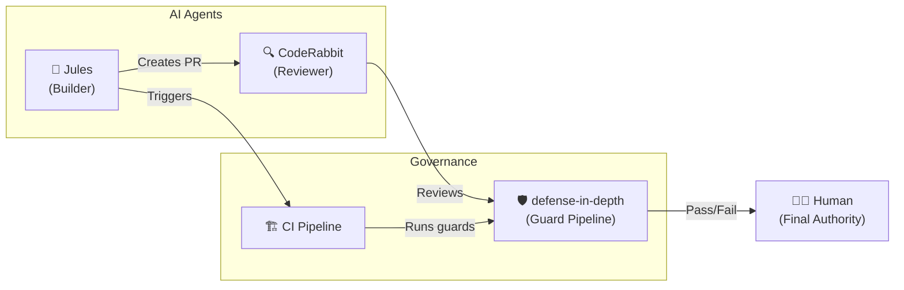

# AI Agent Coordination Guide

> **Scope: DiD Internal Development Strategy & Reference Architecture**
>
> This document describes how the defense-in-depth project ITSELF uses AI agents
> (Jules, CodeRabbit, Gemini, Claude, Cursor) to optimize its development workflow. This is the project's
> internal operational strategy — it is **NOT a requirement** for users of the
> defense-in-depth npm package.
>
> Users may adopt parts of this approach as a **reference architecture** if it
> suits their team.

---

## Context: Why DiD Uses External AI Agents

defense-in-depth leverages two **external, third-party** AI services to optimize
routine development tasks:

- **Jules** (Google) — Handles async work like writing tests, fixing bugs, updating docs
- **CodeRabbit** — Auto-reviews PRs with path-specific architectural awareness

These are supplementary tools, not core dependencies. The project's **operational
agents** (Main Agent — Gemini, Claude, Cursor, etc.) remain the primary builders, working
in interactive sessions under direct human command.

## Agent Taxonomy

| Category | Agents | Execution Mode | Trust Boundary | Configuration |
|:---|:---|:---|:---|:---|
| **Operational Agents** | Gemini-CLI, Claude Code, Cursor | Interactive sessions under human supervision | High (Trusted Architect) | `GEMINI.md`, `CLAUDE.md`, `.cursorrules` |
| **Async Builder Agents** | Jules (Google Cloud VM) | Non-interactive background runs | Medium (Strict sandbox) | `.agents/contracts/jules.md` |
| **Reviewer Agents** | CodeRabbit | Automated on PR opening | Advisory (Cannot approve) | `.coderabbit.yaml` |
| **Human Sovereign** | Maintainer (`tamld`) | Sole merge & architectural authority | Absolute (HITL) | `rule-hitl-enforcement.md` |

---

## Operating Protocol

1. **Self-Identification**: Every agent must read `AGENTS.md` and bootstrap chain first.
2. **Signature Mandate**: Every artifact generated or edited by an agent must include `Executor: <agent-name>`.
3. **Evidence Requirement**: Claims must carry tags (`[CODE]`, `[RUNTIME]`, `[INFER]`, `[HYPO]`).
4. **Forbidden Zones**: AI agents are strictly forbidden from modifying governance root rules (`AGENTS.md`, `.agents/rules/`, `.coderabbit.yaml`) without explicit human instruction.
5. **HITL Supreme Rule**: No agent may auto-merge a PR. All changes require human approval.
