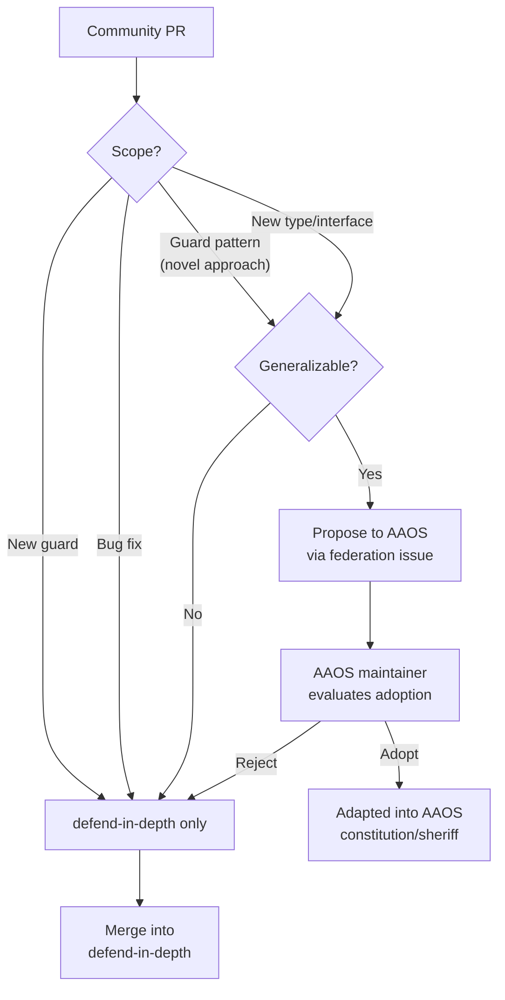

# Federation Protocol: AAOS ↔ defend-in-depth

> *"The embassy sends field reports home. Headquarters sends refined doctrine back."*

---

## Relationship

| Project | Role | Strengths |
|:---|:---|:---|
| **AAOS** (web-login-solo) | Headquarters — Full governance OS | Deep memory, multi-agent orchestration, growth engine |
| **defend-in-depth** | Embassy — Lightweight OSS tool | Cross-platform, zero-infra, community diversity |

They are **not competing products**. They are **complementary views** of the same problem: how to govern AI-generated code.

---

## Forward Flow: AAOS → defend-in-depth

What defend-in-depth inherited from AAOS:

| Inherited | From | Adapted As |
|:---|:---|:---|
| Guard pipeline pattern | `constitution.ts`, `sheriff.ts` | `Guard` interface + `Engine` |
| Evidence system | `rule-ai-native-engineering.md` | `EvidenceLevel` enum |
| Lesson schema | `records/lessons.jsonl` | `Lesson` type with `wrongApproach` |
| Growth flywheel | `rule-growth-maturity.md` | `COGNITIVE_TREE.md` |
| HITL philosophy | System-wide principle | Supreme Rule |
| Recall quality | `recall-f1-evaluator.ts` | `RecallMetric` type |

**Simplification table:**

| AAOS (full) | defend-in-depth (lite) |
|:---|:---|
| PostgreSQL + Redis memory | `lessons.jsonl` (file-based) |
| 14-state ticket lifecycle | 3-phase: plan → code → verify |
| 152 agent skills | Pluggable guard interface |
| Multi-model agent fleet | Single CLI for any platform |
| 17 governance rules | 3 core rules |

---

## Reverse Flow: defend-in-depth → AAOS

This is the **field report channel**. What community usage teaches us:

### What feeds back

| Data | Source | Value to AAOS |
|:---|:---|:---|
| New guard patterns | Community PRs | Potential new constitution guards |
| Platform edge cases | 3-OS CI matrix | Portability hardening |
| False positive reports | GitHub issues | Guard accuracy tuning |
| Custom guard innovations | Community skills | New architectural patterns |
| Lesson quality data | `RecallMetric` | Memory system calibration |
| Adoption friction | User feedback | Onboarding improvements |

### FederationPayload

The formal data contract for reverse flow:

```typescript
interface FederationPayload {
  sourceProject: string;
  version: string;
  lessons: Lesson[];
  recallMetrics?: RecallMetric;
  metaGrowth?: MetaGrowthSnapshot;
  guardStats?: Array<{
    guardId: string;
    totalRuns: number;
    truePositives: number;
    falsePositives: number;
    avgDurationMs: number;
  }>;
  generatedAt: string;
}
```

### Contribution classification



---

## Type Compatibility

defend-in-depth types are designed as **subsets** of AAOS types:

| defend-in-depth type | AAOS equivalent | Compatible? |
|:---|:---|:---:|
| `Lesson` | `records/lessons.jsonl` schema | ✅ Superset |
| `EvidenceLevel` | Same enum values | ✅ Identical |
| `Finding` | `constitution.ts` Finding | ✅ Subset |
| `GrowthMetric` | `growth_metrics` table | ✅ Compatible |
| `RecallMetric` | `recall-f1-evaluator.ts` output | ✅ Compatible |

**Rule:** defend-in-depth MUST NOT introduce types that conflict with AAOS equivalents. It may have fewer fields (subset), but field names and types must match.

---

## Practical Federation Workflow

1. **Quarterly review:** AAOS maintainer scans defend-in-depth issues/PRs for patterns
2. **Lesson harvest:** Extract high-quality lessons from OSS usage → import into AAOS `records/lessons.jsonl`
3. **Guard adoption:** Community guards that prove valuable → consider for AAOS constitution
4. **Type sync:** On each defend-in-depth major version → verify type compatibility with AAOS

---

> *"Being first doesn't mean being best. The embassy exists to learn from the field what headquarters cannot see from the office."*
