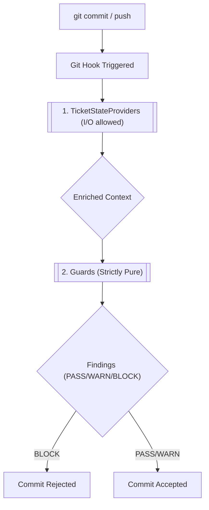

# Ticket State Providers

**Ticket State Providers** enable `defense-in-depth` to read ticket context (such as the current ticket ID, phase, and type) from external sources or files, rather than relying solely on Git branch names. 

Guards in `defense-in-depth` are strictly pure functions—they evaluate data without performing I/O. **Providers** bridge this gap by performing the dirty work of reading files, calling APIs, or checking databases before guards run.

## How it Works

The pipeline executes Providers before evaluating Guards, ensuring the context is enriched prior to purely functional checks.



## The Default `file` Provider

Since `defense-in-depth` adheres to a zero-infrastructure philosophy, the default provider is the `file` provider.

By default, it looks for a `TICKET.md` file located at the root of your project:

```yaml
---
id: TK-20260408-001
phase: EXECUTING
type: feat
---
# Mission
Your ticket description goes here...
```

If `TICKET.md` exists and contains valid YAML frontmatter, the provider extracts the metadata (`id`, `phase`, `type`) and passes it to the `ticketIdentity` guard.

## Configuration

You can configure the provider and its settings in your `defense.config.yml` under the `ticketIdentity` guard.

```yaml
guards:
  ticketIdentity:
    severity: warn
    provider: file
    providerConfig:
      ticketFile: "records/current_ticket.md" # Optional: Custom file path
```

If no config is provided, the engine defaults to the `file` provider with the path `TICKET.md`.

## Built-in Providers

### `linear` Provider — Linear (linear.app)

The Linear provider fetches ticket state from the Linear GraphQL API.

**Configuration:**
```yaml
guards:
  ticketIdentity:
    severity: warn
    provider: linear
    providerConfig:
      endpoint: "https://api.linear.app/graphql"   # Default
      apiKey: "lin_api_xxxx"                       # Required
      teamId: "team-id"                            # Required
  federation:
    enabled: true
    provider: linear
    providerConfig:
      apiKey: "lin_api_xxxx"
      teamId: "team-id"
    parentEndpoint: "https://api.linear.app/graphql"
```

**Features:**
- Fetches `id`, `identifier`, `state.name`, and `parent` fields via GraphQL
- Maps Linear state names to phases (e.g., "In Progress" → `IN PROGRESS`)
- Extracts parent ticket ID for federation governance
- Zero external dependencies (uses `globalThis.fetch`)

**Required:**
- Linear API key (personal or OAuth) — get from Linear Settings → API
- Team ID — find in Linear URL or team settings

---

### `jira` Provider — Atlassian Jira

The Jira provider fetches ticket state from the Jira REST API.

**Configuration:**
```yaml
guards:
  ticketIdentity:
    severity: warn
    provider: jira
    providerConfig:
      baseUrl: "https://your-domain.atlassian.net"  # Required
      email: "user@company.com"                      # Required for Basic auth
      apiToken: "ATATT3x..."                         # Required for Basic auth
      # OR use bearerToken for OAuth:
      # bearerToken: "eyJhbGciOiJIUzI1NiIsInR5cCI6IkpXVCJ9..."
  federation:
    enabled: true
    provider: jira
    providerConfig:
      baseUrl: "https://your-domain.atlassian.net"
      email: "user@company.com"
      apiToken: "ATATT3x..."
```

**Status → Phase Mapping:**
| Jira Status Category | Mapped Phase |
|---|---|
| To Do, Backlog | `BACKLOG` |
| Selected for Development | `PLANNING` |
| In Progress | `EXECUTING` |
| In Review | `REVIEW` |
| Done, Closed | `COMPLETED` |
| Canceled, Cancelled | `CANCELLED` |
| Blocked, On Hold | `BLOCKED` |

**Issue Type → Type Mapping:**
| Jira Issue Type | Mapped Type |
|---|---|
| Story, Task, Epic | `feat` |
| Bug | `fix` |
| Subtask | `chore` |

**Authentication:**
- **Basic Auth**: Email + API Token (generate at `id.atlassian.com/manage-profile/security/api-tokens`)
- **Bearer Token**: OAuth 2.0 token

---

### `http` Provider — Generic REST

For custom REST endpoints:
```yaml
guards:
  ticketIdentity:
    provider: http
    providerConfig:
      endpoint: "https://api.mycompany.com/tickets"
      timeout: 3000
```

**Expected Response:**
```json
{
  "id": "TK-123",
  "phase": "EXECUTING",
  "type": "feat",
  "parentId": "TK-100"
}
```

---

## Building Custom Providers
For enterprise integrations (e.g., PostgreSQL, custom ticketing), see [Writing Providers](../dev-guide/writing-providers.md).
