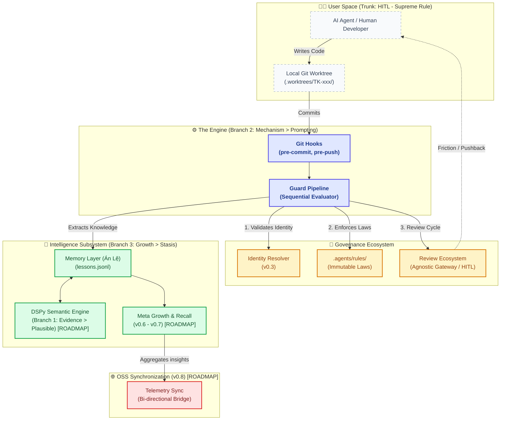
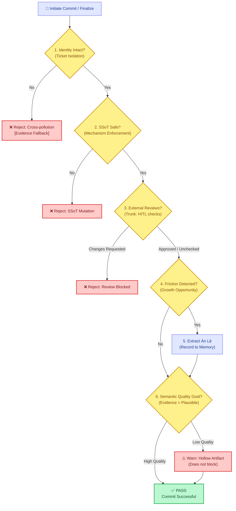

# System Design Blueprint: defense-in-depth

> Executor: Gemini-CLI

This document serves as the **Master Architectural Blueprint**, linking all subsystems from the strategic roadmap (v0.1 to v0.8) into a unified, tight-knit diagram. It bridges the gap between scattered concepts and the actual data flow executing under the hood.

---

## 1. Macro Architecture (The Unified Ecosystem)

This diagram visualizes how the physical parts of the system interact, starting from the external Actor down to the internal intelligence and telemetry layers.

---

## 2. Decision Flow (The Lifecycle Pipeline)

What actually happens when code moves through defense-in-depth? This decision matrix strictly dictates the sequence of validation and learning.

---

## 3. Structural Roadmap Alignment

How these diagrams align with the published vision in `STRATEGY.md`:

| Roadmap Phase | Location in Diagram | Impact on System |
|:--------------|:--------------------|:-----------------|
| **v0.1 / v0.2** | Core Engine, Rules | Establishes the unbreakable mechanical pipeline. |
| **v0.3** | Identity Resolver | Checks `[Identity Intact?]` to ensure git worktrees aren't polluted. |
| **v0.4** | Memory Layer | `[Extract Lesson]` logic routes successful fixes into `lessons.jsonl`. |
| **v0.5** | DSPy Semantic Engine | The final `[Semantic Quality Goal?]` validation prior to passing a commit. |
| **v0.6 / v0.7** | Metrics / Meta Growth | Analyzes the data stored in the Memory Layer. |
| **v0.8** | Telemetry Sync | Pushes `Meta Growth` stats to external dashboards. |
