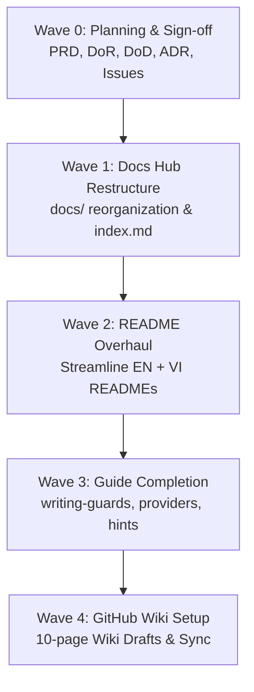

# PRD — Documentation Restructuring & GitHub Wiki Initiative

> **Status**: PROPOSED — awaiting human maintainer sign-off  
> **Owner**: AI Agent (Gemini-CLI / Antigravity) · **Sponsor**: tamld · **Date**: 2026-08-29  
> **Target Version**: v0.8.0 / v1.0.0-rc  
> **Executor**: Gemini-CLI

---

## 1. Problem Statement

`defense-in-depth` has evolved significantly from its initial release to **v0.8.0**, introducing advanced capabilities:
1. **9+ Deterministic Guards**: Hollow Artifact, SSoT Pollution, Root Pollution, Commit Format, Branch Naming, Ticket Identity, Phase Gate, HITL Review, Federation.
2. **Tier 1 Intelligence & Memory**: DSPy semantic validation, Án Lệ (Case Law) memory loop, feedback system, hints emission engine.
3. **Multi-Agent Governance**: Integration with Jules, Cursor, Claude Code, CodeRabbit, and the `.agents/` ecosystem.

However, the project documentation faces several challenges:
- **README Overcrowding & Version Drift**: `README.md` and `README.vi.md` (620+ lines) mix high-level introductory content with deep internal architecture notes and stale version tags (`v0.7.0` vs `0.8.0` in `package.json`).
- **Documentation Hub Fragmentation**: `docs/index.md` does not index all existing guides (e.g. `user-guide/hints.md`, `user-guide/providers.md`, `dev-guide/writing-guards.md` status, `vision/system-blueprint.md`).
- **Lack of GitHub Wiki**: The GitHub Wiki feature is enabled (`hasWikiEnabled: true`) but unpopulated, missing an opportunity for a searchable, web-friendly developer handbook.
- **Language Synchronization**: Discrepancies between English and Vietnamese docs.

---

## 2. Goals & Objectives

1. **Restructure `README.md` & `README.vi.md`**:
   - Clean, compelling hero section with instant value proposition and visual workflow.
   - 60-second Quickstart (`init`, `doctor`, `verify`).
   - Clear comparison matrix (Built-in Guards, Severity, Hook points).
   - Clean progressive disclosure linking to `docs/` and Wiki instead of inlining 200 lines of internal roadmap.
2. **Reorganize & Complete the `docs/` Hub**:
   - Establish a 5-pillar taxonomy:
     - `Getting Started`
     - `User Guide`
     - `Developer Guide`
     - `Ecosystem & Multi-Agent Governance`
     - `Vision & Roadmap`
   - Complete missing/stubbed documentation pages (`dev-guide/writing-guards.md`, `dev-guide/writing-providers.md`).
   - Audit and enforce 100% link integrity.
3. **Establish GitHub Wiki Knowledge Base**:
   - Design a modular 10-page Wiki architecture covering onboarding, guard catalog, architecture deep-dives, CLI commands, custom plugins, Án Lệ memory loop, and FAQ.
   - Create local wiki drafts (`wiki/` or exportable bundle) ready to populate the GitHub Wiki repository.
4. **Enforce Strict HITL & Issue/PR Workflow**:
   - Deconstruct execution into granular, atomic GitHub Issues and PRs with dedicated branches.
   - Zero direct pushes to `main`. Every PR reviewed by human maintainer.

---

## 3. Non-Goals

| Excluded | Rationale |
|---|---|
| Modifying core Guard execution logic (`src/core/engine.ts`, `src/guards/*.ts`) | Documentation and governance initiative only; code changes belong in dedicated feature PRs |
| Introducing external documentation site frameworks (e.g. Docusaurus, VitePress) | Project must remain lightweight and zero-bloat; Markdown + GitHub Wiki is native |
| Auto-merging any PR without human sign-off | Violates Supreme Law: `rule-hitl-enforcement.md` |

---

## 4. Target Personas

1. **Open-Source Developer / AI Agent User**: Wants a 60-second setup (`npx defense-in-depth init`) to protect their repository from AI hallucinated commits and broken templates.
2. **Enterprise / Team Lead**: Needs server-side CI/CD enforcement ([GitHub Action](../../.github/actions/verify/action.yml)), compliance checks, and phase gate rules.
3. **AI Agent (Cursor / Claude / Jules / Gemini)**: Reads `AGENTS.md` and `.agents/rules/` via the bootstrap protocol without consuming excessive context tokens.
4. **Guard / Plugin Author**: Wants clear contracts and step-by-step guides to write custom guards or federation providers.

---

## 5. Success Metrics

| Metric | Baseline | Target |
|---|---|---|
| README Line Count | ~630 lines | ≤ 350 lines (high signal-to-noise ratio) |
| Doc Hub Completeness | 73 lines index, 3 missing links | 100% indexed, 0 broken links |
| GitHub Wiki Pages | 0 pages (empty remote) | 10 structured pages |
| Version Consistency | Drift (`v0.7.0` vs `0.8.0`) | 100% aligned to `0.8.0` across all docs |
| CI / Link Integrity Gate | Unchecked | 100% passed (zero broken markdown links) |

---

## 6. Execution Waves & Milestones

| Wave | Scope | Key Deliverables |
|---|---|---|
| **W0: Planning** | Approvals & Issue Scaffolding | Approved PRD, DoR, DoD, ADR; GitHub Issues created |
| **W1: Docs Hub** | `docs/` Taxonomy & Indexing | Restructured `docs/index.md`, link repair, doc audit score 100% |
| **W2: READMEs** | `README.md` & `README.vi.md` | Streamlined content, updated v0.8.0 tables, removed stale internal logs |
| **W3: Dev Guides** | Developer & User Guides | Full `writing-guards.md`, `writing-providers.md`, `hints.md` |
| **W4: Wiki** | GitHub Wiki Deployment | Complete 10-page Wiki corpus drafted and ready for publish |

---

## 7. Key Decisions Requiring Sign-off

- **D1: README Size Budget**: Target ≤350 lines for `README.md` by delegating detailed roadmaps and internal designs to `docs/` and GitHub Wiki.
- **D2: Wiki Staging Strategy**: Keep a `wiki/` directory in repo or staged markdown files that can be synced directly to `https://github.com/tamld/defense-in-depth.wiki.git`.
- **D3: Granular PR Strategy**: One wave per PR with branch convention `docs/restructure-hub`, `docs/streamline-readme`, `docs/complete-guides`, `docs/github-wiki`.
