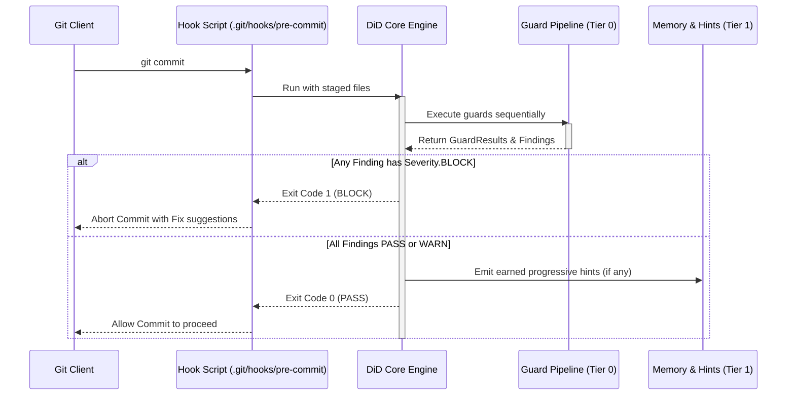

# Core Architecture

> **The design philosophy, layering model, and execution engine powering `defense-in-depth`.**

---

## 🏛️ The 3-Tier Progressive Layering Model

`defense-in-depth` guarantees reliability through strict architectural separation:

```
Tier 0 — Deterministic Core (Always active, Zero external dependencies)
  Regex/AST heuristics, Git hook interception, sequential engine pipeline
  → Budget: < 100ms execution
  → Guarantees: BLOCK/WARN on structural anti-patterns on any machine

Tier 1 — Optional Intelligence (Opt-in plugins)
  DSPy semantic evaluation, Án Lệ (Case Law) memory loop, Progressive Hints
  → Degrades gracefully: Offline environments fall back seamlessly to Tier 0

Tier 2 — Multi-Agent Governance (.agents/ directory)
  Universal agent rules, cognitive framework, and multi-agent contracts
  → Lazy-loaded by AI agents, zero runtime overhead for the TypeScript engine
```

---

## 🔄 The Engine Pipeline Lifecycle

When a developer or AI agent triggers `git commit` or `git push`:



---

## 🚦 Severity Model

Findings emitted by guards carry one of three strict severity levels:

| Severity | Engine Behavior | Exit Code | When to Use |
|:---|:---:|:---:|:---|
| **`Severity.PASS`** | Clean | `0` | Code meets all standards |
| **`Severity.WARN`** | Advisory | `0` | Non-blocking recommendation (e.g. non-standard commit format, hint) |
| **`Severity.BLOCK`** | Hard Gate | `1` | Prohibits commit/push (e.g. hollow artifact, SSoT pollution, secret leak) |

---

## ⚡ Why Git-Level Determinism?

Unlike runtime safety frameworks (e.g., NeMo Guardrails, Guardrails AI) that intercept prompts during LLM inference:
1. **Agent-Agnostic**: Works identically with Claude Code, Cursor, Copilot, Windsurf, Jules, or human developers.
2. **Model-Agnostic**: Does not break or drift when LLM providers update model weights or context APIs.
3. **Deterministic**: Pure AST and regex checks execute in <50ms without network latency or cloud dependencies.
