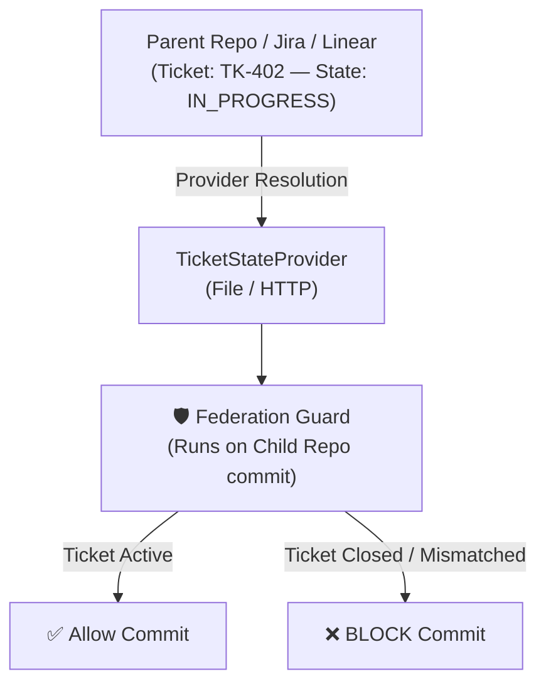

# Federation & Cross-Repo Governance

> **Managing ticket identities and governance state across parent-child repository hierarchies.**

---

## 🌐 The Federation Architecture

In large organizations and monorepo/polyrepo setups, tasks often originate from a parent repository or issue tracker and propagate to child component repositories.



---

## 🔌 Built-in Providers

### 1. File Provider (`file`)
Reads ticket states directly from a shared JSON/YAML state file or local checkout:

```yaml
federation:
  provider: file
  fileConfig:
    path: "../parent-repo/state/tickets.json"
    cacheTtlSeconds: 300
```

### 2. HTTP Provider (`http`)
Queries an external HTTP JSON API with automatic timeout protection and dangling socket safeguards:

```yaml
federation:
  provider: http
  httpConfig:
    endpoint: "https://api.internal.company.com/v1/tickets"
    timeoutMs: 1500
```

---

## 🛡️ Provider Contracts & Invariants

All ticket providers implement the `TicketStateProvider` interface:

1. **Graceful Failures**: Network glitches must never crash a developer's commit. Unreachable providers log a warning and return `undefined`.
2. **Timeout Enforcement**: All HTTP requests use `AbortController` with explicit timeouts.
3. **Pure Resolution**: Resolving tickets does not mutate remote systems or local files.
